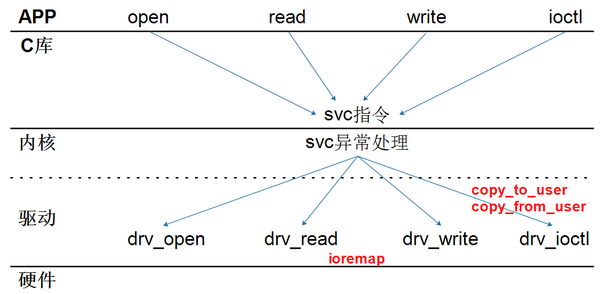
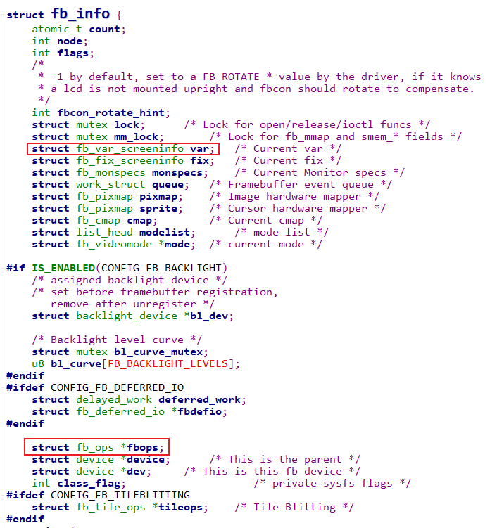

## Framebuffer驱动程序框架


### 1. 怎么编写字符设备驱动程序



* 驱动主设备号
* 构造file_operations结构体，填充open/read/write等成员函数
* 注册驱动：register_chrdev(major, name, &fops)
* 入口函数
* 出口函数


### 2. Framebuffer驱动程序框架

分为上下两层：

* fbmem.c：承上启下
  * 实现、注册file_operations结构体
  * 把APP的调用向下转发到具体的硬件驱动程序
* xxx_fb.c：硬件相关的驱动程序
  * 实现、注册fb_info结构体
  * 实现硬件操作


调用关系：

```c
例子1：
app:  open("/dev/fb0", ...)   主设备号: 29, 次设备号: 0
--------------------------------------------------------------
kernel:
         fb_open
         	int fbidx = iminor(inode);
         	struct fb_info *info = = registered_fb[0];


例子2：
app:  read()
---------------------------------------------------------------
kernel:
		fb_read
			int fbidx = iminor(inode);
			struct fb_info *info = registered_fb[fbidx];
			if (info->fbops->fb_read)
				return info->fbops->fb_read(info, buf, count, ppos);
         	
			src = (u32 __iomem *) (info->screen_base + p);
			dst = buffer;
			*dst++ = fb_readl(src++);
			copy_to_user(buf, buffer, c)         	
```

### 3. 怎么编写Framebuffer驱动程序

核心：



* 分配fb_info

  * framebuffer_alloc

    

* 设置fb_info

  * var
  * fbops
  * 硬件相关操作

* 注册fb_info

  * register_framebuffer