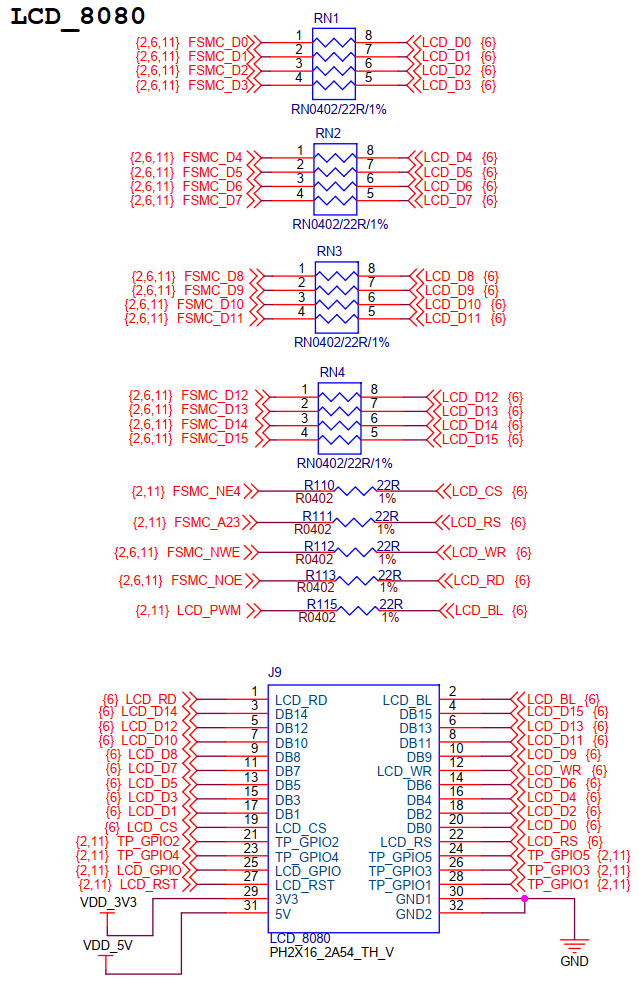
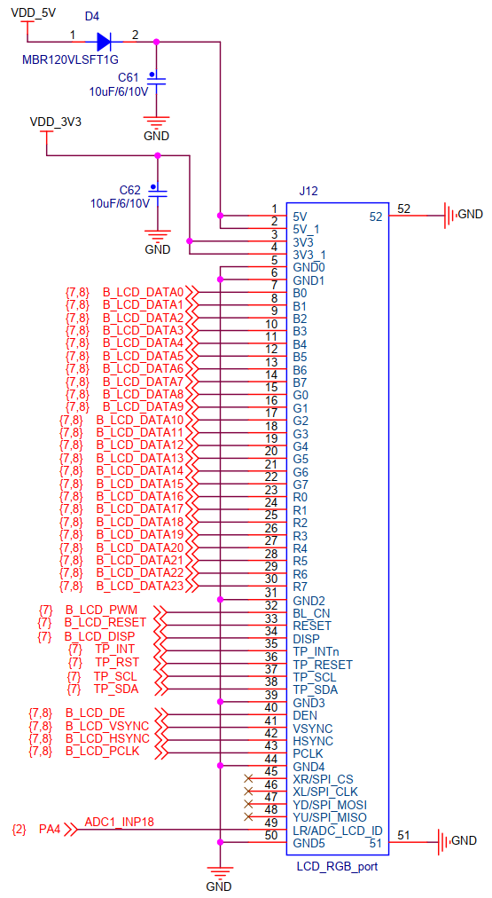

## 硬件\_8080接口LCD时序分析

参考资料，GIT仓库里：

* 8080接口LCD
  
  * 接口原理图：`其他资料\STM32F103\原理图\100ASK_STM32F103_V10_0707FINAL.pdf`
  
* LCD数据手册：
  
  * `其他资料\STM32F103\datasheet\LCD显示屏资料\3.5寸\LCD_3.5寸_320x480_ILI9488_液晶显示模块规格书.pdf`
  * `其他资料\STM32F103\datasheet\LCD显示屏资料\3.5寸\ILI9488驱动芯片数据手册.pdf`
  
    
  

### 1. 接口原理图

#### 1.1 8080接口原理图

#### 1.2 TFT-RGB接口原理图

### 2. 8080接口时序图

