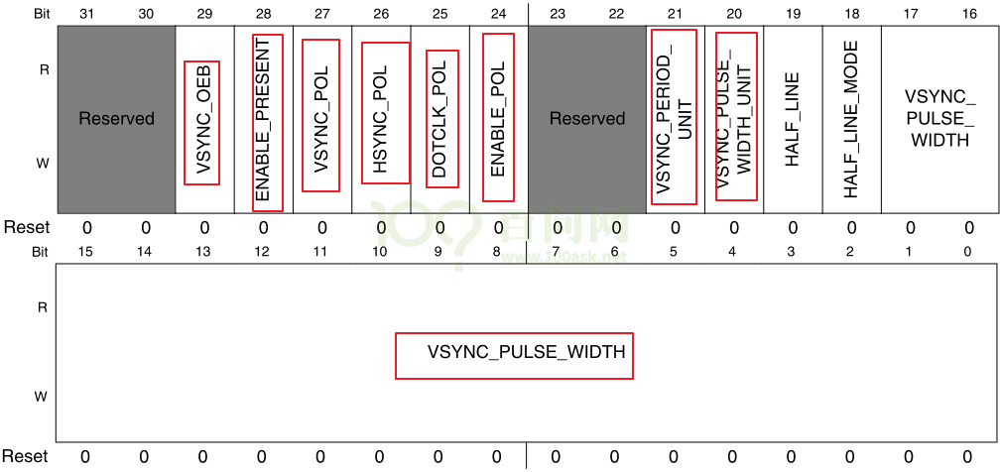
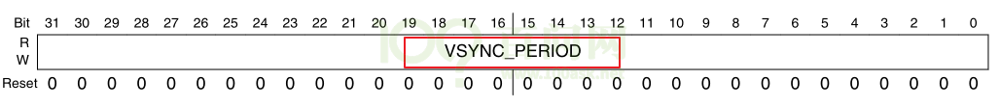
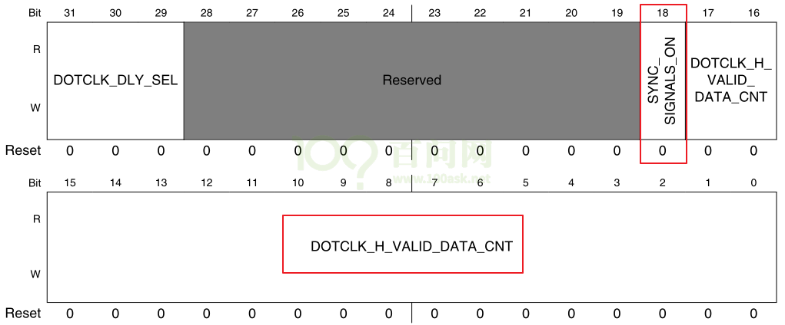
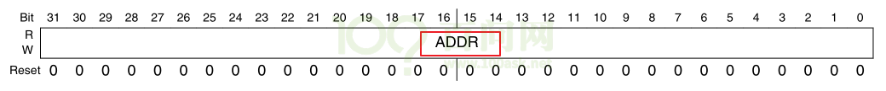

## 硬件\_IMX6ULL的LCD控制器

参考资料，GIT仓库里：

* `IMX6ULL\开发板配套资料\datasheet\Core_board\CPU\IMX6ULLRM.pdf`
  * `《Chapter 34 Enhanced LCD Interface (eLCDIF)》`

* IMX6ULL的LCD裸机程序

  * `IMX6ULL\source\03_LCD\05_参考的裸机源码\03_font_test`

    

### 1. LCD控制器模块介绍

#### 1.1 硬件框图

IMX6ULL的LCD控制器名称为eLCDIF(Enhanced LCD Interface，增强型LCD接口)，主要特性如下：

* 支持MPU模式：有些显示屏自带显存，只需要把命令、数据发送给显示屏即可；就是前面讲的8080接口
* VSYNC模式：跟MPU模式类似，多了VSYNC信号。针对高速数据传输（行场信号）
*  支持DOTCLK模式：RGB接口，就是前面讲的TFT-RGB接口
* 支持ITU-R BT.656接口，可以把4:2:2 YcbCr格式的数据转换为模拟电视信号
* 8/16/18/24/32 bit 的bpp数据都支持，取决于IO的复用设置及寄存器配置
* MPU模式，VSYNC模式，DOTCLK模式，都可以配置时序参数。

上图是IMX6ULL的LCD控制器框图。
我们在内存中划出一块内存，称之为显存，软件把数据写入显存。
设置好LCD控制器之后，它会通过AXI总线协议从显存把RGB数据读入FIFO，再到达LCD接口(LCD Interface)。
LCD控制器有两个时钟域：外设总线时钟域，LCD像素时钟域。前者是用来让LCD控制器正常工作，后者是用来控制电子枪移动。
上图的Read_Data操作，在MPU模式下才用到；我们采用的是DCLK模式，因此不予考虑。

更详细的内容可以查看IMX6ull芯片手册《Chapter 34 Enhanced LCD Interface (eLCDIF)》。

#### 1.2 数据传输与处理

* 框图：

* 举例说明：见视频

#### 1.3 时序控制

看寄存器说明。

### 2. LCD控制器寄存器简介

查看任何芯片的LCD控制器寄存器时，记住几个要点：

① 怎么把LCD的信息告诉LCD控制器：即分辨率、行列时序、像素时钟等；
② 怎么把显存地址、像素格式告诉LCD控制器。

上图是我们将要使用到的寄存器，下面逐个讲解这些寄存器，在后续的LCD控制编程实验会用到。

#### 2.1 LCDIF_CTRL寄存器

| 位域    | 名                   | 读写 | 描述                                                         |
| ------- | -------------------- | ---- | ------------------------------------------------------------ |
| [31]    | SFTRST               | R/W  | 软件复位，正常工作时应设为0；如果设为1，它会复位整个LCD控制器 |
| [30]    | CLKGATE              | R/W  | 时钟开关，  0：正常工作时要设置为0；  1：关闭LCD控制器时钟   |
| [29]    | YCBCR422_INPUT       | R/W  | 使用RGB接口时，设置为0；其他接口我们暂时不关心               |
| [28]    | READ_WRITEB          | R/W  | 使用RGB接口时，设置为0；其他接口我们暂时不关心               |
| [27]    | WAIT_FOR_VSYNC_EDGE  | R/W  | 在VSYNC模式时，设置为1；我们不关心                           |
| [26]    | DATA_SHIFT_DIR       | R/W  | 在DVI模式下才需要设置，我们不关心                            |
| [25:21] | SHIFT_NUM_BITS       | R/W  | 在DVI模式下才需要设置，我们不关心                            |
| [20]    | DVI_MODE             | R/W  | 设置为1时，使用DVI模式，就是ITU-R BT.656数字接口             |
| [19]    | BYPASS_COUNT         | R/W  | DOTCLK和DVI模式下需要设置为1;MPU、VSYNC模式时设为0           |
| [18]    | VSYNC_MODE           | R/W  | 使用VSYNC模式时，设置为1                                     |
| [17]    | DOTCLK_MODE          | R/W  | 使用DOTCLK模式时，设置为1；本实验用的就是这个模式            |
| [16]    | DATA_SELECT          | R/W  | MPU模式下才用到，我们不关心                                  |
| [15:14] | INPUT_DATA_SWIZZLE   | R/W  | 显存中像素颜色的数据转给LCD控制器时，字节位置是否交换：   0x0：NO_SWAP，不交换；  0x0：LITTLE_ENDIAN，小字节序，跟NO_SWAP一样；   0x1：BIG_ENDIAN_SWAP，字节0、3交换；字节1、2交换；   0x1：SWAP_ALL_BYTES，字节0、3交换；字节1、2交换；   0x2：HWD_SWAP，半字交换，即0x12345678转为0x56781234   0x3：HWD_BYTE_SWAP，在每个半字内部放换字节，     即0x12345678转换为0x34127856 |
| [13:12] | CSC_DATA_SWIZZLE     | R/W  | 显存中的数据被传入LCD控制器内部并被转换为24BPP后，在它被转给LCD接口之前，字节位置是否交换：  0x0：NO_SWAP，不交换；  0x0：LITTLE_ENDIAN，小字节序，跟NO_SWAP一样；  0x1：BIG_ENDIAN_SWAP，字节0、3交换；字节1、2交换；  0x1：SWAP_ALL_BYTES，字节0、3交换；字节1、2交换；  0x2：HWD_SWAP，半字交换，即0x12345678转为0x56781234  0x3：HWD_BYTE_SWAP，在每个半字内部放换字节，     即0x12345678转换为0x34127856 |
| [11:10] | LCD_DATABUS_WIDTH    | R/W  | LCD数据总线宽度，就是对外输出的LCD数据的位宽，  0x0：16位；  0x1：8位；  0x2：18位；  0x3：24位 |
| [9:8]   | WORD_LENGTH          | R/W  | 输入的数据格式，即显存中每个像素占多少位，  0x0：16位；  0x1：8位；  0x2：18位；  0x3：24位 |
| [7]     | RGB_TO_YCBCR422_CSC  | R/W  | 设置为1时，使能颜色空间转换：RGB转为YCbCr                    |
| [6]     | ENABLE_PXP_HANDSHAKE | R/W  | 当LCDIF_MASTER设置为1时，再设置这位，  则LCD控制器跟PXP之间的握手机制被关闭(我们不关心) |
| [5]     | MASTER               | R/W  | 设置为1时，LCD控制器成为bus master                           |
| [4]     | RSRVD0               | R/W  | 保留                                                         |
| [3]     | DATA_FORMAT_16_BIT   | R/W  | WORD_LENGTH为0时，表示一个像素用16位，此位作用如下：  0：数据格式为ARGB555；  1：数据格式为RGB565 |
| [2]     | DATA_FORMAT_18_BIT   | R/W  | WORD_LENGTH为2时，表示一个像素用18位，RGB数据还是保存在32位数据里，此位作用如下：  0：低18位用来表示RGB666，高14位无效  1：高18位用来表示RGB666，低14位无效 |
| [1]     | DATA_FORMAT_24_BIT   | R/W  | WORD_LENGTH为3时，表示一个像素用24位，此位作用如下：  0：所有的24位数据都有效，格式为RGB888  1：转给LCD控制器的数据是24位的，但只用到其中的18位，    每个字节用来表示一个原色，每字节中高2位无效 |
| [0]     | RUN                  | R/W  | 使能LCD控制器，开始传输数据                                  |

 

#### 2.2 LCDIF_CTRL1寄存器

本实验中使用TFT LCD，LCD控制器使用DOTCLK模式。本寄存器中其他用不到的位，就不介绍了。

| 位域    | 名                  | 读写 | 描述                                                         |
| ------- | ------------------- | ---- | ------------------------------------------------------------ |
| [19:16] | BYTE_PACKING_FORMAT | R/W  | 用来表示一个32位的word中，哪些字节是有效的，即哪些字节是用来表示颜色的。  bit16、17、18、19分别对应byte0、1、2、3；某位为1，就表示对应的字节有效。  默认值是0xf，表示32位的word中，所有字节都有效。  对于8bpp，可以忽略本设置，所有的字节都是有效的；  对于16bpp，bit[1:0]、bit[3:2]分别对应一个字节，组合中的2位都为1时，对应的字节才有效；  对于24bpp，0x7表示32位数据中只用到3个字节，这称为“24 bit unpacked format”，即ARGB，其中的A字节被丢弃 |
| [0]     | RESET               | R/W  | 用来复位了接的LCD，  0：LCD_RESET引脚输出低电平；  1：LCD_RESET引脚输出高电平 |

#### 2.3 LCDIF_TRANSFER_COUNT寄存器

| 位域    | 名      | 读写 | 描述                     |
| ------- | ------- | ---- | ------------------------ |
| [31:16] | V_COUNT | R/W  | 一帧中，有多少行有效数据 |
| [15:0]  | H_COUNT | R/W  | 一行中，有多少个像素     |

#### 2.4 LCDIF_VDCTRL0寄存器

​	本寄存器用来设置Vsync信号相关的时序，及极性。

| 位域   | 名                     | 读写 | 描述                                                         |
| ------ | ---------------------- | ---- | ------------------------------------------------------------ |
| [29]   | VSYNC_OEB              | R/W  | 用来控制VSYNC信号，对于DOTCLK模式，设为0，  0：VSYNC是输出引脚，用LCD控制器产生；  1：VSYNC是输入引脚 |
| [28]   | ENABLE_PRESENT         | R/W  | 在DOTCLK模式下，硬件是否会产生数据使能信号ENALBE：  0：不产生；  1：产生 |
| [27]   | VSYNC_POL              | R/W  | 用来决定VSYNC脉冲的极性，  0：低脉冲；  1：高脉冲            |
| [26]   | HSYNC_POL              | R/W  | 用来决定HSYNC脉冲的极性，  0：低脉冲；  1：高脉冲            |
| [25]   | DOTCLK_POL             | R/W  | 用来决定DOTCLK的极性，  0：LCD控制器在DOTCLK下降沿发送数据，LCD在上升沿捕获数据；  1：反过来 |
| [24]   | ENABLE_POL             | R/W  | 用来决定ENABLE信号的极性，  0：数据有效期间，ENABLE信号为低；  1：反过来 |
| [21]   | VSYNC_PERIOD_UNIT      | R/W  | 用来决定VSYNC_PERIOD的单位，  0：单位是像素时钟(pix_clk)，这在VSYNC模式下使用；  1：单位是“整行”，这在DOTCLK模式下使用 |
| [20]   | VSYNC_PULSE_WIDTH_UNIT | R/W  | 用来决定VSYNC_PULSE_WIDTH的单位，  0：单位是像素时钟(pix_clk)；  1：单位是“整行” |
| [19]   | HALF_LINE              | R/W  | VSYNC周期是否周加上半行的时间，  0：VSYNC周期=VSYNC_PERIOD；  1：VSYNC周期=VSYNC_PERIOD+HORIZONTAL_PERIOD/2 |
| [18]   | HALF_LINE_MODE         | R/W  | 0：第1帧将在一行的中间结束，第2帧在一行的中间开始；  1：所有帧结束前都加上半行时间，这样所有帧都会起始于“行的开头” |
| [17:0] | VSYNC_PULSE_WIDTH      | R/W  | VSYNC脉冲的宽度                                              |

#### 2.5 LCDIF_VDCTRL1寄存器

| 位域 | 名           | 读写 | 描述                                                         |
| ---- | ------------ | ---- | ------------------------------------------------------------ |
| [29] | VSYNC_PERIOD | R/W  | 两个垂直同步信号之间的间隔，即垂直方向同步信号的总周期；  单位由VSYNC_PERIOD_UNIT决定 |

#### 2.6 LCDIF_VDCTRL2寄存器

​	HSYNC_PULSE_WIDTH：水平同步信号脉冲宽度；

​	HSYNC_PERIOD：两个水平同步信号之间的总数，即水平方向同步信号的总周期

| 位域    | 名                | 读写 | 描述                                                 |
| ------- | ----------------- | ---- | ---------------------------------------------------- |
| [31:18] | HSYNC_PULSE_WIDTH | R/W  | HSYNC脉冲的宽度(单位：pix_clk)                       |
| [17:0]  | HSYNC_PERIOD      | R/W  | 整行的宽度，即两个HYSNC信号之间的宽度(单位：pix_clk) |

#### 2.7 LCDIF_VDCTRL3寄存器

 

| 位域    | 名                  | 读写 | 描述                                                    |
| ------- | ------------------- | ---- | ------------------------------------------------------- |
| [29]    | MUX_SYNC_SIGNALS    | R/W  | 用不着                                                  |
| [28]    | VSYNC_ONLY          | R/W  | 0：DOTCLK模式时必须设置为0；  1：VSYNC模式时必须设置为1 |
| [27:16] | HORIZONTAL_WAIT_CNT | R/W  | 水平方向上的等待像素个数，等于thp+thb                   |
| [15:0]  | VERTICAL_WAIT_CNT   | R/W  | 垂直方向上的等待行数，等于tvp+tvb                       |

 

#### 2.8 LCDIF_VDCTRL4寄存器

 

| 位域    | 名                      | 读写 | 描述                                                         |
| ------- | ----------------------- | ---- | ------------------------------------------------------------ |
| [31:29] | DOTCLK_DLY_SEL          | R/W  | 在LCD控制器内部的DOTCLK输出到LCD_DOTCK引脚时，延时多久：  0：2ns；  1：4ns；  2：6ns；  3：8ns；  其他值保留 |
| [18]    | SYNC_SIGNALS_ON         | R/W  | DOTCLK模式下必须设为1                                        |
| [17:0]  | DOTCLK_H_VALID_DATA_CNT | R/W  | 水平方向上的有效像素个数(pix_clk)，即分辨率的y               |

 

#### 2.9 LCDIF_CUR_BUF寄存器

| 位域   | 名   | 读写 | 描述                                    |
| ------ | ---- | ---- | --------------------------------------- |
| [31:0] | ADDR | R/W  | LCD控制器正在传输的当前帧在显存中的地址 |

 

#### 2.10 LCDIF_NEXT_BUF寄存器

| 位域   | 名   | 读写 | 描述                 |
| ------ | ---- | ---- | -------------------- |
| [31:0] | ADDR | R/W  | 下一帧在显存中的地址 |

LCD控制器传输完当前帧后，会把LCDIF_NEXT_BUF寄存器的值复制到LCDIF_CUR_BUF寄存器。

 

 

 