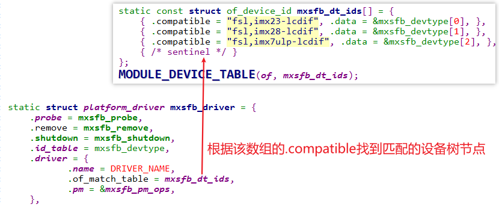
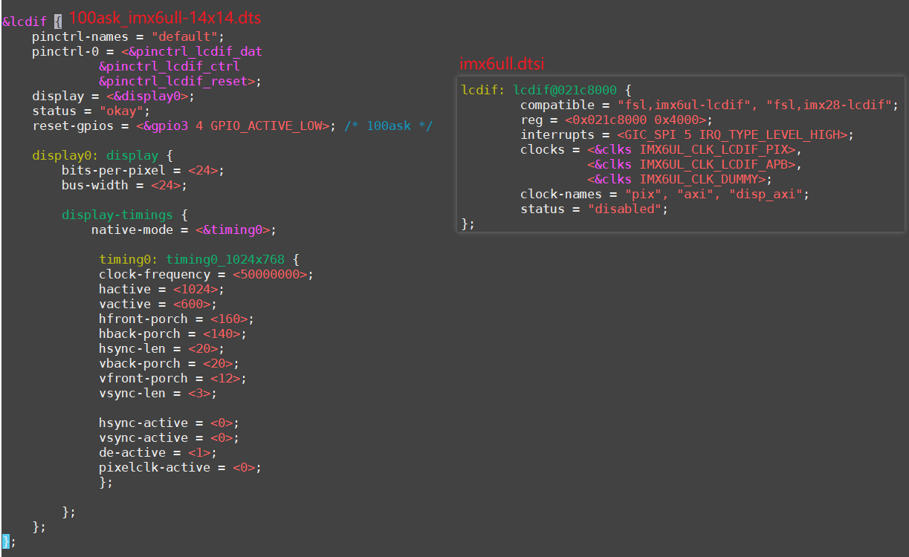
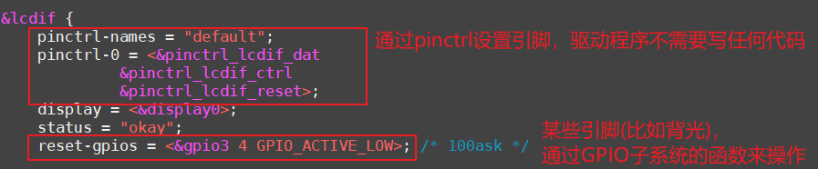
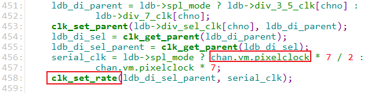

## 分析内核自带的LCD驱动程序\_基于IMX6ULL

参考资料，GIT仓库里：

* `IMX6ULL\开发板配套资料\datasheet\Core_board\CPU\IMX6ULLRM.pdf`
  * `《Chapter 34 Enhanced LCD Interface (eLCDIF)》`

* IMX6ULL的LCD裸机程序

  * `IMX6ULL\source\03_LCD\05_参考的裸机源码\03_font_test`

* 内核自带的IMX6ULL LCD驱动程序
  * 驱动源码：`Linux-4.9.88\drivers\video\fbdev\mxsfb.c`
  * 设备树：
    * `arch/arm/boot/dts/imx6ull.dtsi`
    * `arch/arm/boot/dts/100ask_imx6ull-14x14.dts`

### 1. 驱动程序框架

Linux驱动程序 = 驱动程序框架 + 硬件编程。
在前面已经基于QEMU编写了LCD驱动程序，对LCD驱动程序的框架已经分析清楚。
核心就是：

* 分配fb_info
* 设置fb_info
* 注册fb_info
* 硬件相关的设置


#### 1.1 入口函数注册platform_driver



#### 1.2 设备树有对应节点



#### 1.3 probe函数分析


### 2. 编写硬件相关的代码

我们只需要针对IMX6ULL的编写硬件相关的代码，涉及3部分：

* GPIO设置
  * LCD引脚
  * 背光引脚
* 时钟设置
  * 确定LCD控制器的时钟
  * 根据LCD的DCLK计算相关时钟
* LCD控制器本身的设置
  * 比如设置Framebuffer的地址
  * 设置Framebuffer中数据格式、LCD数据格式
  * 设置时序

#### 2.1 GPIO设置

有两种方法：

* 直接读写相关寄存器
* 使用设备树，在设备树中设置pinctrl
  * 本课程专注于LCD，所以使用pinctrl简化程序

设备树`arch/arm/boot/dts/100ask_imx6ull-14x14.dts`中：



#### 2.2 时钟设置

IMX6ULL的LCD控制器涉及2个时钟：


代码里直接使用时钟子系统的代码。

* 在设备树里指定频率：

  * 文件：arch/arm/boot/dts/100ask_imx6ull-14x14.dts

  * 代码：clock-frequency

    ```shell
           display-timings {
                native-mode = <&timing0>;
    
                 timing0: timing0_1024x768 {
                 clock-frequency = <50000000>;
    ```

    

* 从设备树获得dot clock，存入display_timing

  * 文件：drivers\video\of_display_timing.c

  * 代码：

    ```c
    ret |= parse_timing_property(np, "clock-frequency", &dt->pixelclock);
    ```

* 使用display_timing来设置videomode

  * 文件：drivers\video\videomode.c

  * 代码：

    ```c
    void videomode_from_timing(const struct display_timing *dt,
    			  struct videomode *vm)
    {
    	vm->pixelclock = dt->pixelclock.typ;
    	vm->hactive = dt->hactive.typ;
    	vm->hfront_porch = dt->hfront_porch.typ;
    	vm->hback_porch = dt->hback_porch.typ;
    	vm->hsync_len = dt->hsync_len.typ;
    
    	vm->vactive = dt->vactive.typ;
    	vm->vfront_porch = dt->vfront_porch.typ;
    	vm->vback_porch = dt->vback_porch.typ;
    	vm->vsync_len = dt->vsync_len.typ;
    
    	vm->flags = dt->flags;
    }
    
    ```

    

* 根据videomode的值，使用时钟子系统的函数设置时钟：

  * 文件：drivers\video\fbdev\mxc\ldb.c
  * 代码：
    

  

#### 2.3 LCD控制器的配置

以设置分辨率为例。
* 在设备树里指定频率：

  * 文件：arch/arm/boot/dts/100ask_imx6ull-14x14.dts

  * 代码：clock-frequency

    ```shell
           display-timings {
                native-mode = <&timing0>;
    
                 timing0: timing0_1024x768 {
    				hactive = <1024>;
    	            vactive = <600>;
    
    ```
* 从设备树获得分辨率，存入display_timing

  * 文件：drivers\video\of_display_timing.c

  * 代码：

    ```c
    	ret |= parse_timing_property(np, "hactive", &dt->hactive);
    	ret |= parse_timing_property(np, "vactive", &dt->vactive);
    ```

* 使用display_timing来设置videomode

  * 文件：drivers\video\videomode.c

  * 代码：

    ```c
    void videomode_from_timing(const struct display_timing *dt,
    			  struct videomode *vm)
    {
    	vm->hactive = dt->hactive.typ;
    
        vm->vactive = dt->vactive.typ;
    ```
    
    
  
* 根据videomode的值，设置fb_videomode

  * 文件：drivers\video\fbdev\core\fbmon.c

  * 代码：
    
    ```c
    int fb_videomode_from_videomode(const struct videomode *vm,
    				struct fb_videomode *fbmode)
    {
    	unsigned int htotal, vtotal;
    
    	fbmode->xres = vm->hactive;
    
        fbmode->yres = vm->vactive;
    
    ```

* 根据fb_videomode的值，设置fb_info中的var：

  * 文件：drivers\video\fbdev\core\modedb.c

  * 代码：

    ```c
    void fb_videomode_to_var(struct fb_var_screeninfo *var,
    			 const struct fb_videomode *mode)
    {
    	var->xres = mode->xres;
    	var->yres = mode->yres;
    
    ```

    

* 根据var的分辨率，设置寄存器

  * 文件：drivers\video\fbdev\mxsfb.c

  * 代码：

    ```c
    	writel(TRANSFER_COUNT_SET_VCOUNT(fb_info->var.yres) |
    			TRANSFER_COUNT_SET_HCOUNT(fb_info->var.xres),
    			host->base + host->devdata->transfer_count);
    
    ```