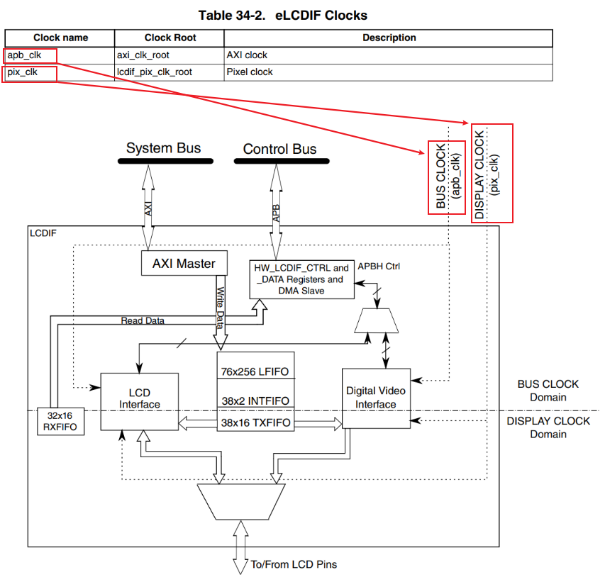

## 编程\_配置时钟\_基于IMX6ULL

参考资料，GIT仓库里：

* 芯片资料
  
  * `IMX6ULL\开发板配套资料\datasheet\Core_board\CPU\IMX6ULLRM.pdf`
    * `《Chapter 34 Enhanced LCD Interface (eLCDIF)》`
  
* IMX6ULL的LCD裸机程序

  * `IMX6ULL\source\03_LCD\05_参考的裸机源码\03_font_test`

* 内核自带的IMX6ULL LCD驱动程序
  * 驱动源码：`Linux-4.9.88\drivers\video\fbdev\mxsfb.c`
  * 设备树：
    * `arch/arm/boot/dts/imx6ull.dtsi`
    * `arch/arm/boot/dts/100ask_imx6ull-14x14.dts`
* 本节视频编写好的代码
  
  * `IMX6ULL\source\03_LCD\08_lcd_drv_clk_config_use_devicetree`
  
* 引脚配置工具/设备树生成工具

  * 打开：http://download.100ask.net/
  * 找到开发板："100ASK_IMX6ULL_PRO开发板"
  * 下载开发板配套资料
  * 下载完后，工具在如下目录里：

  

### 1. 硬件相关的操作

LCD驱动程序的核心就是：

* 分配fb_info
* 设置fb_info
* 注册fb_info
* 硬件相关的设置


硬件相关的设置又可以分为3部分：
  * 引脚设置
  * 时钟设置
  * LCD控制器设置


### 2. 分析内核自带的驱动程序

#### 2.1 芯片手册



#### 2.2 设备树

参考：`arch/arm/boot/dts/imx6ull.dtsi`

```shell
                       lcdif: lcdif@021c8000 {
                                compatible = "fsl,imx6ul-lcdif", "fsl,imx28-lcdif";
                                reg = <0x021c8000 0x4000>;
                                interrupts = <GIC_SPI 5 IRQ_TYPE_LEVEL_HIGH>;
                                clocks = <&clks IMX6UL_CLK_LCDIF_PIX>,
                                         <&clks IMX6UL_CLK_LCDIF_APB>,
                                         <&clks IMX6UL_CLK_DUMMY>;
                                clock-names = "pix", "axi", "disp_axi";
                                status = "disabled";
                        };
```

定义了3个时钟：

* pix：Pixel clock，用于LCD接口，设置为LCD手册上的参数
* axi：AXI clock，用于传输数据、读写寄存器，使能即可
* disp_axi：一个虚拟的时钟，可以不用设置


#### 2.3 代码

* 获得时钟

  ```c
  	host->clk_pix = devm_clk_get(&host->pdev->dev, "pix");
  	if (IS_ERR(host->clk_pix)) {
  		host->clk_pix = NULL;
  		ret = PTR_ERR(host->clk_pix);
  		goto fb_release;
  	}
  
  	host->clk_axi = devm_clk_get(&host->pdev->dev, "axi");
  	if (IS_ERR(host->clk_axi)) {
  		host->clk_axi = NULL;
  		ret = PTR_ERR(host->clk_axi);
  		dev_err(&pdev->dev, "Failed to get axi clock: %d\n", ret);
  		goto fb_release;
  	}
  
  	host->clk_disp_axi = devm_clk_get(&host->pdev->dev, "disp_axi");
  	if (IS_ERR(host->clk_disp_axi)) {
  		host->clk_disp_axi = NULL;
  		ret = PTR_ERR(host->clk_disp_axi);
  		dev_err(&pdev->dev, "Failed to get disp_axi clock: %d\n", ret);
  		goto fb_release;
  	}
  ```

* 设置频率：只需要设置pixel clock的频率

  ```c
  		ret = clk_set_rate(host->clk_pix,
  				PICOS2KHZ(fb_info->var.pixclock) * 1000U);
  ```

* 使能时钟

  ```c
  		clk_enable_pix(host);
  			clk_prepare_enable(host->clk_pix);
  		clk_enable_axi(host);
  			clk_prepare_enable(host->clk_axi);
  		clk_enable_disp_axi(host);
  			clk_prepare_enable(host->clk_disp_axi);
  ```

  

### 3. 自己写代码