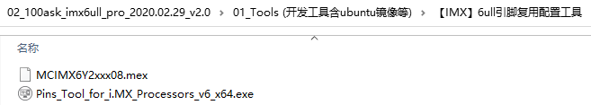
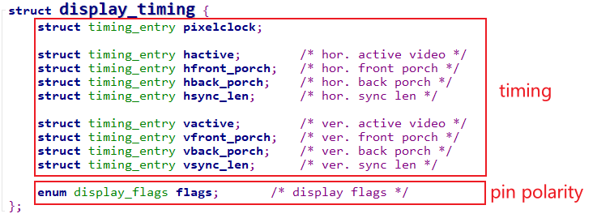

## 编程\_配置LCD控制器\_基于IMX6ULL

参考资料，GIT仓库里：

* 芯片资料
  
  * `IMX6ULL\开发板配套资料\datasheet\Core_board\CPU\IMX6ULLRM.pdf`
    * `《Chapter 34 Enhanced LCD Interface (eLCDIF)》`
  
* IMX6ULL的LCD裸机程序

  * `IMX6ULL\source\03_LCD\05_参考的裸机源码\03_font_test`

* 内核自带的IMX6ULL LCD驱动程序
  * 驱动源码：`Linux-4.9.88\drivers\video\fbdev\mxsfb.c`
  * 设备树：
    * `arch/arm/boot/dts/imx6ull.dtsi`
    * `arch/arm/boot/dts/100ask_imx6ull-14x14.dts`
* 本节视频编写好的代码
  
  * `IMX6ULL\source\03_LCD\09_lcd_drv_lcdcontroller_config_use_devicetree`
  
* 引脚配置工具/设备树生成工具

  * 打开：http://download.100ask.net/
  * 找到开发板："100ASK_IMX6ULL_PRO开发板"
  * 下载开发板配套资料
  * 下载完后，工具在如下目录里：

  

### 1. 硬件相关的操作

LCD驱动程序的核心就是：

* 分配fb_info
* 设置fb_info
* 注册fb_info
* 硬件相关的设置


硬件相关的设置又可以分为3部分：
  * 引脚设置
  * 时钟设置
  * LCD控制器设置


### 2. 在设备树里指定LCD参数

```shell
	framebuffer-mylcd {
			compatible = "100ask,lcd_drv";
	        pinctrl-names = "default";
			pinctrl-0 = <&mylcd_pinctrl>;
			backlight-gpios = <&gpio1 8 GPIO_ACTIVE_HIGH>;

            clocks = <&clks IMX6UL_CLK_LCDIF_PIX>,
                     <&clks IMX6UL_CLK_LCDIF_APB>;
            clock-names = "pix", "axi";
            
            display = <&display0>;

			display0: display {
				bits-per-pixel = <24>;
				bus-width = <24>;

				display-timings {
					native-mode = <&timing0>;

					 timing0: timing0_1024x768 {
					 clock-frequency = <50000000>;
					 hactive = <1024>;
					 vactive = <600>;
					 hfront-porch = <160>;
					 hback-porch = <140>;
					 hsync-len = <20>;
					 vback-porch = <20>;
					 vfront-porch = <12>;
					 vsync-len = <3>;

					 hsync-active = <0>;
					 vsync-active = <0>;
					 de-active = <1>;
					 pixelclk-active = <0>;
					 };

				};
			};            
	};
```


### 3. 编程

#### 3.1 从设备树获得参数

时序参数、引脚极性等信息，都被保存在一个display_timing结构体里：



参考内核文件：

* `drivers\video\of_display_timing.c`

* `drivers\video\fbdev\mxsfb.c`

  

#### 3.2 使用参数配置LCD控制器

