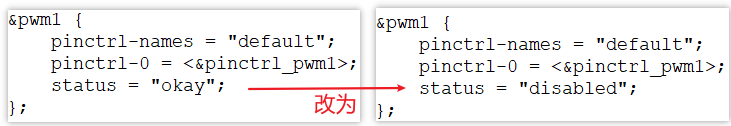

## 上机实验\_基于IMX6ULL

参考资料，GIT仓库里：

* 芯片资料
  
  * `IMX6ULL\开发板配套资料\datasheet\Core_board\CPU\IMX6ULLRM.pdf`
    * `《Chapter 34 Enhanced LCD Interface (eLCDIF)》`
  
* IMX6ULL的LCD裸机程序

  * `IMX6ULL\source\03_LCD\05_参考的裸机源码\03_font_test`

* 内核自带的IMX6ULL LCD驱动程序
  * 驱动源码：`Linux-4.9.88\drivers\video\fbdev\mxsfb.c`
  * 设备树：
    * `arch/arm/boot/dts/imx6ull.dtsi`
    * `arch/arm/boot/dts/100ask_imx6ull-14x14.dts`
* 本节视频测试通过的代码
  
  * `IMX6ULL\source\03_LCD\11_lcd_drv_imx6ull_ok`
  
* 搭建开发环境
* 视频：https://www.100ask.net/
    * 《Linux系列教程之快速入门》之《【第2篇】环境搭建、Linux基本操作、工具使用》
  * 文档：` git clone https://e.coding.net/weidongshan/01_all_series_quickstart.git`
    * 《嵌入式Linux应用开发完全手册\_韦东山全系列视频文档全集V2.8.pdf》

### 1. 要做的事情

* 去除内核自带的驱动程序

* 加入我们编写的驱动程序、设备树文件

* 重新编译内核、设备树

* 上机测试：使用编译出来的内核、设备树启动板子

  

### 2. 去除内核自带的驱动程序

修改内核文件：`drivers/video/fbdev/Makefile`，把内核自带驱动程序mxsfb.c对应的那行注释掉，如下：

```shell
#obj-$(CONFIG_FB_MXS)             += mxsfb.o
```


### 3. 加入新驱动程序、设备树
* 复制驱动程序：
  * 把`11_lcd_drv_imx6ull_ok\lcd_drv.c`放到内核源码目录`drivers/video/fbdev`
  * 备份内核自带设备树文件：`arch/arm/boot/dts/100ask_imx6ull-14x14.dts`
  * 把`11_lcd_drv_imx6ull_ok\100ask_imx6ull-14x14.dts`放到内核源码目录`arch/arm/boot/dts/`

* 修改内核文件：
  * 修改：`drivers/video/fbdev/Makefile`，使用我们提供的lcd_drv.c，如下：

```shell
#obj-$(CONFIG_FB_MXS)             += mxsfb.o
obj-$(CONFIG_FB_MXS)             += lcd_drv.o
```


### 4. 重新编译内核、设备树

**以下命令在Ubuntu中执行。**

* 设置工具链

  ```shell
  export ARCH=arm
  export CROSS_COMPILE=arm-linux-gnueabihf-
  export PATH=$PATH:/home/book/100ask_imx6ull-sdk/ToolChain/gcc-linaro-6.2.1-2016.11-x86_64_arm-linux-gnueabihf/bin
  ```

* 配置、编译

  ```shell
  book@100ask:~/100ask_imx6ull-sdk$ cd Linux-4.9.88
  book@100ask:~/100ask_imx6ull-sdk/Linux-4.9.88$ make 100ask_imx6ull_defconfig   
  book@100ask:~/100ask_imx6ull-sdk/Linux-4.9.88$ make zImage 
  book@100ask:~/100ask_imx6ull-sdk/Linux-4.9.88$ make dtbs
  ```

* 得到
  * 内核：`arch/arm/boot/zImage`
  * 设备树文件：`arch/arm/boot/dts/100ask_imx6ull-14x14.dtb`
  
* 复制到NFS目录：

  ```shell
  $ cp arch/arm/boot/zImage ~/nfs_rootfs/
  $ cp arch/arm/boot/dts/100ask_imx6ull-14x14.dtb ~/nfs_rootfs/
  ```

  

### 5. 上机测试

**以下命令在开发板中执行。**

* 挂载NFS

  * vmware使用NAT(假设windowsIP为192.168.1.100)

    ```shell
    [root@100ask:~]# mount -t nfs -o nolock,vers=3,port=2049,mountport=9999 
    192.168.1.100:/home/book/nfs_rootfs /mnt
    ```

  * vmware使用桥接，或者不使用vmware而是直接使用服务器：假设Ubuntu IP为192.168.1.137

    ```shell
    [root@100ask:~]#  mount -t nfs -o nolock,vers=3 192.168.1.137:/home/book/nfs_rootfs /mnt
    ```

* 更新单板文件

  ```shell
  [root@100ask:~]# cp /mnt/zImage /boot
  [root@100ask:~]# cp /mnt/100ask_imx6ull-14x14.dtb /boot
  [root@100ask:~]# sync
  ```

* 重启开发板观察现象

  * 如果可以看到企鹅LOGO，就表示正常
  
  * 如果在终端中可以查看到存在`/dev/fb0`节点，也表示正常
  
    
  
* 解决BUG

  * 现象：LCD上没有企鹅LOGO，在终端中执行`ls -l /dev/fb0`发现没有设备节点

  * 观察内核启动信息，看到：

    ```shell
    [    0.619880] imx6ul-pinctrl 20e0000.iomuxc: pin MX6UL_PAD_GPIO1_IO08 already requested by 2080000.pwm; cannot claim for 21c8000.framebuffer-mylcd
    [    0.619920] imx6ul-pinctrl 20e0000.iomuxc: pin-31 (21c8000.framebuffer-mylcd) status -22
    [    0.619954] imx6ul-pinctrl 20e0000.iomuxc: could not request pin 31 (MX6UL_PAD_GPIO1_IO08) from group mylcd_pingrp  on device 20e0000.iomuxc
    [    0.619985] mylcd 21c8000.framebuffer-mylcd: Error applying setting, reverse things back
    [    0.620070] mylcd: probe of 21c8000.framebuffer-mylcd failed with error -22
    ```

  * 原因：引脚冲突

    * 设备树中pwm节点、framebuffer-mylcd节点，都使用到的同一个引脚：PAD_GPIO1_IO08

  * 解决方法：修改`arch/arm/boot/dts/100ask_imx6ull-14x14.dts`，禁止pwm节点，如下：
    

