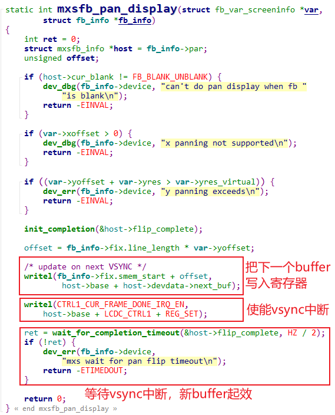

## 单Buffer的缺点与改进方法

参考资料，GIT仓库里：

* 内核自带的LCD驱动程序
  
  * IMX6ULL驱动源码：`Linux-4.9.88\drivers\video\fbdev\mxsfb.c`
  * STM32MP157的驱动程序是基于GPU的，在Linux-5.4里没有mxsfb.c，可以参考另一个：
    * `Linux-5.4\drivers\video\fbdev\goldfishfb.c`
  * 在视频里基于IMX6ULL的mxsfb.c来讲解，我们把这个驱动程序也放到GIT仓库里
    * `IMX6ULL\source\03_LCD\12_lcd_drv_imx6ull_from_kernel_4.9.88`
    * `STM32MP157\source\A7\03_LCD\12_lcd_drv_imx6ull_from_kernel_4.9.88`
  * 使用多buffer的APP参考程序，在GIT仓库中
    * `IMX6ULL\source\03_LCD\13_multi_framebuffer_example\testcamera`
    * `STM32MP157\source\A7\03_LCD\13_multi_framebuffer_example\testcamera`
  
  
  

### 1. 单Buffer的缺点

* 如果APP速度很慢，可以看到它在LCD上缓慢绘制图案

* 即使APP速度很高，LCD控制器不断从Framebuffer中读取数据来显示，而APP不断把数据写入Framebuffer

  * 假设APP想把LCD显示为整屏幕的蓝色、红色

  * 很大几率出现这种情况：

    * LCD控制器读取Framebuffer数据，读到一半时，在LCD上显示了半屏幕的蓝色
    * 这是APP非常高效地把整个Framebuffer的数据都改为了红色
    * LCD控制器继续读取数据，于是LCD上就会显示半屏幕蓝色、半屏幕红色
    * 人眼就会感觉到屏幕闪烁、撕裂

    

### 2. 使用多Buffer来改进

上述两个缺点的根源是一致的：Framebuffer中的数据还没准备好整帧数据，就被LCD控制器使用了。
使用双buffer甚至多buffer可以解决这个问题：

* 假设有2个Framebuffer：FB0、FB1
* LCD控制器正在读取FB0
* APP写FB1
* 写好FB1后，让LCD控制器切换到FB1
* APP写FB0
* 写好FB0后，让LCD控制器切换到FB0	


### 3. 内核驱动程序、APP互相配合使用多buffer

流程如下：


* 驱动：分配多个buffer

  ```c
  fb_info->fix.smem_len = SZ_32M;
  fbi->screen_base = dma_alloc_writecombine(fbi->device,
  				fbi->fix.smem_len,
  				(dma_addr_t *)&fbi->fix.smem_start,
  				GFP_DMA | GFP_KERNEL);
  ```

  

* 驱动：保存buffer信息

  ```c
  fb_info->fix.smem_len  // 含有总buffer大小 
  fb_info->var           // 含有单个buffer信息
  ```

* APP：读取buffer信息

  ```c
  ioctl(fd_fb, FBIOGET_FSCREENINFO, &fix);
  ioctl(fd_fb, FBIOGET_VSCREENINFO, &var);
  
  // 计算是否支持多buffer，有多少个buffer
  screen_size = var.xres * var.yres * var.bits_per_pixel / 8;
  nBuffers = fix.smem_len / screen_size;
  ```

* APP：使能多buffer

  ```c
  var.yres_virtual = nBuffers * var.yres;
  ioctl(fd_fb, FBIOPUT_VSCREENINFO, &var);
  ```

* APP：写buffer

  ```c
  fb_base = (unsigned char *)mmap(NULL , fix.smem_len, PROT_READ | PROT_WRITE, MAP_SHARED, fd_fb, 0);
  
  /* get buffer */
  pNextBuffer =  fb_base + nNextBuffer * screen_size;
  
  /* set buffer */
  lcd_draw_screen(pNextBuffer, colors[i]);
  ```

* APP：开始切换buffer

  ```c
  /* switch buffer */
  var.yoffset = nNextBuffer * var.yres;
  ioctl(fd_fb, FBIOPAN_DISPLAY, &var);
  ```

* 驱动：切换buffer

  ```c
  // fbmem.c
  fb_ioctl
      do_fb_ioctl
      	fb_pan_display(info, &var);
  			err = info->fbops->fb_pan_display(var, info) // 调用硬件相关的函数            
  ```

  示例：
  


* APP：等待切换完成(在驱动程序中已经等待切换完成了，所以这个调用并无必要)

  ```c
  ret = 0;
  ioctl(fd_fb, FBIO_WAITFORVSYNC, &ret);
  ```

  