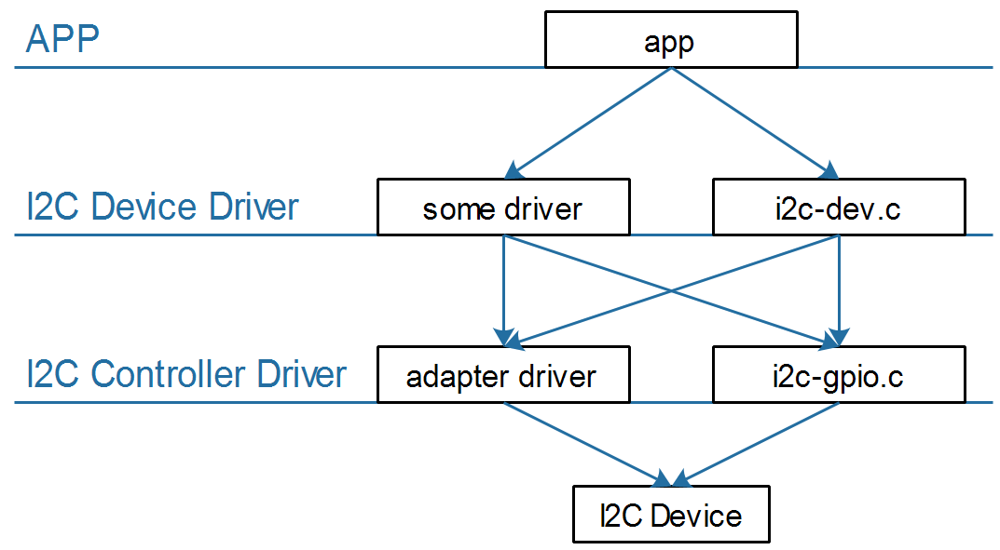

## I2C视频介绍

参考资料：

* I2CTools：https://mirrors.edge.kernel.org/pub/software/utils/i2c-tools/

  

### 1. I2C硬件框架

* 在一个芯片(SoC)内部，有一个或多个I2C控制器
* 在一个I2C控制器上，可以连接一个或多个I2C设备
* I2C总线只需要2条线：时钟线SCL、数据线SDA
* 在I2C总线的SCL、SDA线上，都有上拉电阻

### 2. I2C软件框架

以I2C接口的存储设备AT24C02为例：

* APP：
  * 提出要求：把字符串"www.100ask.net"写入AT24C02地址16开始的地方
  * 它是大爷，不关心底层实现的细节
  * 它只需要调用设备驱动程序提供的接口
* AT24C02驱动：
  * 它知道AT24C02要求的地址、数据格式
  * 它知道发出什么信号才能让AT24C02执行擦除、烧写工作
  * 它知道怎么判断数据是否烧写成功
  * 它构造好一系列的数据，发给I2C控制器
* I2C控制器驱动
  * 它根据I2C协议发出各类信号：I2C设备地址、I2C存储地址、数据
  * 它根据I2C协议判断

### 3. 我们讲什么

####  3.1 对于Linux

从上到下：

* 先讲I2C协议
* APP可以通过两类驱动程序访问设备
  * I2C设备自己的驱动程序
  * 内核自带的i2c-dev.c驱动程序，它是i2c控制器驱动程序暴露给用户空间的驱动程序(i2c-dev.c)
* I2C Device Driver
  * I2C设备自己的驱动程序
  * 内核自带的i2c-dev.c驱动程序，它是i2c控制器驱动程序暴露给用户空间的驱动程序(i2c-dev.c)
* I2C Controller Driver
  * 芯片I2C控制器的驱动程序(称为adapter)
  * 使用GPIO模拟的I2C控制器驱动程序(i2c-gpio.c)

#### 3.2 对于单片机/裸机

从上到下：

* 先讲I2C协议
* APP
* I2C Device Driver
* I2C Controller Driver(也被称为adapter)