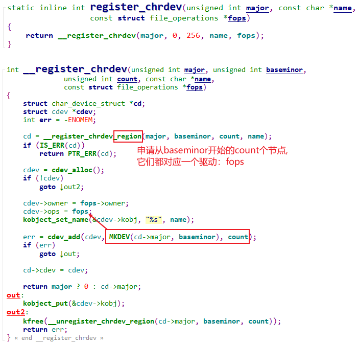
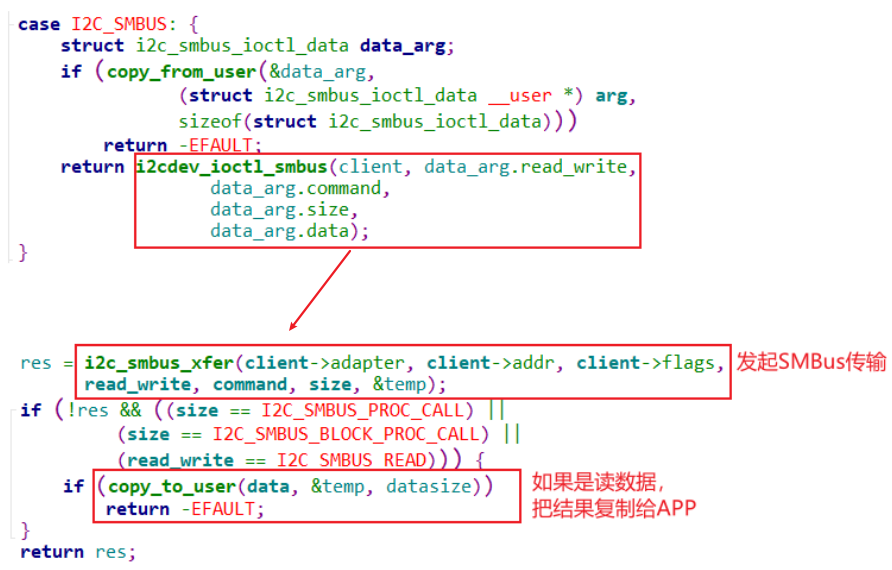

## 通用驱动i2c-dev分析

参考资料：

* Linux驱动程序: `drivers/i2c/i2c-dev.c`
* I2C-Tools-4.2: `https://mirrors.edge.kernel.org/pub/software/utils/i2c-tools/`
* AT24cxx.pdf

### 1. 回顾字符设备驱动程序


怎么编写字符设备驱动程序？

* 确定主设备号
* 创建file_operations结构体
  * 在里面填充drv_open/drv_read/drv_ioctl等函数
* 注册file_operations结构体
  * register_chrdev(major, &fops, name)
* 谁调用register_chrdev？在入口函数调用
* 有入口自然就有出口
  * 在出口函数unregister_chrdev
* 辅助函数(帮助系统自动创建设备节点)
  * class_create
  * device_create


### 2. i2c-dev.c注册过程分析

 #### 2.1 register_chrdev的内部实现

  


#### 2.2 i2c-dev驱动的注册过程


### 3. file_operations函数分析

i2c-dev.c的核心：

```c
static const struct file_operations i2cdev_fops = {
	.owner		= THIS_MODULE,
	.llseek		= no_llseek,
	.read		= i2cdev_read,
	.write		= i2cdev_write,
	.unlocked_ioctl	= i2cdev_ioctl,
	.compat_ioctl	= compat_i2cdev_ioctl,
	.open		= i2cdev_open,
	.release	= i2cdev_release,
};
```

主要的系统调用：open, ioctl：


要理解这些接口，记住一句话：APP通过I2C Controller与I2C Device传输数据。

#### 3.1 i2cdev_open


#### 3.2 i2cdev_ioctl: I2C_SLAVE/I2C_SLAVE_FORCE


#### 3.3 i2cdev_ioctl: I2C_RDWR


#### 3.4 i2cdev_ioctl: I2C_SMBUS




#### 3.5 总结

