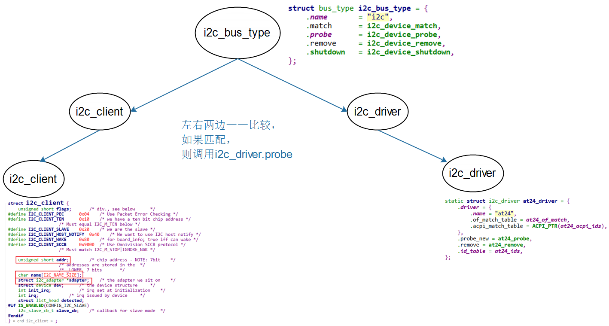
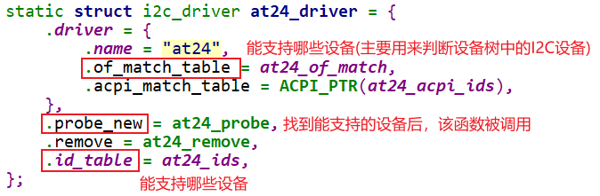
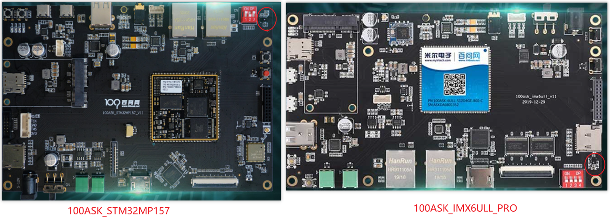

## 编写设备驱动之i2c_driver

参考资料：

* Linux内核文档:
  * `Documentation\i2c\instantiating-devices.rst`
  * `Documentation\i2c\writing-clients.rst`
* Linux内核驱动程序示例:
  * `drivers/eeprom/at24.c`
* 本节代码：GIT仓库中
  * 框架：
    * `IMX6ULL\source\04_I2C\02_i2c_driver_example`
    * `STM32MP157\source\A7\04_I2C\02_i2c_driver_example`
  * AP3216C
    * `IMX6ULL\source\04_I2C\03_ap3216c`
    * `STM32MP157\source\A7\04_I2C\03_ap3216c`

### 1. 套路

#### 1.1 I2C总线-设备-驱动模型

#### 1.2 示例

分配、设置、注册一个i2c_driver结构体，类似`drivers/eeprom/at24.c`：

在probe_new函数中，分配、设置、注册file_operations结构体。
在file_operations的函数中，使用i2c_transfer等函数发起I2C传输。

### 2. 编写i2c_driver

#### 2.1 先写一个框架

#### 2.2 在为AP3216C编写代码
百问网的开发板上有光感芯片AP3216C：

AP3216C是红外、光强、距离三合一的传感器，以读出光强、距离值为例，步骤如下：

* 复位：往寄存器0写入0x4
* 使能：往寄存器0写入0x3
* 读红外：读寄存器0xA、0xB得到2字节的红外数据
* 读光强：读寄存器0xC、0xD得到2字节的光强
* 读距离：读寄存器0xE、0xF得到2字节的距离值

AP3216C的设备地址是0x1E。

### 3. 构造i2c_client

下节视频。

