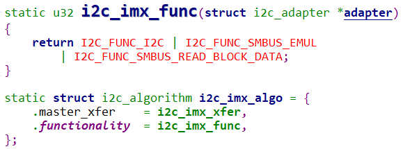

## I2C\_Adapter驱动框架讲解与编写

参考资料：

* Linux内核文档:
  * `Linux-4.9.88\Documentation\devicetree\bindings\i2c\i2c-gpio.txt`
  * `Linux-5.4\Documentation\devicetree\bindings\i2c\i2c-gpio.yaml`
  
* Linux内核驱动程序：使用GPIO模拟I2C
  
  * `Linux-4.9.88\drivers\i2c\busses\i2c-gpio.c`
  * `Linux-5.4\drivers\i2c\busses\i2c-gpio.c`
  
* Linux内核真正的I2C控制器驱动程序

  * IMX6ULL: `Linux-4.9.88\drivers\i2c\busses\i2c-imx.c`
  * STM32MP157: `Linux-5.4\drivers\i2c\busses\i2c-stm32f7.c`
* 本节视频的代码在GIT仓库里
  * IMX6ULL：`doc_and_source_for_drivers\IMX6ULL\source\04_I2C\05_i2c_adapter_framework`
  * STM32MP157：`doc_and_source_for_drivers\STM32MP157\source\A7\04_I2C\05_i2c_adapter_framework`

### 1. 回顾

#### 1.1 2C驱动程序的层次


#### 1.2 I2C总线-设备-驱动模型


### 2. I2C_Adapter驱动框架

#### 2.1 核心的结构体

##### 1. i2c_adapter

  

##### 2. i2c_algorithm


* master_xfer：这是最重要的函数，它实现了一般的I2C传输，用来传输一个或多个i2c_msg

* master_xfer_atomic：

  * 可选的函数，功能跟master_xfer一样，在`atomic context`环境下使用
  * 比如在关机之前、所有中断都关闭的情况下，用来访问电源管理芯片

* smbus_xfer：实现SMBus传输，如果不提供这个函数，SMBus传输会使用master_xfer来模拟

* smbus_xfer_atomic：

  * 可选的函数，功能跟smbus_xfer一样，在`atomic context`环境下使用
  * 比如在关机之前、所有中断都关闭的情况下，用来访问电源管理芯片

* functionality：返回所支持的flags：各类I2C_FUNC_*

* reg_slave/unreg_slave：

  * 有些I2C Adapter也可工作与Slave模式，用来实现或模拟一个I2C设备
* reg_slave就是让把一个i2c_client注册到I2C Adapter，换句话说就是让这个I2C Adapter模拟该i2c_client
  * unreg_slave：反注册

  

  

#### 2.2 驱动程序框架

分配、设置、注册一个i2c_adpater结构体：

* i2c_adpater的核心是i2c_algorithm
* i2c_algorithm的核心是master_xfer函数

#### 1. 所涉及的函数

* 分配

  ```c
  struct i2c_adpater *adap = kzalloc(sizeof(struct i2c_adpater), GFP_KERNEL);
  ```

* 设置

  ```c
  adap->owner = THIS_MODULE;
  adap->algo = &stm32f7_i2c_algo;
  ```

* 注册：i2c_add_adapter/i2c_add_numbered_adapter

  ```c
  ret = i2c_add_adapter(adap);          // 不管adap->nr原来是什么，都动态设置adap->nr
  ret = i2c_add_numbered_adapter(adap); // 如果adap->nr == -1 则动态分配nr; 否则使用该nr   
  ```

* 反注册

  ```c
  i2c_del_adapter(adap);
  ```

#### 2. i2c_algorithm示例

* Linux-5.4中使用GPIO模拟I2C
  


* Linux-5.4中STM32F157的I2C驱动
  


* Linux-4.9.88中IMX6ULL的I2C驱动
  


### 3. 编写一个框架程序

#### 3.1 设备树

在设备树里构造I2C Bus节点：

```shell
	i2c-bus-virtual {
		 compatible = "100ask,i2c-bus-virtual";
	};
```


#### 3.2 platform_driver

分配、设置、注册platform_driver结构体。

核心是probe函数，它要做这几件事：

* 根据设备树信息设置硬件(引脚、时钟等)
* 分配、设置、注册i2c_apdater

#### 3.3 i2c_apdater

i2c_apdater核心是master_xfer函数，它的实现取决于硬件，大概代码如下：

```c
static int xxx_master_xfer(struct i2c_adapter *adapter,
						struct i2c_msg *msgs, int num)
{
    for (i = 0; i < num; i++) {
        struct i2c_msg *msg = msgs[i];
        {
        	// 1. 发出S信号: 设置寄存器发出S信号
            CTLREG = S;
            
            // 2. 根据Flag发出设备地址和R/W位: 把这8位数据写入某个DATAREG即可发出信号
            //    判断是否有ACK
            
            if (!ACK)
                return ERROR;
            else {
	            // 3. read / write
	            if (read) {
                    STATUS = XXX; // 这决定读到一个数据后是否发出ACK给对方
                    val = DATAREG; // 这会发起I2C读操作
                } else if(write) {
                    DATAREG = val; // 这会发起I2C写操作
                    val = STATUS;  // 判断是否收到ACK
                    if (!ACK)
                        return ERROR;
                }                
            }
            // 4. 发出P信号
            CTLREG = P;
        }
    }
    
    return i;
}
```


