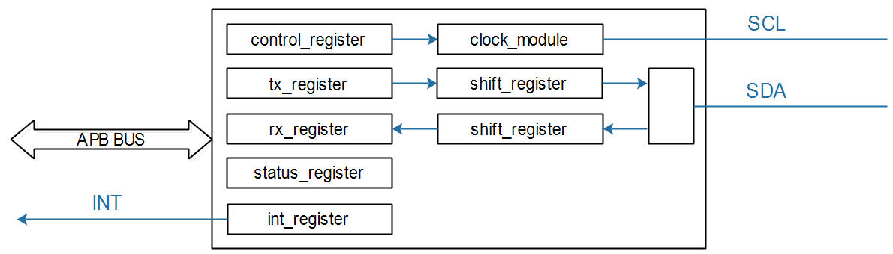
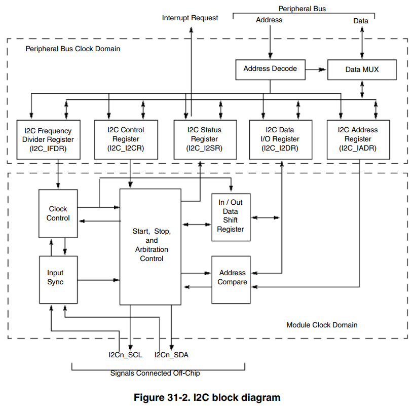
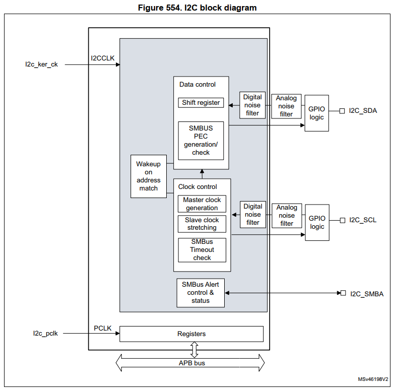
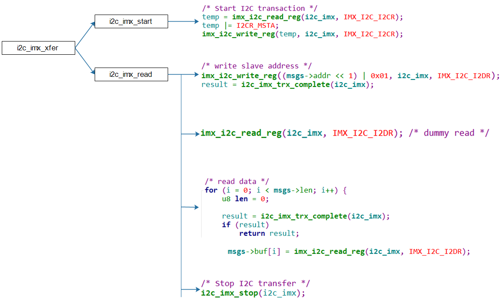
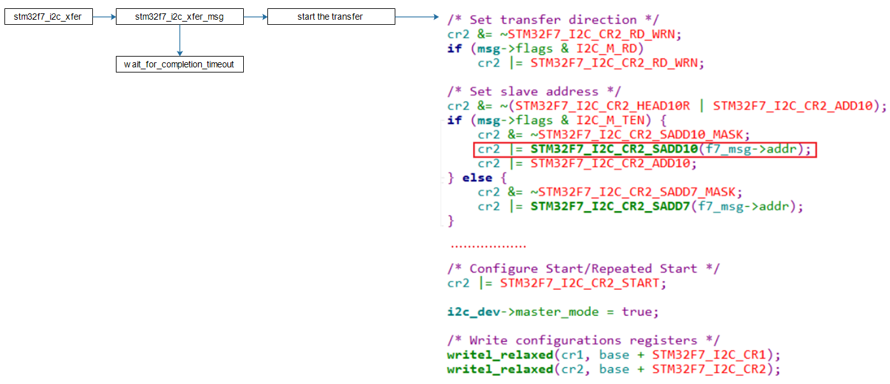
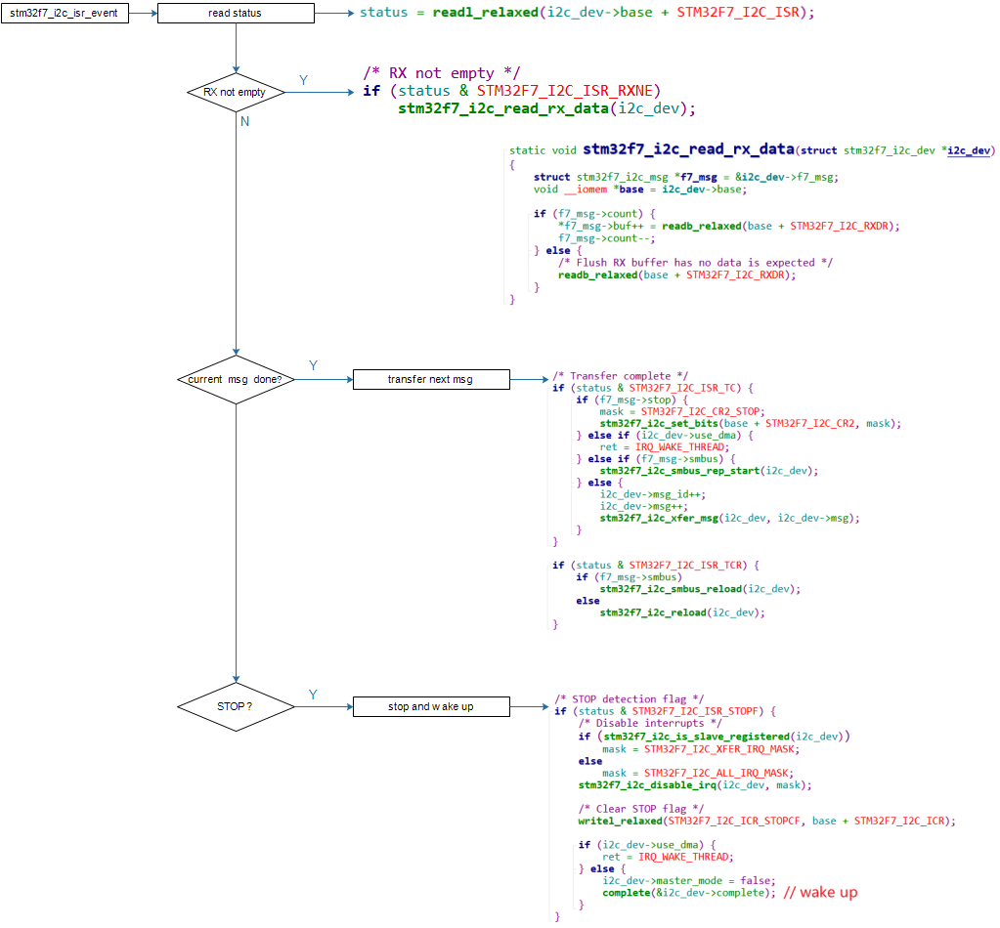

## 具体芯片的I2C_Adapter驱动分析

参考资料：

* Linux内核真正的I2C控制器驱动程序
  * IMX6ULL: `Linux-4.9.88\drivers\i2c\busses\i2c-imx.c`
  * STM32MP157: `Linux-5.4\drivers\i2c\busses\i2c-stm32f7.c`
* 芯片手册
  * IMXX6ULL：`IMX6ULLRM.pdf`
    * `Chapter 31: I2C Controller (I2C)`
  * STM32MP157：`DM00327659.pdf`
    * `52 Inter-integrated circuit (I2C) interface`

### 1. I2C控制器内部结构

#### 1.1 通用的简化结构



#### 1.2 IMX6ULL的I2C控制器内部结构



#### 1.3 STM32MP157的I2C控制器内部结构



### 2. I2C控制器操作方法

* 使能时钟、设置时钟
* 发送数据：
  * 把数据写入**tx_register**，等待中断发生
  * 中断发生后，判断状态：是否发生错误、是否得到回应信号(ACK)
  * 把下一个数据写入**tx_register**，等待中断：如此循环
* 接收数据：
  * 设置**controller_register**，进入接收模式，启动接收，等待中断发生
  * 中断发生后，判断状态，读取**rx_register**得到数据
  * 如此循环

### 3. 分析代码

#### 3.1 设备树

* IMX6ULL:  `arch/arm/boot/dts/imx6ull.dtsi`

  ```shell
  i2c1: i2c@021a0000 {
  		#address-cells = <1>;
  		#size-cells = <0>;
  		compatible = "fsl,imx6ul-i2c", "fsl,imx21-i2c";
  		reg = <0x021a0000 0x4000>;
  		interrupts = <GIC_SPI 36 IRQ_TYPE_LEVEL_HIGH>;
  		clocks = <&clks IMX6UL_CLK_I2C1>;
  		status = "disabled";   // 在100ask_imx6ull-14x14.dts把它改为了"okay"
  };
  ```

* STM32MP157:  `arch/arm/boot/dts/stm32mp151.dtsi`

  ```shell
  i2c1: i2c@40012000 {
  		compatible = "st,stm32mp15-i2c";
  		reg = <0x40012000 0x400>;
  		interrupt-names = "event", "error";
  		interrupts-extended = <&exti 21 IRQ_TYPE_LEVEL_HIGH>,
  							  <&intc GIC_SPI 32 IRQ_TYPE_LEVEL_HIGH>;
  		clocks = <&rcc I2C1_K>;
  		resets = <&rcc I2C1_R>;
  		#address-cells = <1>;
  		#size-cells = <0>;
  		dmas = <&dmamux1 33 0x400 0x80000001>,
  			   <&dmamux1 34 0x400 0x80000001>;
  		dma-names = "rx", "tx";
  		power-domains = <&pd_core>;
  		st,syscfg-fmp = <&syscfg 0x4 0x1>;
  		wakeup-source;
  		status = "disabled";   // 在stm32mp15xx-100ask.dtsi把它改为了"okay"
  };
  ```


#### 3.2 驱动程序分析

读I2C数据时，要先发出设备地址，这是写操作，然后再发起读操作，涉及写、读操作。所以以读I2C数据为例讲解核心代码。

* IMX6ULL：函数`i2c_imx_xfer`分析：
  


* STM32MP157：函数`stm32f7_i2c_xfer`分析
  这函数完全有驱动程序来驱动：启动传输后，就等待；在中断服务程序里传输下一个数据，知道传输完毕。

  * 启动传输
    

  * 通过中断进行后续传输
    