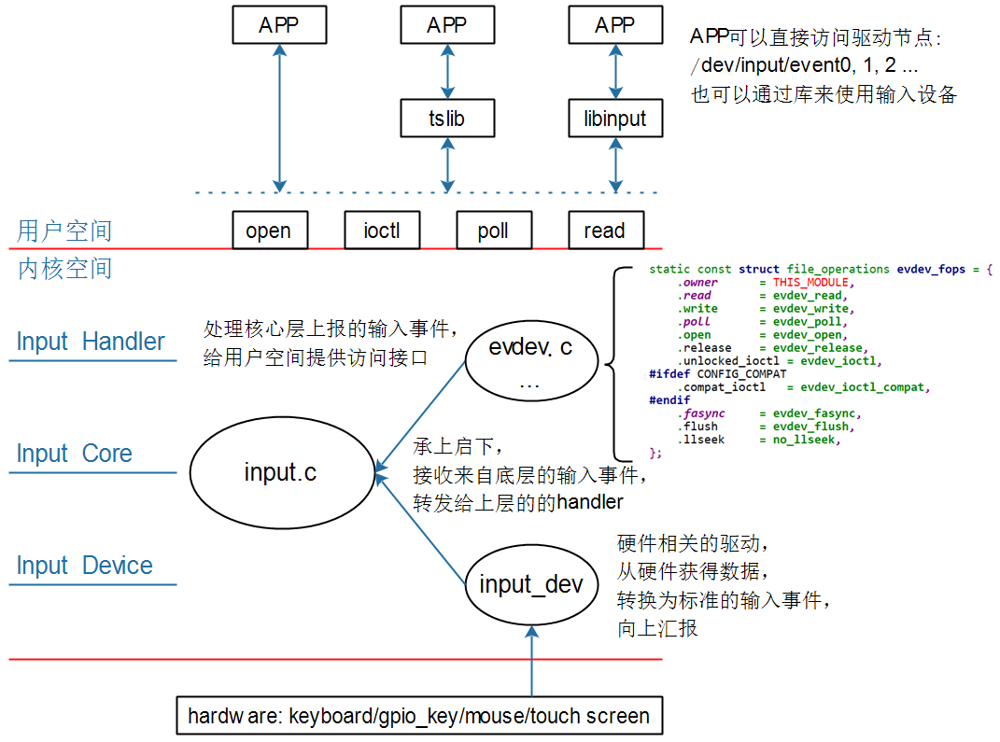

## Input子系统视频介绍

参考资料：

* Linux 5.x内核文档
* Documentation\input\input-programming.rst
  * Documentation\input\event-codes.rst
* Linux 4.x内核文档
  * Documentation\input\input-programming.txt
  * Documentation\input\event-codes.txt

### 1. 输入设备的种类

输入设备种类很多，有GPIO按键、鼠标、电阻触摸屏、电容触摸屏、USB键盘、遥控手柄等等。
安装它能产生的数据类型，可以分为(前面3项比较容易理解，后面的就属于扩展了)：

* 按键：EV_KEY，比如键盘
* 相对位移：EV_REL，比如鼠标
* 绝对位移：EV_ABS，比如触摸屏
* 杂项：EV_MSC
* 软件：EV_SW
* LED：EV_LED
* 声音：EV_SND
* 会自动发出重复按键：EV_REP
* 电源开关、按键：EV_PWR

### 2. 输入设备的驱动程序框架

有没有一个驱动程序，能支持那么多的设备？没有！
有没有一套驱动程序，容易扩展，最终能支持那么多的设备？有！
这就是输入子系统的驱动程序，框架如下：

### 3. 讲什么内容

#### 3.1 框架

#### 3.2 evdev.c剖析

#### 3.3 input_dev驱动编写

#### 3.4 GPIO按键驱动分析与使用

* 分析内核自带的GPIO按键驱动：drivers\input\keyboard\gpio_keys.c
* 使用

#### 3.5 在QEMU上实现最简单的触摸屏驱动

#### 3.6 I2C接口的触摸屏驱动分析与实践

#### 3.7 UInput: 用户态模拟输入设备