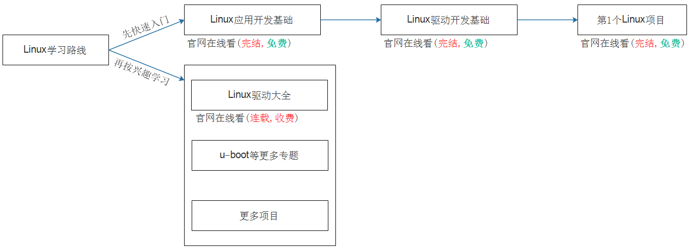
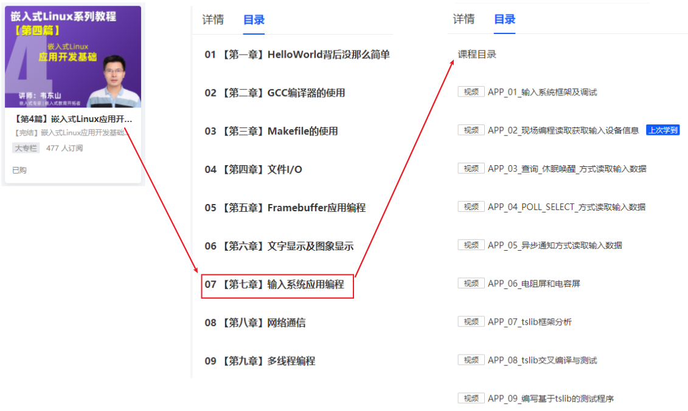
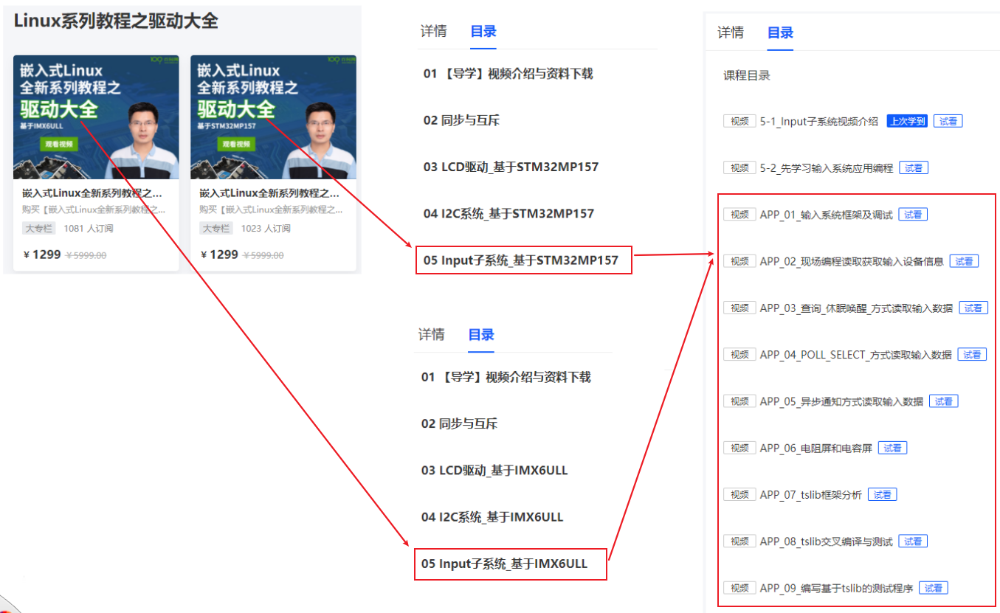
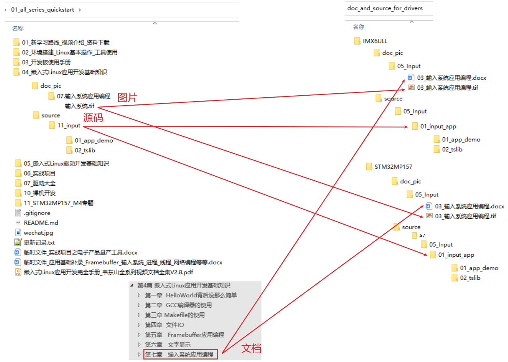

## 先学习输入系统应用编程

### 1. 百问网Linux视频体系



### 2. 建议

在《Linux系列教程之快速入门》的《嵌入式Linux应用开发基础知识》的视频里，
我们讲解了9节的输入系统应用编程：

```shell
1.输入系统框架及调试
2.现场编程读取获取输入设备信息
3.查询_休眠唤醒_方式读取输入数据
4.POLL_SELECT_方式读取输入数据
5.异步通知方式读取输入数据
6.电阻屏和电容屏
7.tslib框架分析
8.tslib交叉编译与测试
9.编写基于tslib的测试程序
```

强烈建议先学习这9个视频，至少必须学习其中这4个视频：

```shell
1.输入系统框架及调试
2.现场编程读取获取输入设备信息
3.查询_休眠唤醒_方式读取输入数据
6.电阻屏和电容屏
```


### 3. 视频在哪里

你当然可以去学习《嵌入式Linux应用开发基础知识》中的输入系统应用编程的视频，
为了方便大家学习，为了保持视频的完整性，我们把这些视频也放到了《驱动大全》里。

#### 3.1 在《嵌入式Linux应用开发基础》里

打开[官网](https://www.100ask.net/)，根据下图找到视频


#### 3.2 在驱动大全里

为了保持视频的完整性，我们把这9个视频也放到了驱动大全里，如下：



### 4. 文档、源码、图片在哪

输入系统应用编程对应的文档、源码、图片，可以从它的原始GIT仓库获得。
为了保持视频的完整性，我们把这些资料也放到的驱动大全的GIT仓库里。

* 在《Linux系列教程之快速入门》的GIT仓库里

  ```shell
  git clone https://e.coding.net/weidongshan/01_all_series_quickstart.git
  ```

* 在《驱动大全》的GIT仓库里

  ```shell
  git clone https://e.coding.net/weidongshan/linux/doc_and_source_for_drivers.git
  ```


它们的位置如下图所示(左边是原始仓库，右边是驱动大全仓库)：

