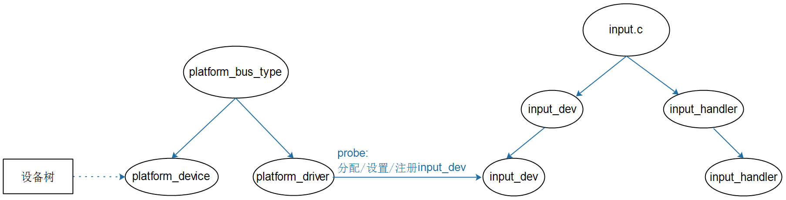

## 编写input_dev驱动框架

参考资料：

* Linux 5.x内核文档
* Documentation\input\input-programming.rst
  * Documentation\input\event-codes.rst
* Linux 4.x内核文档
  * Documentation\input\input-programming.txt
  * Documentation\input\event-codes.txt

* 本节视频代码：GIT仓库中

  ```shell
  IMX6ULL\source\05_Input\02_input_dev_framework
  STM32MP157\source\A7\05_Input\02_input_dev_framework
  ```

  

### 1. 回顾框架


### 2. 怎么编写input_dev驱动

#### 2.1 分配/设置/注册input_dev


#### 2.2 硬件相关的操作

* 申请中断

* 在中断服务程序里

  * 读取硬件获得数据

  * 上报数据

    ```shell
    void input_event(struct input_dev *dev,
    		 unsigned int type, unsigned int code, int value);
    		 
    static inline void input_sync(struct input_dev *dev); // 实质也是 input_event
    ```

    

### 3. 现场编程



* 在设备树里创建一个节点
  * 指定硬件资源等信息
* 编译一个plartform_driver驱动
  * 在probe函数里
    * 从设备树获得资源
    * 分配/设置/注册input_dev
    * 硬件相关的操作
      * request_irq等