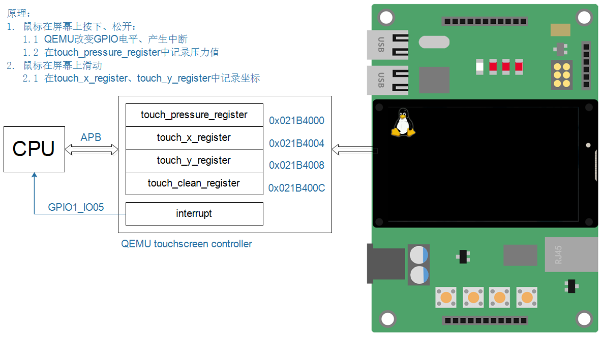

## 编写最简单的触摸屏驱动程序_基于QEMU

参考资料：

* Linux 5.x内核文档
* Documentation\input\input-programming.rst
  
  * Documentation\input\event-codes.rst
* Linux 4.x内核文档
  * Documentation\input\input-programming.txt
  * Documentation\input\event-codes.txt

* 本节视频代码：GIT仓库中

  ```shell
  IMX6ULL\source\05_Input\03_touchscreen_qemu\
  	01_irq_ok
  	02_all_ok
STM32MP157\source\A7\05_Input\03_touchscreen_qemu\
  	01_irq_ok
  	02_all_ok
  ```
  
  

### 1. 写在前面的话

目前百问网主推的开发板是IMX6ULL、STM32MP157。
但是也推出了一块虚拟的开发板：IMX6ULL_QEMU，对QEMU进行了大量的修改，比如增加了更多外设的模拟。
使用QEMU的原因有3：

* 降低学习成本
  * 初学阶段，可以不买开发板，使用QEMU即可入门。
* 深入学习内核及驱动
  * 使用QEMU可以非常方便地调试内核、查看驱动程序执行过程
  * 有助于深入研究内核及驱动
* 学习某些驱动时可以用QEMU模拟硬件，简化硬件的操作，把精力放在驱动程序框架本身

后面的视频里，会使用QEMU来讲解某些驱动程序。
**注意**：

* 使用QEMU不是必须的
* QEMU只是提供另一个角度的学习方法，比如：
  * LCD驱动：使用QEMU可以时，可以简化硬件的操作
  * 中断子系统：可以跟踪调用过程
* 你可以只看QEMU相关的视频，不使用QEMU来操作
* 在真实的开发板上讲解的内容，会覆盖QEMU视频的知识


### 2. 准备工作

在2021.03.27，我们给QEMU增加了新的功能：模拟触摸屏。
如果你是在这个时间之前下载了百问网的QEMU映像，那么需要重新下载。
下载、使用方法请参考：http://wiki.100ask.org/Qemu

下面以Ubuntu 18.04简单介绍一下。

#### 2.1 下载

执行命令：

```shell
git  clone  https://e.coding.net/weidongshan/ubuntu-18.04_imx6ul_qemu_system.git
```

#### 2.2 安装运行环境

执行命令：

```shell
$ cd buntu-18.04_imx6ul_qemu_system
$./install_sdl.sh // 提示输入用户密码，等待安装完成
```

#### 2.3 运行QEMU

执行命令：

```shell
$./qemu-imx6ull-gui.sh // 启动后，登录名是root，无需密码
```


### 3. QEMU触摸屏操作方法



寄存器说明如下：


| 地址       | 寄存器                  | 说明                                                         |
| ---------- | ----------------------- | ------------------------------------------------------------ |
| 0x021B4000 | touch_pressure_register | 记录触摸屏压力值，只有0、1两个取值，<br />1表示被按下，0表示松开 |
| 0x021B4004 | touch_x_register        | 记录触摸屏X坐标                                              |
| 0x021B4008 | touch_y_register        | 记录触摸屏Y坐标                                              |
| 0x021B400C | touch_clean_register    | 写入任意值，就会清零上述3个寄存器(仅用于测试，不用也可)      |


操作原理：

* 鼠标在屏幕上按下、松开
  * QEMU改变GPIO电平、产生中断
  * 在touch_pressure_register中记录压力值

* 鼠标在屏幕上滑动
  * 在touch_x_register、touch_y_register中记录坐标
* 仅能模拟单点触摸，不能模拟多点触摸

### 4. 编写驱动程序

* request_irq

* 在中断处理函数里

  * 上报按下、松开的事件
* 如果触摸屏被按下，启动定时器
  
* 如果触摸屏被松开，取消定时器
  
*  在定时器函数里

   * 如果触摸屏还是被按下的状态，上报坐标值，并设置下一个超时时间
   
    

### 5. 上机实验

#### 5.1 设置工具链

在Ubuntu中执行：

```shell
export ARCH=arm
export CROSS_COMPILE=arm-linux-gnueabihf-
export PATH=$PATH:/home/book/100ask_imx6ull-qemu/ToolChain/gcc-linaro-6.2.1-2016.11-x86_64_arm-linux-gnueabihf/bin
```

#### 5.2 编译内核/设备树

在Ubuntu中执行：

```shell
book@100ask:~/100ask_imx6ull-qemu$ cd linux-4.9.88
book@100ask:~/100ask_imx6ull-qemu/linux-4.9.88$ make mrproper
book@100ask:~/100ask_imx6ull-qemu/linux-4.9.88$ make 100ask_imx6ull_qemu_defconfig
book@100ask:~/100ask_imx6ull-qemu/linux-4.9.88$ make zImage -jN //编译zImage内核镜像，其中N参数可以根据CPU个数，来加速编译系统。
book@100ask:~/100ask_imx6ull-qemu/linux-4.9.88$ make dtbs //编译设备树文件
```

成功的话，可以得到：

```shell
arch/arm/boot/zImage // 内核
arch/arm/boot/dts/100ask_imx6ull_qemu.dtb // 设备树
```

复制到如下目录：

```shell
$ cd ubuntu-18.04_imx6ul_qemu_system/imx6ull-system-image
$ ls
100ask_imx6ull_qemu.dtb  rootfs.img  rootfs.tar.gz  zImage
```


#### 5.3 启动QEMU

在Ubuntu中执行：

```shell
$ cd ubuntu-18.04_imx6ul_qemu_system
$ ./qemu-imx6ull-gui.sh
```


#### 5.4 挂载NFS

在QEMU中执行：

```shell
$ mount -t nfs -o nolock,vers=3 10.0.2.2:/home/book/nfs_rootfs /mnt
```

开启printk：

```shell
echo "7 4 1 7" > /proc/sys/kernel/printk
```


#### 5.5 编译、使用tslib

在Ubuntu上执行下列命令。

* 编译

```shell
tar xJf tslib-1.21.tar.xz
cd tslib-1.21
./configure --host=arm-linux-gnueabihf  --prefix=/
make
make install DESTDIR=$PWD/tmp
```

* 复制头文件/库到工具链(非必须, 编译其他APP时需要)

```shell
cd tslib-1.21/tmp/

cp include/* /home/book/100ask_imx6ull-qemu/ToolChain/gcc-linaro-6.2.1-2016.11-x86_64_arm-linux-gnueabihf/bin/../lib/gcc/arm-linux-gnueabihf/6.2.1/../../../../arm-linux-gnueabihf/include

cp -d lib/*so*  /home/book/100ask_imx6ull-qemu/ToolChain/gcc-linaro-6.2.1-2016.11-x86_64_arm-linux-gnueabihf/bin/../arm-linux-gnueabihf/libc/usr/lib/

```

* 复制库、APP到开发板

  假设在Ubuntu的/home/book/nfs_rootfs目录下有tslib-1.21。
  在开发板上执行：

```shell
mount -t nfs -o nolock,vers=3 10.0.2.2:/home/book/nfs_rootfs /mnt
cp  /mnt/tslib-1.21/tmp/lib/*  -drf     /lib
cp  /mnt/tslib-1.21/tmp/bin/*            /bin
cp  /mnt/tslib-1.21/tmp/etc/ts.conf  -d  /etc
```

* 使用tslib  
```shell
export TSLIB_TSDEVICE=/dev/input/event3
export TSLIB_CALIBFILE=/etc/pointercal
export TSLIB_CONFFILE=/etc/ts.conf
export TSLIB_PLUGINDIR=/lib/ts
export TSLIB_CONSOLEDEVICE=none
export TSLIB_FBDEVICE=/dev/fb0

ts_calibrate

ts_test
```


#### 5.5 退出QEMU

```shell
要退出QEMU，可以同时按住ctrl+a，松开后再输入'x'
```

#### 5.6 改进驱动

如果在驱动程序里设置属性位：

```shell
	__set_bit(INPUT_PROP_DIRECT, g_input_dev->propbit);
```

那么tslib可以自动扫描到触摸屏设备，
使用tslib时就不需要设置这些环境变量：

```shell
export TSLIB_TSDEVICE=/dev/input/event3
export TSLIB_CALIBFILE=/etc/pointercal
export TSLIB_CONFFILE=/etc/ts.conf
export TSLIB_PLUGINDIR=/lib/ts
export TSLIB_CONSOLEDEVICE=none
export TSLIB_FBDEVICE=/dev/fb0
```

