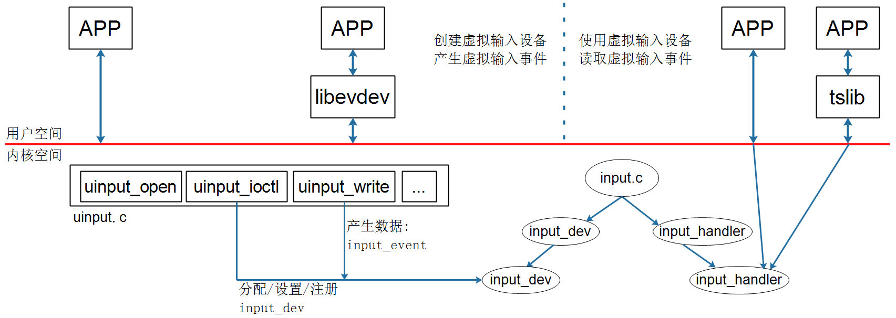

## UInput分析_用户态创建input_dev

参考资料：

* Linux 5.x内核

  * Documentation\input\uinput.rst
  * drivers\input\misc\uinput.c
  
* Linux 4.x内核
  * 内核没有对应文档
  * drivers\input\misc\uinput.c

* 本节视频对应的源码：GIT仓库中

  ```shell
  doc_and_source_for_drivers\STM32MP157\source\A7\05_Input\04_uinput
  doc_and_source_for_drivers\IMX6ULL\source\05_Input\04_uinput
  ```

  

### 1. 概念

uinput是一个内核模块(驱动)，它允许应用程序模拟输入设备(input_dev)。
应用程序通过访问`/dev/uinput`或`/dev/input/uinput`：

* 创建一个虚拟的输入设备
* 设置它的属性
* APP发送数据给它，让它产生输入事件
* uinput就会把这些输入事件分发给其他使用者(APP或内核里其他模块)

框图如下：



### 2. 编写应用程序


### 3. 上机实验

#### 3.1 设置工具链

在Ubuntu中执行：

```shell
export ARCH=arm
export CROSS_COMPILE=arm-linux-gnueabihf-
export PATH=$PATH:/home/book/100ask_imx6ull-qemu/ToolChain/gcc-linaro-6.2.1-2016.11-x86_64_arm-linux-gnueabihf/bin
```

#### 3.2 配置内核

配置内核：执行`make menuconfig`

```shell
-> Device Drivers
  -> Input device support
    -> Generic input layer   
      -> Miscellaneous devices
         <M>   User level driver support
```


#### 3.3 编译驱动

```shell
book@100ask:~/100ask_imx6ull-qemu$ cd linux-4.9.88
book@100ask:~/100ask_imx6ull-qemu/linux-4.9.88$ make modules
```

成功的话，可以得到：

```shell
drivers/input/misc/uinput.ko
```

复制到如下目录：

```shell
$ cp drivers/input/misc/uinput.ko ~/nfs_rootfs/
```

#### 3.4 编译测试程序

把代码`04_uinput`上传到Ubuntu，设置好交叉编译工具链后，在`04_uinput`目录下执行make命令即可。

```shell
$ make
$ cp uinput_test ~/nfs_rootfs/
```


#### 3.5 启动QEMU

在Ubuntu中执行：

```shell
$ cd ubuntu-18.04_imx6ul_qemu_system
$ ./qemu-imx6ull-gui.sh
```


#### 3.6 挂载NFS、实验

在QEMU中执行：

```shell
$ mount -t nfs -o nolock,vers=3 10.0.2.2:/home/book/nfs_rootfs /mnt
$ insmod /mnt/uinput.ko
$ ls -l /dev/uinput   // 确认设备节点

// 后台运行uinput_test
/mnt/uinput_test &

// 看到提示这个提示时: Will sleep 60s, in this time you should run ts_calibreate
// 运行校准程序
// 注意：如果有真实的触摸屏驱动，需要指定使用虚拟的设备节点
//      方法示例: export TSLIB_TSDEVICE=/dev/input/event3
ts_calibrate

// 看到提示这个提示时: Will sleep 60s, in this time you should run ts_test
// 运行测试程序
ts_test
```


### 4. 结合应用程序分析uinput

