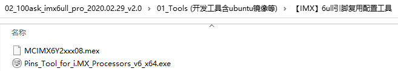

## Pinctrl子系统使用示例_基于IMX6ULL

参考资料：

* Linux 5.x内核文档
  * Documentation\devicetree\bindings\pinctrl\pinctrl-bindings.txt
* Linux 4.x内核文档
  * Documentation\pinctrl.txt
  * Documentation\devicetree\bindings\pinctrl\pinctrl-bindings.txt

### 1. 要做什么

以I2C为例：


* 查看原理图确定使用哪些引脚：比如pinA、pinB
* 生成pincontroller设备树信息
  * 选择功能：比如把pinA配置为I2C_SCL、把pinB配置为I2C_SDA
  * 配置：比如把pinA、pinB配置为open drain
* 使用pincontroller设备树信息：比如在i2c节点里定义"pinctrl-names"、"pinctrl-0"


### 2. 生成pincontroller设备树信息

生成pincontroller设备树信息，有3中方法：

* 有些芯片有图形化的工具，可以点点鼠标就可以配置引脚信息，得到pincontroller中的信息
* 有些芯片，只能看厂家给的设备树文档或者参考设备树的例子
* 最差的就是需要阅读驱动代码才能构造设备树信息。

#### 2.1 安装工具

对于IMX6ULL，有引脚配置工具/设备树生成工具：

* 打开：http://download.100ask.net/
* 找到开发板："100ASK_IMX6ULL_PRO开发板"
* 下载开发板配套资料
* 下载完后，工具在如下目录里：




#### 2.2 根据原理图生成pinctrl信息

```shell
&iomuxc {
    pinctrl-names = "default";
    pinctrl-0 = <&BOARD_InitPins>;
    imx6ull-board {
        i2c1_pins: i2c1_pins {                /*!< Function assigned for the core: Cortex-A7[ca7] */
            fsl,pins = <
                MX6UL_PAD_UART4_RX_DATA__I2C1_SDA          0x000018B0
                MX6UL_PAD_UART4_TX_DATA__I2C1_SCL          0x000018B0
            >;
        };
    };
};
```


### 3. 在client节点使用pinctrl

```shell
&i2c1 {
    clock-frequency = <100000>;
    pinctrl-names = "default";
    pinctrl-0 = <&i2c1_pins>;
    status = "okay";
};
```


### 4. 使用过程

这是透明的，我们的驱动基本不用管。当设备切换状态时，对应的pinctrl就会被调用。

比如在platform_device和platform_driver的枚举过程中，流程如下：

