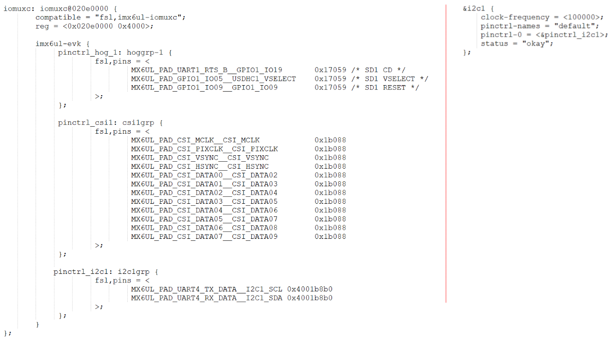

## Pincontroller构造过程情景分析_基于IMX6ULL

参考资料：

* Linux 4.x内核文档
  * Documentation\pinctrl.txt
  * Documentation\devicetree\bindings\pinctrl\pinctrl-bindings.txt
  * arch/arm/boot/dts/imx6ull-14x14-evk.dts
  * arch/arm/boot/dts/100ask_imx6ull-14x14.dts
  * drivers\pinctrl\freescale\pinctrl-imx6ul.c
  * drivers\pinctrl\freescale\pinctrl-imx.c

### 1. 设备树



### 2. 驱动代码执行流程

驱动程序位置：

```shell
drivers\pinctrl\freescale\pinctrl-imx6ul.c
drivers\pinctrl\freescale\pinctrl-imx.c
```

调用过程：

```c
imx6ul_pinctrl_probe
    imx_pinctrl_probe(pdev, pinctrl_info);
        imx_pinctrl_desc->name = dev_name(&pdev->dev);
        imx_pinctrl_desc->pins = info->pins;
        imx_pinctrl_desc->npins = info->npins;
        imx_pinctrl_desc->pctlops = &imx_pctrl_ops;
        imx_pinctrl_desc->pmxops = &imx_pmx_ops;
        imx_pinctrl_desc->confops = &imx_pinconf_ops;
        imx_pinctrl_desc->owner = THIS_MODULE;
		
		ret = imx_pinctrl_probe_dt(pdev, info);

        ipctl->pctl = devm_pinctrl_register(&pdev->dev,
                            imx_pinctrl_desc, ipctl);
```


### 3. 作用1：描述、获得引脚：解析设备树

#### 3.1 单个引脚

```c
	imx_pinctrl_desc->pins = info->pins;
	imx_pinctrl_desc->npins = info->npins;
```


可以在开发板上查看：

```shell
/sys/kernel/debug/pinctrl/20e0000.iomuxc]# cat pins
```


#### 3.2 某组引脚

```c
static const struct pinctrl_ops imx_pctrl_ops = {
	.get_groups_count = imx_get_groups_count,
	.get_group_name = imx_get_group_name,
	.get_group_pins = imx_get_group_pins,
	.pin_dbg_show = imx_pin_dbg_show,
	.dt_node_to_map = imx_dt_node_to_map,
	.dt_free_map = imx_dt_free_map,

};
```

某组引脚中，有哪些引脚？这要分析设备树：imx_pinctrl_probe_dt。

```shell
[root@100ask:/sys/kernel/debug/pinctrl/20e0000.iomuxc]# cat pingroups
```


#### 3.3 设备树解析情景分析

分析：imx_pinctrl_probe_dt


### 4. 作用2：引脚复用

下节视频讲解。

### 5. 作用3：引脚配置

下节视频讲解。

