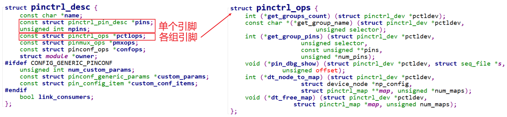
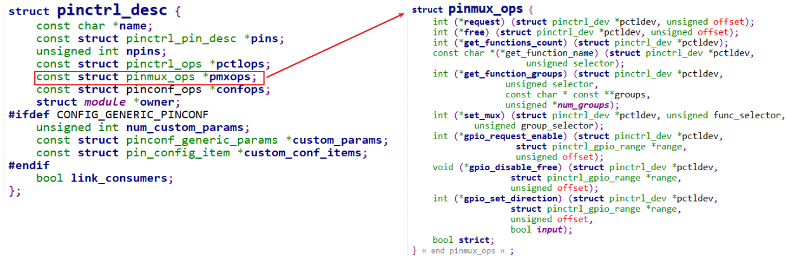
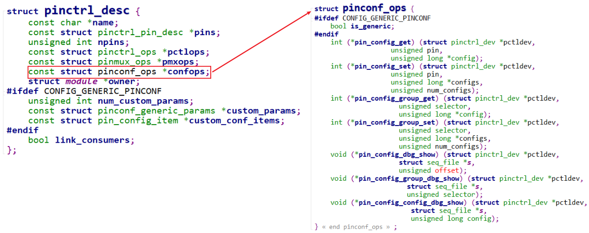
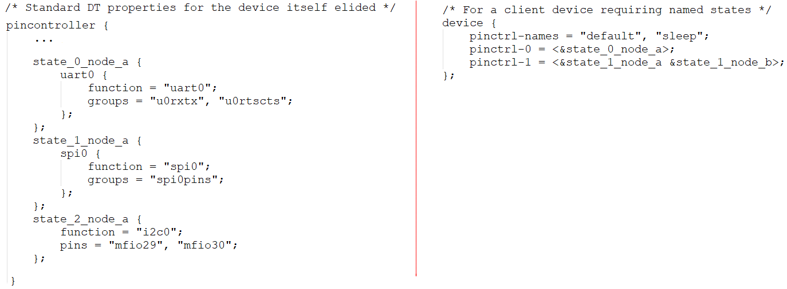
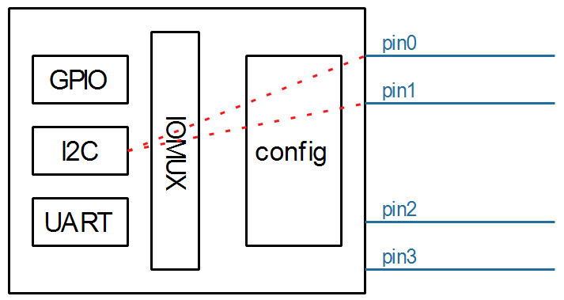

## 编写虚拟的Pinctrl驱动程序

参考资料：
* Linux 5.x内核
  * Documentation\devicetree\bindings\pinctrl\pinctrl-bindings.txt
  * arch/arm/boot/dts/stm32mp151.dtsi
  * arch/arm/boot/dts/stm32mp157-100ask-pinctrl.dtsi  
  * arch/arm/boot/dts/stm32mp15xx-100ask.dtsi
  * drivers\pinctrl\stm32\pinctrl-stm32mp157.c
  * drivers\pinctrl\stm32\pinctrl-stm32.c

* Linux 4.x内核
  * Documentation\pinctrl.txt
  * Documentation\devicetree\bindings\pinctrl\pinctrl-bindings.txt
  * arch/arm/boot/dts/imx6ull-14x14-evk.dts
  * arch/arm/boot/dts/100ask_imx6ull-14x14.dts
  * drivers\pinctrl\freescale\pinctrl-imx6ul.c
  * drivers\pinctrl\freescale\pinctrl-imx.c
  
* 本课对应的源码

  * GIT仓库中(未测试，下一课才测试)

    ```shell
    doc_and_source_for_drivers\IMX6ULL\source\06_Pinctrl\01_virtual_pinctrl
    doc_and_source_for_drivers\STM32MP157\source\A7\06_Pinctrl\01_virtual_pinctrl
    ```

    

### 1. 回顾Pinctrl的三大作用

记住pinctrl的三大作用，有助于理解所涉及的数据结构：

* 引脚枚举与命名(Enumerating and naming)
  * 单个引脚
  * 各组引脚
* 引脚复用(Multiplexing)：比如用作GPIO、I2C或其他功能
* 引脚配置(Configuration)：比如上拉、下拉、open drain、驱动强度等


Pinctrl驱动程序的核心是构造一个pinctrl_desc结构体：


#### 1.1 作用1：描述、获得引脚

分为2部分：

* 描述、获得单个引脚的信息
* 描述、获得某组引脚的信息



#### 1.2 作用2：引脚复用

用来把某组引脚(group)复用为某个功能(function)。



#### 1.3 作用3：引脚配置

用来配置：某个引脚(pin)或某组引脚(group)。



### 2. 编写Pinctrl驱动程序要做什么



我们要做的事情：

* pin controller：
  * 创建设备树节点
  * 编写驱动程序
* 测试：
  * 创建client设备树节点
  * 编写驱动程序


### 3. 硬件功能

假设这个虚拟的pin controller有4个引脚：



* pin0,1,2,3都可以配置为GPIO功能
* pin0,1还可以配置为I2C功能
* pin2,3还可以配置为UART功能


### 4. 编写设备树文件

```shell
virtual_pincontroller {
	compatible = "100ask,virtual_pinctrl";
	i2cgrp: i2cgrp {
			functions = "i2c", "i2c";
			groups = "pin0", "pin1";
			configs = <0x11223344  0x55667788>;
	};
};

virtual_i2c {
	compatible = "100ask,virtual_i2c";
	pinctrl-names = "default";
	pinctrl-0 = <&i2cgrp>;
};
```


### 5. 编写Pinctrl驱动程序

#### 5.1 核心：pinctrl_desc

* 分配pinctrl_desc结构体
* 设置pinctrl_desc结构体
* 注册pinctrl_desc结构体


#### 5.2 辅助函数

```c
include/linux/of.h
    for_each_child_of_node
    of_get_child_count
    of_find_property
    of_property_read_u32
    of_property_read_u32_index
    of_property_read_string_index
```


### 6. 编写测试用的client驱动

编写、注册一个platform_driver即可。

