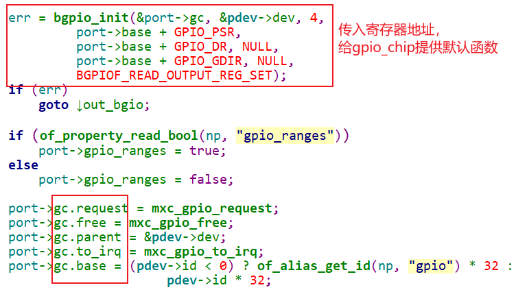

## IMX6ULL的GPIO驱动源码分析

参考资料：

* Linux 4.x内核文档
  * Linux-4.9.88\Documentation\gpio
  * Linux-4.9.88\Documentation\devicetree\bindings\gpio\gpio.txt
  * Linux-4.9.88\drivers\gpio\gpio-mxc.c
  * Linux-4.9.88\arch\arm\boot\dts\imx6ull.dtsi

### 1. 设备树

Linux-4.9.88\arch\arm\boot\dts\imx6ull.dtsi：

```shell
aliases {
		can0 = &flexcan1;
		can1 = &flexcan2;
		ethernet0 = &fec1;
		ethernet1 = &fec2;
		gpio0 = &gpio1;
};

gpio1: gpio@0209c000 {
		compatible = "fsl,imx6ul-gpio", "fsl,imx35-gpio";
		reg = <0x0209c000 0x4000>;
		interrupts = <GIC_SPI 66 IRQ_TYPE_LEVEL_HIGH>,
					 <GIC_SPI 67 IRQ_TYPE_LEVEL_HIGH>;
		gpio-controller;
		#gpio-cells = <2>;
		interrupt-controller;
		#interrupt-cells = <2>;
};
```


GPIO控制器的设备树中，有两项是必须的：

* gpio-controller : 表明这是一个GPIO控制器
* gpio-cells : 指定使用多少个cell(就是整数)来描述一个引脚


当解析设备节点中的GPIO信息时，需要用到上面的属性。

比如下面的`led-gpios`，在`#gpio-cells = <2>`的情况下，它表示的引脚数量是1。

```shell
		myled {
            compatible = "100ask,leddrv";
            led-gpios = <&gpio1 10 GPIO_ACTIVE_LOW>;
        };
```


### 2. 驱动程序

Linux-4.9.88\drivers\gpio\gpio-mxc.c

#### 2.1 分配gpio_chip

```c
static int mxc_gpio_probe(struct platform_device *pdev)
{
	struct device_node *np = pdev->dev.of_node;
	struct mxc_gpio_port *port;
	struct resource *iores;
	int irq_base = 0;
	int err;

	mxc_gpio_get_hw(pdev);

	port = devm_kzalloc(&pdev->dev, sizeof(*port), GFP_KERNEL);
	if (!port)
		return -ENOMEM;

```


#### 2.2 设置gpio_chip



#### 2.3 注册gpio_chip

```c
	err = devm_gpiochip_add_data(&pdev->dev, &port->gc, port);
	if (err)
		goto out_bgio;
```

