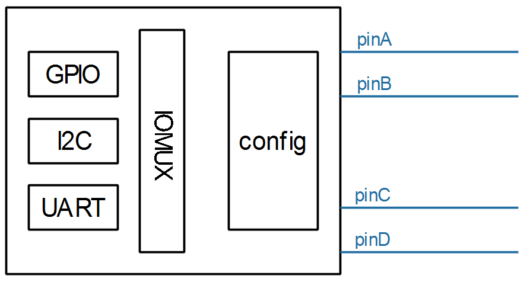

## 编写一个虚拟GPIO控制器的驱动程序

参考资料：

* Linux 5.x内核文档
  * Linux-5.4\Documentation\driver-api
  * Linux-5.4\Documentation\devicetree\bindings\gpio\gpio.txt
  * Linux-5.4\drivers\gpio\gpio-74x164.c
  
* Linux 4.x内核文档
  * Linux-4.9.88\Documentation\gpio
  * Linux-4.9.88\Documentation\devicetree\bindings\gpio\gpio.txt
  * Linux-4.9.88\drivers\gpio\gpio-74x164.c
  
* 本章课程源码位于GIT仓库里(未调试)

  ```shell
  doc_and_source_for_drivers\IMX6ULL\source\07_GPIO\02_virtual_gpio
  doc_and_source_for_drivers\STM32MP157\source\A7\07_GPIO\02_virtual_gpio
  ```

  

### 1. 硬件功能

假设这个虚拟的GPIO Controller有4个引脚：




### 2. 编写设备树文件

```shell
gpio_virt: virtual_gpiocontroller {
	compatible = "100ask,virtual_gpio";
    gpio-controller;
    #gpio-cells = <2>;
    ngpios = <4>;
};
```


### 3. 编写驱动程序

现场编写。

核心：分配/设置/注册一个gpio_chip结构体。


