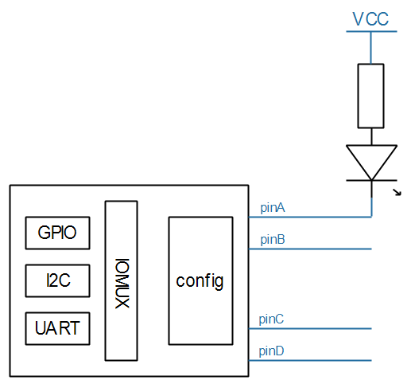
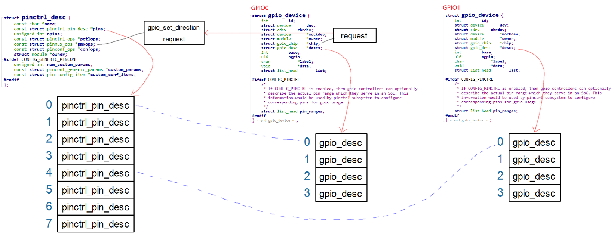

## GPIO子系统与Pinctrl子系统的交互

参考资料：

* Linux 5.x内核文档
  * Linux-5.4\Documentation\driver-api
  * Linux-5.4\Documentation\devicetree\bindings\gpio\gpio.txt
  * Linux-5.4\drivers\gpio\gpio-74x164.c
  
* Linux 4.x内核文档
  * Linux-4.9.88\Documentation\gpio
  * Linux-4.9.88\Documentation\devicetree\bindings\gpio\gpio.txt
  * Linux-4.9.88\drivers\gpio\gpio-74x164.c
  

### 1. 使用GPIO前应该设置Pinctrl

假设使用这个虚拟的GPIO Controller的pinA来控制LED：




要使用pinA来控制LED，首先要通过Pinctrl子系统把它设置为GPIO功能，然后才能设置它为输出引脚、设置它的输出值。

所以在设备树文件里，应该添加Pinctrl的内容：

```shell
virtual_pincontroller {
	compatible = "100ask,virtual_pinctrl";
	myled_pin: myled_pin {
			functions = "gpio";
			groups = "pin0";
			configs = <0x11223344>;
	};
};

gpio_virt: virtual_gpiocontroller {
	compatible = "100ask,virtual_gpio";
    gpio-controller;
    #gpio-cells = <2>;
    ngpios = <4>;
};

myled {
	compatible = "100ask,leddrv";
	led-gpios = <&gpio_virt 0 GPIO_ACTIVE_LOW>;
	pinctrl-names = "default";
	pinctrl-0 = <&myled_pin>;	
};
```


但是很多芯片，并不要求在设备树中把把引脚复用为GPIO功能。

比如STM32MP157，在它的设备树工具`STM32CubeMX`即使把引脚配置为GPIO功能，它也不会在设备树中出现。

原因在于：GPIO走了后门。

现实的芯片中，并没有Pinctrl这样的硬件，它的功能大部分是在GPIO模块中实现的。

Pinctrl是一个软件虚拟处理的概念，它的实现本来就跟GPIO密切相关。

甚至一些引脚默认就是GPIO功能。

按理说：

一个引脚可能被用作GPIO，也可能被用作I2C，GPIO和I2C这些功能时相同低位的。

要用作GPIO，需要先通过Pinctrl把引脚复用为GPIO功能。

但是Pinctrl和GPIO关系密切，当你使用gpiod_get获得GPIO引脚时，它就`偷偷地`通过Pinctrl把引脚复用为GPIO功能了。


### 2. GPIO和Pinctrl的映射关系

#### 2.1 示例


从上图可知：

* 左边的Pinctrl支持8个引脚，在Pinctrl的内部编号为0~7
* 图中有2个GPIO控制器
  * GPIO0内部引脚编号为0~3，假设在GPIO子系统中全局编号为100~103
  * GPIO1内部引脚编号为0~3，假设在GPIO子系统中全局编号为104~107

* 假设我们要使用pin1_1，应该这样做：
  * 根据GPIO1的内部编号1，可以换算为Pinctrl子系统中的编号5
  * 使用Pinctrl的函数，把第5个引脚配置为GPIO功能


#### 2.2 数据结构


### 3. GPIO调用Pinctrl的过程

GPIO子系统中的request函数，用来申请某个GPIO引脚，

它会导致Pinctrl子系统中的这2个函数之一被调用：`pmxops->gpio_request_enable`或`pmxops->request`



调用关系如下：

```c
gpiod_get
    gpiod_get_index
    	desc = of_find_gpio(dev, con_id, idx, &lookupflags);
		ret = gpiod_request(desc, con_id ? con_id : devname);
					ret = gpiod_request_commit(desc, label);
								if (chip->request) {
                                    ret = chip->request(chip, offset);
                                }
```


我们编写GPIO驱动程序时，所设置`chip->request`函数，一般直接调用`gpiochip_generic_request`，它导致Pinctrl把引脚复用为GPIO功能。

```c
gpiochip_generic_request(struct gpio_chip *chip, unsigned offset)
    pinctrl_request_gpio(chip->gpiodev->base + offset)
		ret = pinctrl_get_device_gpio_range(gpio, &pctldev, &range); // gpio是引脚的全局编号

		/* Convert to the pin controllers number space */
		pin = gpio_to_pin(range, gpio);
    	
		ret = pinmux_request_gpio(pctldev, range, pin, gpio);
					ret = pin_request(pctldev, pin, owner, range);
```


Pinctrl子系统中的pin_request函数就会把引脚配置为GPIO功能：

```c
static int pin_request(struct pinctrl_dev *pctldev,
		       int pin, const char *owner,
		       struct pinctrl_gpio_range *gpio_range)
{
    const struct pinmux_ops *ops = pctldev->desc->pmxops;
    
	/*
	 * If there is no kind of request function for the pin we just assume
	 * we got it by default and proceed.
	 */
	if (gpio_range && ops->gpio_request_enable)
		/* This requests and enables a single GPIO pin */
		status = ops->gpio_request_enable(pctldev, gpio_range, pin);
	else if (ops->request)
		status = ops->request(pctldev, pin);
	else
		status = 0;
}
```


### 3. 我们要做什么

如果不想在使用GPIO引脚时，在设备树中设置Pinctrl信息，

如果想让GPIO和Pinctrl之间建立联系，

我们需要做这些事情：

#### 3.1 表明GPIO和Pinctrl间的联系

在GPIO设备树中使用`gpio-ranges`来描述它们之间的联系：

  * GPIO系统中有引脚号

  * Pinctrl子系统中也有自己的引脚号

  * 2个号码要建立映射关系

  * 在GPIO设备树中使用如下代码建立映射关系

    ```shell
    // 当前GPIO控制器的0号引脚, 对应pinctrlA中的128号引脚, 数量为12
    gpio-ranges = <&pinctrlA 0 128 12>; 
    ```

#### 3.2 解析这些联系

在GPIO驱动程序中，解析跟Pinctrl之间的联系：处理`gpio-ranges`:

  * 这不需要我们自己写代码

  * 注册gpio_chip时会自动调用

    ```c
    int gpiochip_add_data(struct gpio_chip *chip, void *data)
        status = of_gpiochip_add(chip);
    				status = of_gpiochip_add_pin_range(chip);
    
    of_gpiochip_add_pin_range
    	for (;; index++) {
    		ret = of_parse_phandle_with_fixed_args(np, "gpio-ranges", 3,
    				index, &pinspec);
    
        	pctldev = of_pinctrl_get(pinspec.np); // 根据gpio-ranges的第1个参数找到pctldev
    
            // 增加映射关系	
            /* npins != 0: linear range */
            ret = gpiochip_add_pin_range(chip,
                                         pinctrl_dev_get_devname(pctldev),
                                         pinspec.args[0],
                                         pinspec.args[1],
                                         pinspec.args[2]);
    ```
    


#### 3.3 编程
* 在GPIO驱动程序中，提供`gpio_chip->request`

* 在Pinctrl驱动程序中，提供`pmxops->gpio_request_enable`或`pmxops->request`


