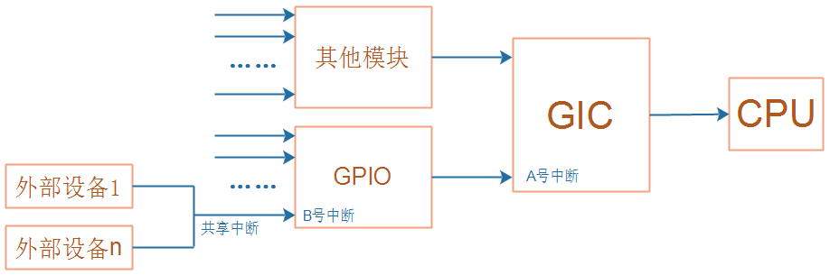
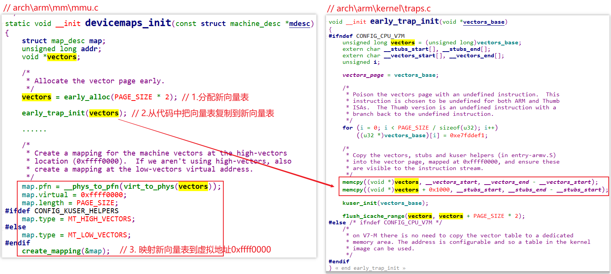
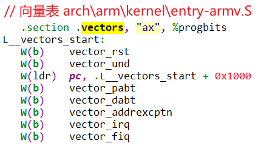
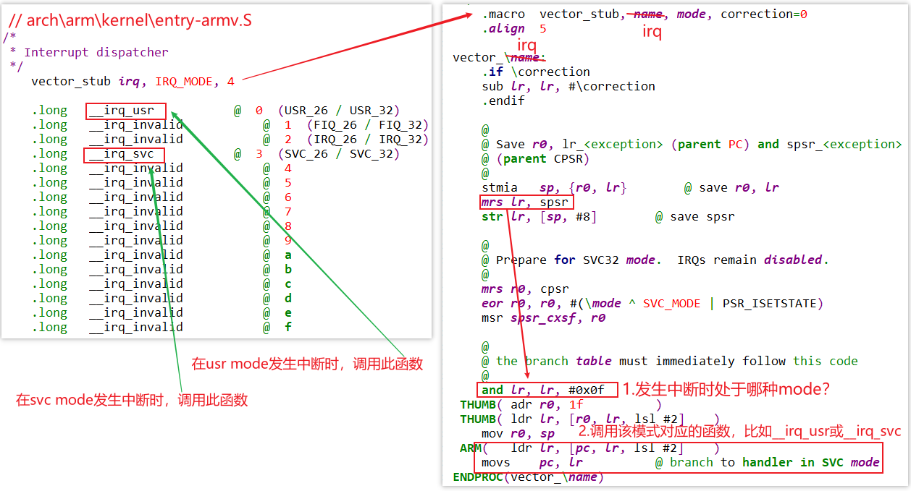
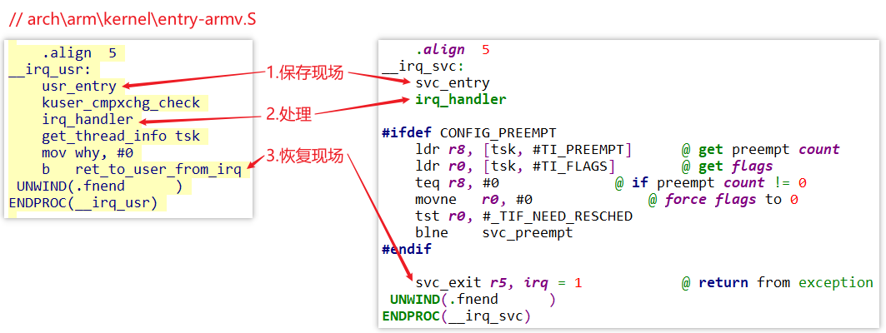
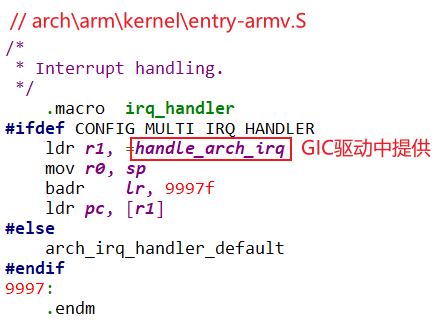

## 异常向量表的安装与调用

### 1. 回顾中断的发生、处理过程

* 中断发生的硬件过程




* 中断处理的软件处理流程
  * CPU执行完当前指令，检查到发生了中断，跳到向量表
  * 保存现场、执行GIC提供的处理函数、恢复现场


### 2. 异常向量表的安装

#### 2.1 复制向量表

* 汇编代码

```c
// arch\arm\kernel\head.S
1. bl	__lookup_processor_type
   ...... 
2. bl	__create_page_tables
3. ldr	r13, =__mmap_switched
4. b	__enable_mmu
   b	__turn_mmu_on
   mov	r3, r13
   ret	r3
5. __mmap_switched: // arch\arm\kernel\head-common.S
6. b	start_kernel
```


* 复制向量表

```c
start_kernel // init\main.c
    setup_arch(&command_line); // arch\arm\kernel\setup.c
		paging_init(mdesc);    // arch\arm\mm\mmu.c
			devicemaps_init(mdesc); // arch\arm\mm\mmu.c
				vectors = early_alloc(PAGE_SIZE * 2); // 1.分配新向量表
				early_trap_init(vectors);             // 2.从代码把向量表复制到新向量表

				// 3. 映射新向量表到虚拟地址0xffff0000
                /*
                 * Create a mapping for the machine vectors at the high-vectors
                 * location (0xffff0000).  If we aren't using high-vectors, also
                 * create a mapping at the low-vectors virtual address.
                 */
                map.pfn = __phys_to_pfn(virt_to_phys(vectors));
                map.virtual = 0xffff0000;
                map.length = PAGE_SIZE;
            #ifdef CONFIG_KUSER_HELPERS
                map.type = MT_HIGH_VECTORS;
            #else
                map.type = MT_LOW_VECTORS;
            #endif
                create_mapping(&map);
```



#### 2.2 向量表在哪

上面代码中可以看到代码中向量表位于`__vectors_start`，它在`arch/arm/kernel/vmlinux.lds`中定义：

```shell
 __vectors_start = .;
 .vectors 0xffff0000 : AT(__vectors_start) {
  *(.vectors)
 }
 . = __vectors_start + SIZEOF(.vectors);
 __vectors_end = .;
 __stubs_start = .;
 .stubs ADDR(.vectors) + 0x1000 : AT(__stubs_start) {
  *(.stubs)
 }
```

在代码里搜`.vectors`，可以找到向量表：



### 3. 中断向量

发生中断时，CPU跳到向量表去执行`b vector_irq`。

vector_irq函数使用宏来定义：




### 4. 处理流程




### 5. 处理函数

