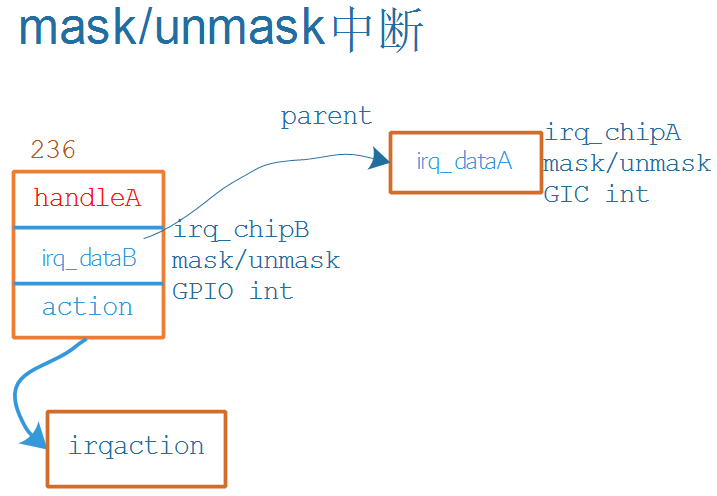

## 层级中断控制器驱动程序编写

参考资料：

* [linux kernel的中断子系统之（七）：GIC代码分析](http://www.wowotech.net/irq_subsystem/gic_driver.html)

* Linux 4.9.88内核源码

  * `Linux-4.9.88\drivers\gpio\gpio-mxc.c`
  * `Linux-4.9.88\arch\arm\boot\dts\imx6ull.dtsi`

* Linux 5.4内核源码
  
  * `Linux-5.4\drivers\pinctrl\stm32\pinctrl-stm32mp157.c`
  * `Linux-5.4\drivers\irqchip\irq-stm32-exti.c`
  * `Linux-5.4\arch\arm\boot\dts\stm32mp151.dtsi`
  
* 本节视频源码在GIT仓库里

  ```shell
  doc_and_source_for_drivers\
  	IMX6ULL\source\08_Interrupt\
  		06_virtual_int_controller_hierarchy
	
  doc_and_source_for_drivers\
  	STM32MP157\source\A7\08_Interrupt\
  		06_virtual_int_controller_hierarchy
  ```
  
  

### 1. 层级中断控制器的重要函数和结构体

#### 1.1 回顾处理流程

为方便描述，假设下级的层级中断控制器就是GPIO控制器。

下图中：

* handleA、irq_dataA由GIC驱动提供
* irq_dataB由GPIO驱动提供，不需要handleB


* 假设GPIO模块下有4个引脚，都可以产生中断，分别链接到GIC的100~103号中断
* GPIO就是一个层级中断控制器
* 对于GPIO模块中0~3这四个hwirq，分配四个irq_desc，用到时再分配
* 假设这4个irq_desc的序号为234~237
  * 在GIC domain中记录(100,234) (101,235)(102,236) (103,237)
  * 在GPIO domain中记录(0,234) (1,235)(2,236) (3,237)
* 对于KEY，注册中断时就是：`request_irq(236, ...)`
* 按下KEY时：
  * 程序从GIC中读取寄存器知道发生了102号中断，通过GIC irq_domain可以知道virq为236
  * 处理virq 236号中断：调用irq_desc[236].handle_irq，即handleA
    * mask/ack中断: 
      * 调用irq_desc[236].irq_data->irq_chip的函数，即irq_dataB
        * 它会调用父级irq_dataA->irq_chip的函数
    * 调用irq_desc[236].action链表中用户注册的函数
    * unmask中断: 
      * 调用irq_desc[236].irq_data->irq_chip的函数，即irq_dataB
        * 它会调用父级irq_dataA->irq_chip的函数

#### 1.2 irq_domain的核心作用

怎么把handleA、GIC Domain和GPIO Domain、irq_chipA和irq_chipB这4个结构体组织起来，irq_domain是核心。

为方便描述，我们把上图中的层级中断控制器当做GPIO控制器。

我们从使用中断的流程来讲解。

* 在设备树里指定使用哪个中断

  ```shell
      gpio_keys_100ask {
          compatible = "100ask,gpio_key";
  		interrupt-parent = <&gpio5>;
  		interrupts = <3 IRQ_TYPE_EDGE_BOTH>,
      };
  ```

* 内核解析、处理设备树的中断信息

  * 根据`interrupt-parent`找到驱动程序注册的GPIO irq_domain
  * GPIO irq_domain对设备树的解析
    * 使用GPIO irq_domain.ops中的translate或xlate函数解析设备树，得到hwirq和type
    * 分配/找到irq_desc，得到virq
      * 把(hwirq, virq)的关系存入GPIO irq_domain
      * 把virq存入platform_device的resource中
    * 修改得到对应的GIC_hwirq，调用父级GIC irq_domain继续解析
      * 把(GIC_hwirq, virq)的关系存入GIC irq_domain
    * **注意**：对于同一个硬件中断，它在两个irq_domain里的virq是相同的，hwirq可能不一样。
  * GPIO irq_domain对设备树的设置
    * 使用GPIO irq_domain.ops中的alloc函数进行设置
      * 替换irq_desc[virq].irq_data，里面有irq_chip改为irq_chipB，即GPIO的irq_chip
      * 调用父级GIC irq_domain的alloc继续设置
        * 设置irq_desc[virq].handle_irq为GIC的handle_irq，即上图中的handleA

* 用户的驱动程序注册中断
  
  * 从platform_device的resource中得到中断号virq
  * request_irq(virq, ..., func)
  
* 发生中断、处理中断：处理流程见上面。
  
  
  
### 2. 硬件模型

下图中列出了链式中断控制器、层级中断控制器，本节课程之设计右边的层级中断控制器。

内核中有各类中断控制器的驱动程序，它们涉及的硬件过于复杂，从这些杂乱的代码中去讲清楚中断体系，比较难。

我们实现一些虚拟的中断控制器，如下图所示。

实际板子中，我们可以通过按键触发中断。

对于这些虚拟的中断控制器，我们没有真实按键，通过devmem指令写GIC的PENDING寄存器触发中断。

  

  

###  3. 编程

会涉及2个驱动程序：虚拟的中断控制器驱动程序，按键驱动程序，以及对应的设备树。

虚拟的中断控制器驱动程序中，涉及2个递归处理。

#### 3.1 alloc的递归处理


#### 3.2 irq_chip的递归处理



