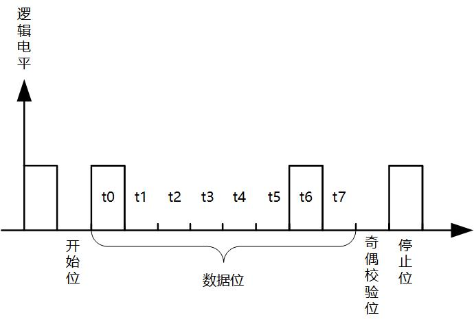

# 硬件知识_UART硬件介绍 #
## 1. 串口的硬件介绍
UART的全称是Universal Asynchronous Receiver and Transmitter，即异步发送和接收。
串口在嵌入式中用途非常的广泛，主要的用途有：

* 打印调试信息；
* 外接各种模块：GPS、蓝牙；

串口因为结构简单、稳定可靠，广受欢迎。

通过三根线即可，发送、接收、地线。

通过TxD->RxD把ARM开发板要发送的信息发送给PC机。
通过RxD->TxD线把PC机要发送的信息发送给ARM开发板。
最下面的地线统一参考地。

## 2. 串口的参数

- 波特率：一般选波特率都会有9600,19200,115200等选项。其实意思就是每秒传输这么多个比特位数(bit)。
- 起始位:先发出一个逻辑”0”的信号，表示传输数据的开始。
- 数据位：可以是5~8位逻辑”0”或”1”。如ASCII码（7位），扩展BCD码（8位）。小端传输。
- 校验位：数据位加上这一位后，使得“1”的位数应为偶数(偶校验)或奇数(奇校验)，以此来校验数据传送的正确性。
- 停止位：它是一个字符数据的结束标志。

怎么发送一字节数据，比如‘A‘?
‘A’的ASCII值是0x41,二进制就是01000001，怎样把这8位数据发送给PC机呢？
* 双方约定好波特率（每一位占据的时间）；

* 规定传输协议

  *  原来是高电平，ARM拉低电平，保持1bit时间；
  *  PC在低电平开始处计时；
  *  ARM根据数据依次驱动TxD的电平，同时PC依次读取RxD引脚电平，获得数据；

  

前面图中提及到了逻辑电平，也就是说代表信号1的引脚电平是人为规定的。
如图是TTL/CMOS逻辑电平下，传输‘A’时的波形：

在xV至5V之间，就认为是逻辑1，在0V至yV之间就为逻辑0。

如图是RS-232逻辑电平下，传输‘A’时的波形：

在-12V至-3V之间，就认为是逻辑1，在+3V至+12V之间就为逻辑0。

RS-232的电平比TTL/CMOS高，能传输更远的距离，在工业上用得比较多。

市面上大多数ARM芯片都不止一个串口，一般使用串口0来调试，其它串口来外接模块。

## 3. 串口电平

ARM芯片上得串口都是TTL电平的，通过板子上或者外接的电平转换芯片，转成RS232接口，连接到电脑的RS232串口上，实现两者的数据传输。

现在的电脑越来越少有RS232串口的接口，当USB是几乎都有的。因此使用USB串口芯片将ARM芯片上的TTL电平转换成USB串口协议，即可通过USB与电脑数据传输。

上面的两种方式，对ARM芯片的编程操作都是一样的。

## 4. 串口内部结构

ARM芯片是如何发送/接收数据？
如图所示串口结构图：

要发送数据时，CPU控制内存要发送的数据通过FIFO传给UART单位，UART里面的移位器，依次将数据发送出去，在发送完成后产生中断提醒CPU传输完成。
接收数据时，获取接收引脚的电平，逐位放进接收移位器，再放入FIFO，写入内存。在接收完成后产生中断提醒CPU传输完成。

