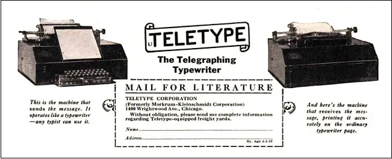
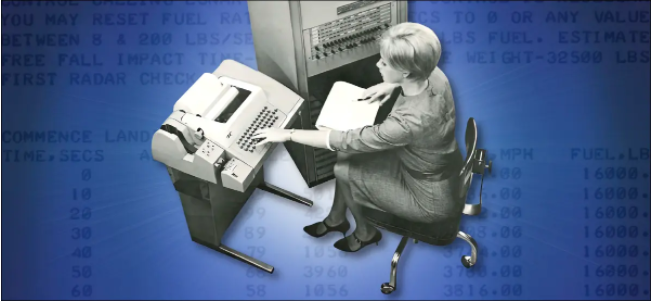
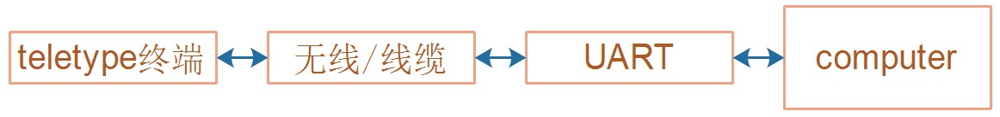
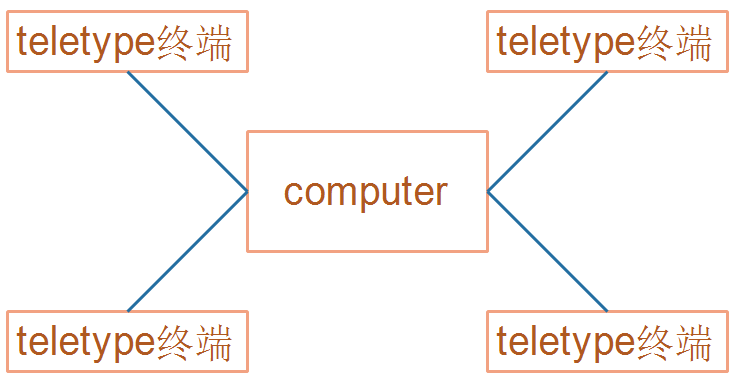
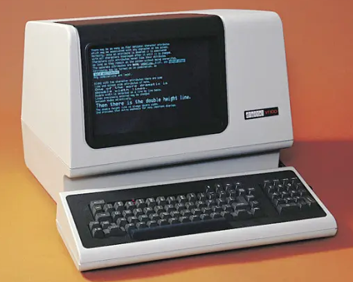
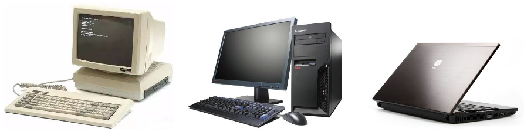

## TTY体系中设备节点的差别

参考资料

* [解密TTY](https://www.cnblogs.com/liqiuhao/p/9031803.html)
* [彻底理解Linux的各种终端类型以及概念](https://blog.csdn.net/dog250/article/details/78766716)
* [Linux终端和Line discipline图解](https://blog.csdn.net/dog250/article/details/78818612)
* [What Are Teletypes, and Why Were They Used with Computers?](https://www.howtogeek.com/727213/what-are-teletypes-and-why-were-they-used-with-computers/)


### 1. 傻傻分不清

/dev/ttyS0、/dev/ttySAC0、/dev/tty、/dev/tty0、/dev/tty1、/dev/console，

它们有什么差别？

| 设备节点                            | 含义                                         |
| ----------------------------------- | -------------------------------------------- |
| /dev/ttyS0、/dev/ttySAC0            | 串口                                         |
| /dev/tty1、/dev/tty2、/dev/tty3、…… | 虚拟终端设备节点                             |
| /dev/tty0                           | 前台终端                                     |
| /dev/tty                            | 程序自己的终端，可能是串口、也可能是虚拟终端 |
| /dev/console                        | 控制台，又内核的cmdline参数确定              |


TTY/Terminal/Console/UART，

它们有什么差别？

| 术语     | 含义                                                         |
| -------- | ------------------------------------------------------------ |
| TTY      | 来自teletype，最古老的输入输出设备，现在用来表示内核的一套驱动系统 |
| Terminal | 终端，暗含远端之意，也是一个输入输出设备，可能是真实设备，也可能是虚拟设备 |
| Console  | 控制台，含控制之意，也是一种Terminal，权限更大，可以查看内核打印信息 |
| UART     | 串口，它的驱动程序包含在TTY驱动体系之内                      |


### 2. 要讲历史了

#### 2.1 电传机teletype 

teletype，更准确地说是teleprinter，是一种通信设备，可以用来发送、接收文本信息。

teletype是一家公司的名字，它生产的teleprinter实在太有名，结果公司名变成了这类产品的名字：teleprinter都被称为teletype了。



teletype被用来传输商业电报，想像一下：

* 把两台teletype的线缆接在一起，或者使用无线技术连接两台teletype
* 这边打字，另一边就可以接收到信息并通过纸张打印出来
* 注意：这两台teletype可以离得很远

#### 2.2 计算机需要控制

##### 2.2.1 使用teletype

teletype的简称就是TTY。


最古老的计算机支持的是批处理模型：

* 怎么编程？卡片打孔，然后喂给计算机。
* 怎么得到输出信息？计算机根据结果在卡片上打孔，需要专人翻译这些卡片。


如果把两台teletype的其中一台，替换为计算机，不就更方便了吗？可以即时输入指令、即时看到结果。

于是teletype变成了计算机的终端、Terminal，远端之意。

teletype和计算机可以放在一个房间里，也可以放在很远很远的地方。




teletype是通过串口(UART)跟计算机相连的：




那时计算机很贵，发展出多用户系统，多个用户可以分时使用计算机，降低成本：




##### 2.2.2 teletype被淘汰了

1960年代，CRT显示器+键盘，替代了teletype：

* 显示器替代了纸张
* 速度更快
* 成本更低
* 它仍然只是一个终端(terminal)，通过线缆连接到计算机
* 虽然不再是teletype，但是它的驱动程序仍然叫做TTY




##### 2.2.3 个人电脑和虚拟终端

上图长得像电脑，但是它只是一个终端，它要连接到计算机才能工作。

这才是电脑：计算单元(CPU、硬盘、内存等等)、终端(键盘、显示器)都齐全了：



硬件上只有一套键盘、显示器。

但是在Linux系统中，我们可以打开多个命令行程序(也叫terminal、shell)，每个程序都对应一个"虚拟终端"。


### 3. 在Ubuntu上演示

按住键盘：Ctrl+Alt+F3启动一个虚拟终端，Ctrl+Alt+F4再启动一个虚拟终端。

在里面切换为root用户：

```shell
sudo passwd root // 如果su root不成功，就先设置root密码
su root
```


#### 3.1 各类设备节点的差别

由于历史原因，下图中两条红线之内的代码被称为TTY子系统。

它既支持UART，也支持键盘、显示器，还支持更复杂的功能(比如伪终端)。


#### 3.2 /dev/ttyN(N=1,2,3,...)

/dev/tty3、/dev/tty4：表示某个程序使用的虚拟终端

```shell
// 在tty3、tty4终端来回切换，执行命令

echo hello > /dev/tty3
echo hi    > /dev/tty4
```


#### 3.3 /dev/tty0

/dev/tty0：表示前台程序的虚拟终端

* 你正在操作的界面，就是前台程序

* 其他后台程序访问/dev/tty0的话，就是访问前台程序的终端，切换前台程序时，/dev/tty0是变化的

  ```shell
  // 1. 在tty3终端执行如下命令
  // 2. 然后在tty3、tty4来回切换
  
  while [ 1 ]; do echo msg_from_tty3 > /dev/tty0; sleep 5; done
  ```

#### 3.4  /dev/tty

/dev/tty表示本程序的终端，可能是虚拟终端，也可能是真实的中断。

程序A在前台、后台间切换，它自己的/dev/tty都不会变。

```shell
// 1. 在tty3终端执行如下命令
// 2. 然后在tty3、tty4来回切换

while [ 1 ]; do echo msg_from_tty3 > /dev/tty; sleep 5; done
```


#### 3.5 Terminal和Console的差别

Terminal含有远端的意思，中文为：终端。Console翻译为控制台，可以理解为权限更大、能查看更多信息。

比如我们可以在Console上看到内核的打印信息，从这个角度上看：

* Console是某一个Terminal
* Terminal并不都是Console。
* 我们可以从多个Terminal中选择某一个作为Console
* 很多时候，两个概念混用，并无明确的、官方的定义

#### 3.6 /dev/console

选哪个？内核的打印信息从哪个设备上显示出来？
可以通过内核的cmdline来指定，
比如: console=ttyS0 console=tty
我不想去分辨这个设备是串口还是虚拟终端，
有没有办法得到这个设备？
有！通过/dev/console！
console=ttyS0时：/dev/console就是ttyS0
console=tty时：/dev/console就是前台程序的虚拟终端
console=tty0时：/dev/console就是前台程序的虚拟终端
console=ttyN时：/dev/console就是/dev/ttyN
console有多个取值时，使用最后一个取值来判断


