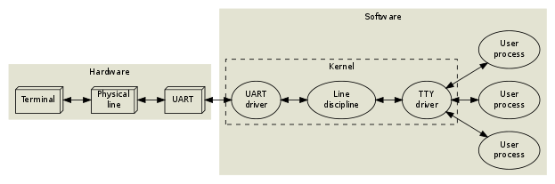
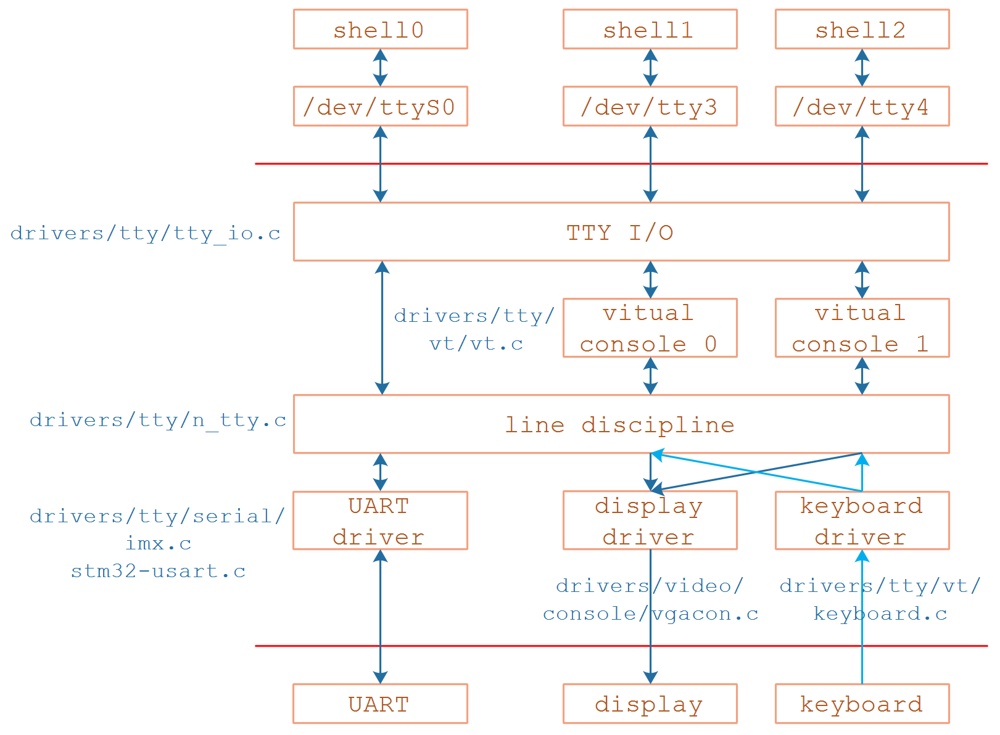

## TTY驱动程序框架

参考资料

* [解密TTY](https://www.cnblogs.com/liqiuhao/p/9031803.html)
* [彻底理解Linux的各种终端类型以及概念](https://blog.csdn.net/dog250/article/details/78766716)
* [Linux终端和Line discipline图解](https://blog.csdn.net/dog250/article/details/78818612)
* [What Are Teletypes, and Why Were They Used with Computers?](https://www.howtogeek.com/727213/what-are-teletypes-and-why-were-they-used-with-computers/)

### 1. 行规程的引入

以下文字引用自参考资料**解密TTY**：

大多数用户都会在输入时犯错，所以退格键会很有用。这当然可以由应用程序本身来实现，但是根据UNIX设计“哲学”，应用程序应尽可能保持简单。为了方便起见，操作系统提供了一个编辑缓冲区和一些基本的编辑命令（退格，清除单个单词，清除行，重新打印），这些命令在行规范（line discipline）内默认启用。高级应用程序可以通过将行规范设置为原始模式（raw mode）而不是默认的成熟或准则模式（cooked and canonical）来禁用这些功能。大多数交互程序（编辑器，邮件客户端，shell，及所有依赖curses或readline的程序）均以原始模式运行，并自行处理所有的行编辑命令。行规范还包含字符回显和回车换行（译者注：\r\n 和 \n）间自动转换的选项。如果你喜欢，可以把它看作是一个原始的内核级sed(1)。

另外，内核提供了几种不同的行规范。一次只能将其中一个连接到给定的串行设备。行规范的默认规则称为N_TTY（drivers/char/n_tty.c，如果你想继续探索的话）。其他的规则被用于其他目的，例如管理数据包交换（ppp，IrDA，串行鼠标），但这不在本文的讨论范围之内。

### 2. TTY驱动程序框架

