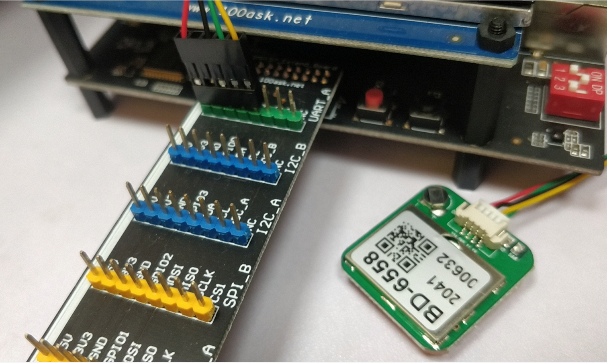

## 在STM32MP157上做串口实验的准备工作

* 本节课程源码在GIT仓库里
  ```shell
doc_and_source_for_drivers\STM32MP157\source\A7\09_UART
	    00_stm32mp157_devicetree_for_uart8
	```


### 1. 出厂系统不支持扩展板上的UART




### 2. 只关注APP开发的话

把GIT仓库中这个dtb文件复制到开发板上去就可以：

```shell
doc_and_source_for_drivers\STM32MP157\source\A7\09_UART\00_stm32mp157_devicetree_for_uart8\dtb
	stm32mp157c-100ask-512d-lcd-v1.dtb
```


操作方法：

  * Ubuntu上：复制dtb文件到NFS目录：

    ```shell
    $ cp stm32mp157c-100ask-512d-lcd-v1.dtb ~/nfs_rootfs/
    ```

  * 开发板上挂载NFS文件系统

    * vmware使用NAT(假设windowsIP为193.168.1.100)

      ```shell
      [root@100ask:~]# mount -t nfs -o nolock,vers=3,port=2049,mountport=9999 
      193.168.1.100:/home/book/nfs_rootfs /mnt
      ```

    * vmware使用桥接，或者不使用vmware而是直接使用服务器：假设Ubuntu IP为193.168.1.137

      ```shell
      [root@100ask:~]#  mount -t nfs -o nolock,vers=3 193.168.1.137:/home/book/nfs_rootfs /mnt
      ```

* 更新设备树

  ```shell
  [root@100ask:~]# mount  /dev/mmcblk2p2  /boot
  [root@100ask:~]# cp /mnt/stm32mp157c-100ask-512d-lcd-v1.dtb /boot
  [root@100ask:~]# sync
  ```

* 重启开发板

* 在串口可以看到以下设备节点

  ```shell
  ls  /dev/ttySTM*
  /dev/ttySTM0
  /dev/ttySTM1
  /dev/ttySTM3
  ```

  


### 3. 从头修改设备树文件

#### 3.1 确定硬件资源

观察STM32MP157的扩展板，背后写着: UART8_TX, UART8_RX，如下图：


打开STM32MP157底板原理图，可知UART8_TX、UART8_RX使用引脚PE1、PE0，如下图：


#### 3.2 使能设备树节点

在STM32MP157的内核设备树文件`arch/arm/boot/dts/stm32mp151.dtsi`中，已经设置了uart8节点：


我们需要使能这个节点，往下看。

#### 3.3 通过Pinctrl指定引脚

光使能UART8还不行，还需要为它选择引脚。

修改`arch/arm/boot/dts/stm32mp15xx-100ask.dtsi`，如下：

```shell
&uart8 {
        pinctrl-names = "default", "sleep";
        pinctrl-0 = <&uart8_pins_mx>;
        pinctrl-1 = <&uart8_sleep_pins_mx>;
        status = "okay";
};
```


这些Pinctrl信息已经在`arm/boot/dts/stm32mp157-100ask-pinctrl.dtsi`中有了，无需我们添加：


#### 3.4 指定设备别名

UART8对应的设备节点是哪个？它的驱动程序需要从"别名"里确定编号。

修改`arch/arm/boot/dts/stm32mp157c-100ask-512d-v1.dts`，如下：

```shell
	aliases {
		ethernet0 = &ethernet0;
		serial0 = &uart4; //debug
		serial1 = &usart6; //rs485
		serial2 = &usart1; //bluetooth
		serial3 = &uart8;  // extend board uart, /dev/ttySTM3
	};
```


#### 3.5 编译、使用

  * 设置工具链

  ```shell
  export ARCH=arm
  export CROSS_COMPILE=arm-buildroot-linux-gnueabihf-
  export PATH=$PATH:/home/book/100ask_stm32mp157_pro-sdk/ToolChain/arm-buildroot-linux-gnueabihf_sdk-buildroot/bin
  ```

  * 编译设备树：
    在Ubuntu的STM32MP157内核目录下执行如下命令,
    得到设备树文件：`arch/arm/boot/dts/stm32mp157c-100ask-512d-lcd-v1.dtb`

    ```shell
    make dtbs
    ```

  * 复制到NFS目录：

    ```shell
    $ cp arch/arm/boot/dts/stm32mp157c-100ask-512d-lcd-v1.dtb ~/nfs_rootfs/
    ```

  * 开发板上挂载NFS文件系统

    * vmware使用NAT(假设windowsIP为193.168.1.100)

      ```shell
      [root@100ask:~]# mount -t nfs -o nolock,vers=3,port=2049,mountport=9999 
      193.168.1.100:/home/book/nfs_rootfs /mnt
      ```

    * vmware使用桥接，或者不使用vmware而是直接使用服务器：假设Ubuntu IP为193.168.1.137

      ```shell
      [root@100ask:~]#  mount -t nfs -o nolock,vers=3 193.168.1.137:/home/book/nfs_rootfs /mnt
      ```

* 更新设备树

  ```shell
  [root@100ask:~]# mount  /dev/mmcblk2p2  /boot
  [root@100ask:~]# cp /mnt/stm32mp157c-100ask-512d-lcd-v1.dtb /boot
  [root@100ask:~]# sync
  ```

* 重启开发板

* 在串口可以看到以下设备节点

  ```shell
  ls  /dev/ttySTM*
  /dev/ttySTM0
  /dev/ttySTM1
  /dev/ttySTM3
  ```

