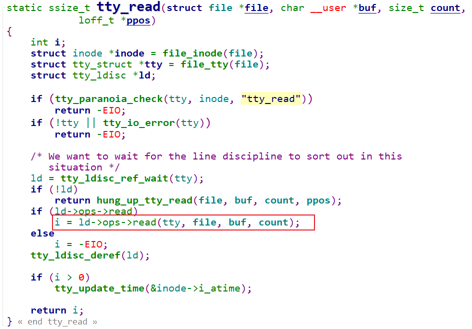
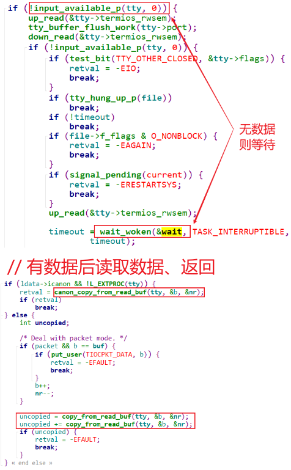

## UART驱动情景分析_read

参考资料

* 参考代码：

  ```shell
  硬件相关：
  drivers/tty/serial/imx.c
  drivers/tty/serial/stm32-usart.c
  
  串口核心层：
  drivers/tty/serial/serial_core.c
  
  TTY层:
  drivers/tty/tty_io.c
  ```

  


### 1. 情景分析大纲

* 注册过程分析
* open过程分析
* read过程分析
* write过程分析


### 2. 源码框架回顾


### 3. 使用哪个行规程

#### 3.1 行规程注册

文件：`drivers\tty\n_tty.c`

```c
void __init n_tty_init(void)
{
	tty_register_ldisc(N_TTY, &n_tty_ops);
}
```

以后可以通过标号N_TTY找到这个行规程。


#### 3.2 open设备时确定行规程

```c
tty_open
    tty_open_by_driver
    	tty_init_dev
    		tty = alloc_tty_struct(driver, idx);
					tty_ldisc_init(tty);
						struct tty_ldisc *ld = tty_ldisc_get(tty, N_TTY);
						tty->ldisc = ld;
```


### 4. read过程分析

流程为：

* APP读

  * 使用行规程来读
  * 无数据则休眠

  

* UART接收到数据，产生中断

  * 中断程序从硬件上读入数据
* 发给行规程
  * 行规程处理后存入buffer
  * 行规程唤醒APP
  
  
  
* APP被唤醒后，从行规程buffer中读入数据，返回
  
  


#### 4.1 tty_read

文件：`drivers\tty\tty_io.c`




#### 4.2 ldisk read

文件：`drivers\tty\n_tty.c`

函数：`n_tty_read` 




```c
copy_from_read_buf
		const unsigned char *from = read_buf_addr(ldata, tail);
										// return &ldata->read_buf[i & (N_TTY_BUF_SIZE - 1)];
		retval = copy_to_user(*b, from, n);
```


#### 4.3 数据源头: 中断

##### 4.3.1 IMX6ULL
文件：`drivers\tty\serial\imx.c`

函数：`imx_rxint`

```c
imx_rxint
    // 读取硬件状态
    // 得到数据
    // 在对应的uart_port中更新统计信息, 比如sport->port.icount.rx++;
    
    // 把数据存入tty_port里的tty_buffer
    tty_insert_flip_char(port, rx, flg)
    
    // 通知行规程来处理
    tty_flip_buffer_push(port);
    	tty_schedule_flip(port);
			queue_work(system_unbound_wq, &buf->work); // 使用工作队列来处理
				// 对应flush_to_ldisc函数
```


##### 4.3.2 STM32MP157
  文件：`drivers\tty\serial\stm32-usart.c`

  函数：`stm32_usart_threaded_interrupt`

```c
stm32_usart_threaded_interrupt
    stm32_usart_receive_chars(port, true);
		// 通过DMA方式得到数据
		stm32_usart_receive_chars_dma(port);
			stm32_usart_push_buffer_dma(port, dma_size);
				// 把数据存入tty_port里的tty_buffer
				dma_count = tty_insert_flip_string(ttyport, dma_start, dma_size);
				// 更新统计信息
				port->icount.rx += dma_count;

		// 通知行规程来处理
		tty_flip_buffer_push(tport);
            tty_schedule_flip(port);
                queue_work(system_unbound_wq, &buf->work); // 使用工作队列来处理
                    // 对应flush_to_ldisc函数
```


