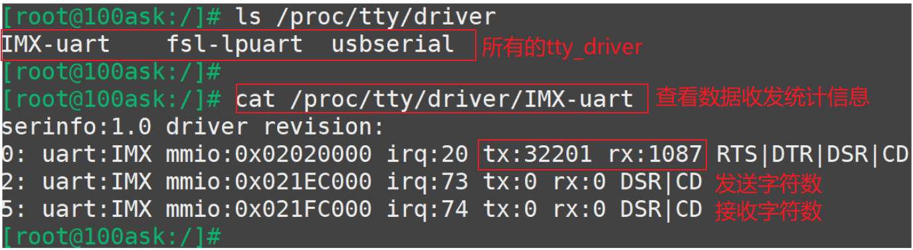

## UART驱动调试方法

参考资料

* 参考代码：

  ```shell
  硬件相关：
  drivers/tty/serial/imx.c
  drivers/tty/serial/stm32-usart.c
  
  串口核心层：
  drivers/tty/serial/serial_core.c
  
  TTY层:
  drivers/tty/tty_io.c
  ```

  

### 1. 怎么得到UART硬件上收发的数据

#### 1.1 接收到的原始数据

可以在接收中断函数里把它打印出来，这些数据也会存入UART对应的tty_port的buffer里：


#### 1.2 发送出去的数据

所有要发送出去的串口数据，都会通过uart_write函数发送，所有可以在uart_write中把它们打印出来：


### 2. proc文件


#### 2.1 /proc/interrupts

查看中断次数。


#### 2.2 /proc/tty/drivers


#### 2.3 /proc/tty/driver(非常有用)



#### 2.4 /proc/tty/ldiscs


### 3. sys文件

在`drivers\tty\serial\serial_core.c`中，有如下代码：


这写代码会在/sys目录中创建串口的对应文件，查看这些文件可以得到串口的很多参数。

怎么找到这些文件？在开发板上执行：

```shell
cd /sys
find -name uartclk  // 就可以找到这些文件所在目录
```


