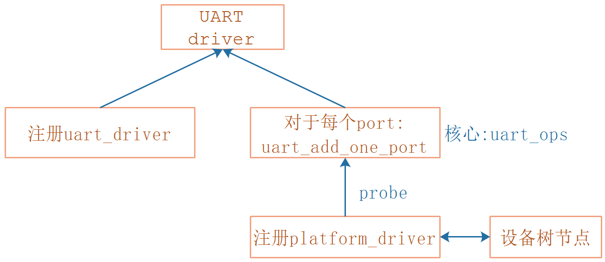
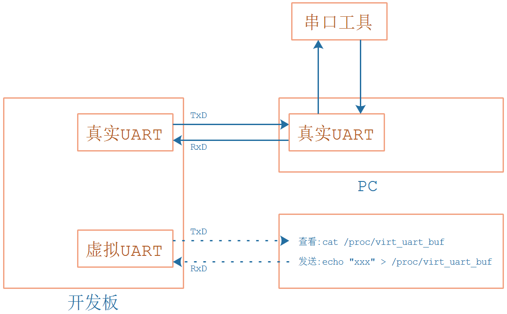

## 编写虚拟UART驱动程序_框架

* 参考代码

  ```shell
  硬件相关：
  drivers/tty/serial/imx.c
  drivers/tty/serial/stm32-usart.c
  
  串口核心层：
  drivers/tty/serial/serial_core.c
  
  TTY层:
  drivers/tty/tty_io.c
  ```

  

* 本节课程源码在GIT仓库里

  ```shell
  doc_and_source_for_drivers\IMX6ULL\source\09_UART
  	04_virtual_uart_driver
  doc_and_source_for_drivers\STM32MP157\source\A7\09_UART
  	04_virtual_uart_driver
  ```
  
  

### 1. 框架回顾


### 2. 编写UART驱动要做的事




* 注册一个uart_driver：它里面有名字、主次设备号等
* 对于每一个port，调用uart_add_one_port，里面的核心是uart_ops，提供了硬件操作函数
  * uart_add_one_port由platform_driver的probe函数调用
  * 所以：
    * 编写设备树节点
    * 注册platform_driver


### 3. 虚拟的UART



为了做实验，我们还要创建一个虚拟文件：/proc/virt_uart_buf

* 要发数据给虚拟串口时，执行：echo "xxx" > /proc/virt_uart_buf
* 要读取虚拟串口的数据时，执行：cat /proc/virt_uart_buf


### 4. 编程

#### 4.1 编写设备树

#### 4.2 编写uart_driver

#### 4.3 编写platform_driver

#### 4.4 实现uart_ops

#### 4.5 实现/proc/virt_uart_buf


