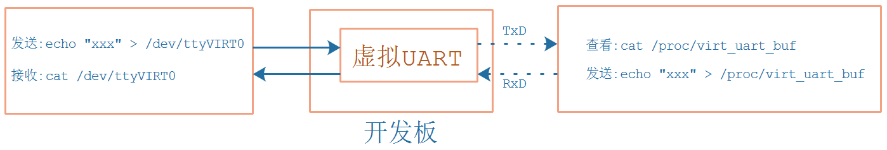

## 编写虚拟UART驱动程序_调试

* 参考代码

  ```shell
  硬件相关：
  drivers/tty/serial/imx.c
  drivers/tty/serial/stm32-usart.c
  
  串口核心层：
  drivers/tty/serial/serial_core.c
  
  TTY层:
  drivers/tty/tty_io.c
  ```

  

* 本节课程源码在GIT仓库里

  ```shell
  doc_and_source_for_drivers\IMX6ULL\source\09_UART
  	07_virtual_uart_driver_ok
  doc_and_source_for_drivers\STM32MP157\source\A7\09_UART
  	07_virtual_uart_driver_ok
  ```
  


### 1. 实验流程




### 2. 上机实验

#### 2.1 设置工具链

##### 1. STM32MP157

  ```shell
  export ARCH=arm
  export CROSS_COMPILE=arm-buildroot-linux-gnueabihf-
  export PATH=$PATH:/home/book/100ask_stm32mp157_pro-sdk/ToolChain/arm-buildroot-linux-gnueabihf_sdk-buildroot/bin
  ```

##### 2. IMX6ULL

  ```shell
  export ARCH=arm
  export CROSS_COMPILE=arm-linux-gnueabihf-
  export PATH=$PATH:/home/book/100ask_imx6ull-sdk/ToolChain/gcc-linaro-6.2.1-2016.11-x86_64_arm-linux-gnueabihf/bin
  ```


#### 2.2 编译、替换设备树

##### 1. STM32MP157

  * 修改`arch/arm/boot/dts/stm32mp157c-100ask-512d-lcd-v1.dts`，添加如下代码：

    ```shell
    / {
    	virtual_uart: virtual_uart_100ask {
    		compatible = "100ask,virtual_uart";
    		
    		interrupt-parent = <&intc>;
    		interrupts = <GIC_SPI 99 IRQ_TYPE_LEVEL_HIGH>;
    		
    	};
    };
    ```

    

  * 编译设备树：
    在Ubuntu的STM32MP157内核目录下执行如下命令,
    得到设备树文件：`arch/arm/boot/dts/stm32mp157c-100ask-512d-lcd-v2.dtb`

    ```shell
    make dtbs
    ```

  * 复制到NFS目录：

    ```shell
    $ cp arch/arm/boot/dts/stm32mp157c-100ask-512d-lcd-v2.dtb ~/nfs_rootfs/
    ```

  * 开发板上挂载NFS文件系统

    * vmware使用NAT(假设windowsIP为192.168.2.100)

      ```shell
      [root@100ask:~]# mount -t nfs -o nolock,vers=3,port=2049,mountport=9999 
      192.168.2.100:/home/book/nfs_rootfs /mnt
      ```

    * vmware使用桥接，或者不使用vmware而是直接使用服务器：假设Ubuntu IP为192.168.2.137

      ```shell
      [root@100ask:~]#  mount -t nfs -o nolock,vers=3 192.168.2.137:/home/book/nfs_rootfs /mnt
      ```

* 更新设备树

  ```shell
  [root@100ask:~]# mount  /dev/mmcblk2p2  /boot
  [root@100ask:~]# cp /mnt/stm32mp157c-100ask-512d-lcd-v1.dtb /boot
  [root@100ask:~]# sync
  ```

* 重启开发板

  


##### 2. IMX6ULL

  * 修改`arch/arm/boot/dts/100ask_imx6ull-14x14.dts`，添加如下代码：

    ```shell
    / {
    	virtual_uart: virtual_uart_100ask {
    		compatible = "100ask,virtual_uart";
    		
    		interrupt-parent = <&intc>;
    		interrupts = <GIC_SPI 99 IRQ_TYPE_LEVEL_HIGH>;
    		
    	};
    
    };
    ```

    

  * 编译设备树：
    在Ubuntu的IMX6ULL内核目录下执行如下命令,
    得到设备树文件：`arch/arm/boot/dts/100ask_imx6ull-14x14.dtb`

    ```shell
    make dtbs
    ```

  * 复制到NFS目录：

    ```shell
    $ cp arch/arm/boot/dts/100ask_imx6ull-14x14.dtb ~/nfs_rootfs/
    ```

* 开发板上挂载NFS文件系统

  * vmware使用NAT(假设windowsIP为192.168.2.100)

    ```shell
    [root@100ask:~]# mount -t nfs -o nolock,vers=3,port=2049,mountport=9999 
    192.168.2.100:/home/book/nfs_rootfs /mnt
    ```

  * vmware使用桥接，或者不使用vmware而是直接使用服务器：假设Ubuntu IP为192.168.2.137

    ```shell
    [root@100ask:~]#  mount -t nfs -o nolock,vers=3 192.168.2.137:/home/book/nfs_rootfs /mnt
    ```

  * 更新设备树

    ```shell
    [root@100ask:~]# cp /mnt/100ask_imx6ull-14x14.dtb /boot
    [root@100ask:~]# sync
    ```

* 重启开发板


#### 2.3 编译、安装驱动程序

* 编译：

  * 在Ubuntu上
  * 修改`07_virtual_uart_driver_ok`中的Makefile，指定内核路径`KERN_DIR`，在执行`make`命令即可。

* 安装：

  * 在开发板上

  * 挂载NFS，复制文件，insmod，类似如下命令：

    ```shell
    mount -t nfs -o nolock,vers=3 192.168.2.137:/home/book/nfs_rootfs /mnt
    // 对于IMX6ULL，想看到驱动打印信息，需要先执行
    echo "7 4 1 7" > /proc/sys/kernel/printk
    
    insmod -f /mnt/virtual_uart.ko
    
    ```

* 观察内核打印的信息


### 3. 调试

根据框架、数据流程来调试：

