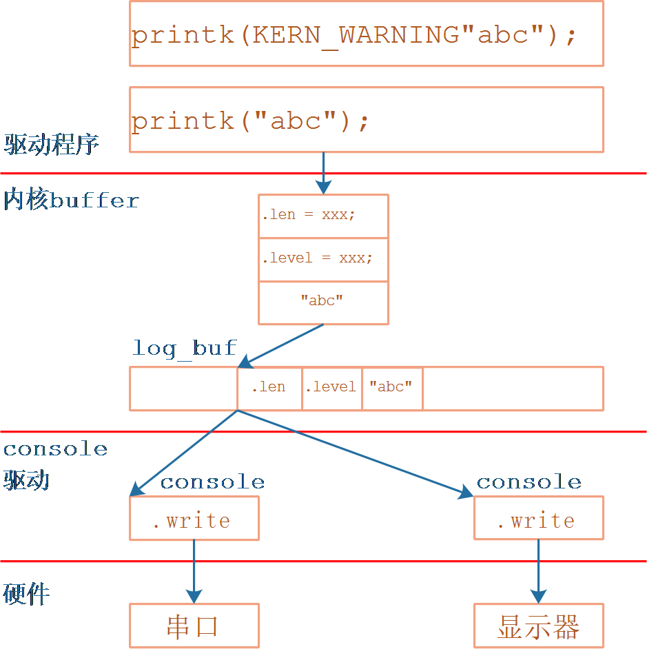
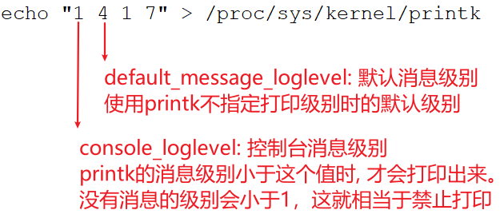
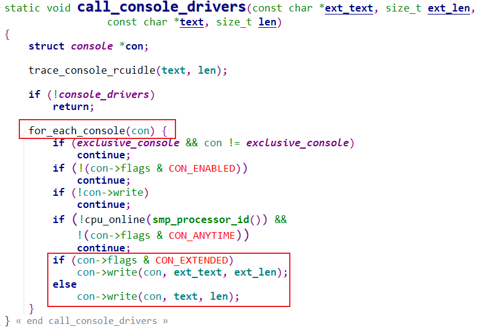
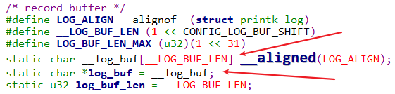

## printk执行过程

* 参考代码

  * Linux 4.9.88
  
    ```shell
    kernel/printk.c
    include/linux/kernel.h
    kernel/printk/internal.h
    ```
  
    
  
  * Linux 5.4
  
    ```shell
    kernel/printk.c
    include/linux/kernel.h
    kernel/printk/printk_safe.c
    ```
  
  

### 1.  printk的使用



#### 1.1  printk使用示例

调试内核、驱动的最简单方法，是使用printk函数打印信息。

printk函数与用户空间的printf函数格式完全相同，它所打印的字符串头部可以加入“\001n”样式的字符。

其中n为0～7，表示这条信息的记录级别，n数值越小级别越高。

**注意**：linux 2.x内核里，打印级别是用"<n>"来表示。

在驱动程序中，可以这样使用printk：

```c
printk("This is an example\n");
printk("\0014This is an example\n");
printk("\0014""This is an example\n");
printk(KERN_WARNING"This is an example\n");
```

在上述例子中：

* 第一条语句没有明确表明打印级别，它被处理前内核会在前面添加默认的打印级别："<4>"

* KERN_WARNING是一个宏，它也表示打印级别：

```c
#define KERN_SOH	"\001"		/* ASCII Start Of Header */
#define KERN_WARNING	KERN_SOH "4"	/* warning conditions */
```

现在我们知道了，内核的每条打印信息都有自己的级别，当自己的级别在数值上小于某个阈值时，内核才会打印该信息。


#### 1.2 printk函数的记录级别

在内核代码`include/linux/kernel.h`中，下面几个宏确定了printk函数怎么处理打印级别：

```c
#define console_loglevel (console_printk[0])
#define default_message_loglevel (console_printk[1])
#define minimum_console_loglevel (console_printk[2])
#define default_console_loglevel (console_printk[3])
```

 

举例说明这几个宏的含义：

① 对于printk(“<n>……”)，只有n小于console_loglevel时，这个信息才会被打印。

② 假设default_message_loglevel的值等于4，如果printk的参数开头没有“<n>”样式的字符，则在printk函数中进一步处理前会自动加上“<4>”；

③ minimum_console_logleve是一个预设值，平时不起作用。通过其他工具来设置console_loglevel的值时，这个值不能小于minimum_console_logleve。

④ default_console_loglevel也是一个预设值，平时不起作用。它表示设置console_loglevel时的默认值，通过其他工具来设置console_loglevel的值时，用到这个值。

 

上面代码中，console_printk是一个数组，它在kernel/printk.c中定义：
```c
/* 数组里的宏在include/linux/printk.h中定义
 */
int console_printk[4] = {
	CONSOLE_LOGLEVEL_DEFAULT,	/* console_loglevel */
	MESSAGE_LOGLEVEL_DEFAULT,	/* default_message_loglevel */
	CONSOLE_LOGLEVEL_MIN,		/* minimum_console_loglevel */
	CONSOLE_LOGLEVEL_DEFAULT,	/* default_console_loglevel */
};

/* Linux 4.9.88 include/linux/printk.h */
#define CONSOLE_LOGLEVEL_DEFAULT 7 /* anything MORE serious than KERN_DEBUG */
#define MESSAGE_LOGLEVEL_DEFAULT CONFIG_MESSAGE_LOGLEVEL_DEFAULT
#define CONSOLE_LOGLEVEL_MIN	 1 /* Minimum loglevel we let people use */

/* Linux 5.4 include/linux/printk.h */
#define CONSOLE_LOGLEVEL_DEFAULT CONFIG_CONSOLE_LOGLEVEL_DEFAULT
#define MESSAGE_LOGLEVEL_DEFAULT CONFIG_MESSAGE_LOGLEVEL_DEFAULT
#define CONSOLE_LOGLEVEL_MIN	 1 /* Minimum loglevel we let people use */
```

 

#### 1.3 在用户空间修改printk函数的记录级别

挂接proc文件系统后，读取/proc/sys/kernel/printk文件可以得知console_loglevel、default_message_loglevel、minimum_console_loglevel和default_console_loglevel这4个值。

比如执行以下命令，它的结果“7 4 1 7”表示这4个值：


也可以直接修改/proc/sys/kernel/printk文件来改变这4个值，比如：
```shell
# echo "1 4 1 7" > /proc/sys/kernel/printk
```
这使得console_loglevel被改为1，于是所有的printk信息都不会被打印。

 

#### 1.4 printk函数记录级别的名称及使用

在内核代码include/linux/kernel.h中，有如下代码，它们表示0～7这8个记录级别的名称：
```c
#define KERN_SOH	"\001"		/* ASCII Start Of Header */
#define KERN_SOH_ASCII	'\001'

#define KERN_EMERG	KERN_SOH "0"	/* system is unusable */
#define KERN_ALERT	KERN_SOH "1"	/* action must be taken immediately */
#define KERN_CRIT	KERN_SOH "2"	/* critical conditions */
#define KERN_ERR	KERN_SOH "3"	/* error conditions */
#define KERN_WARNING	KERN_SOH "4"	/* warning conditions */
#define KERN_NOTICE	KERN_SOH "5"	/* normal but significant condition */
#define KERN_INFO	KERN_SOH "6"	/* informational */
#define KERN_DEBUG	KERN_SOH "7"	/* debug-level messages */

```


在使用printk函数时，可以这样使用记录级别；
```c
printk(KERN_WARNING”there is a warning here!\n”)
```


### 2.  printk执行过程

#### 2.1  函数调用过程

在嵌入式Linux开发中，printk信息常常从串口输出，这时串口被称为串口控制台。从内核kernel/printk.c的printk函数开始，往下查看它的调用关系，可以知道printk函数是如何与具体设备的输出函数挂钩的。

printk函数调用的子函数的主要脉落如下：

```c
printk
    // linux 4.9: kernel/printk/internal.h
    // linux 5.4: kernel/printk/printk_safe.c
    vprintk_func 
    	vprintk_default(fmt, args);
			vprintk_emit
                vprintk_store // 把要打印的信息保存在log_buf中
                	log_output
                
                preempt_disable();
                if (console_trylock_spinning())
                    console_unlock();
                preempt_enable();

console_unlock
	for (;;) {
    	
        msg = log_from_idx(console_idx);
        if (suppress_message_printing(msg->level)) {
            /* 如果消息的级别数值大于console_loglevel, 则不打印此信息 */
        }
        
    	printk_safe_enter_irqsave(flags);
		call_console_drivers(ext_text, ext_len, text, len);
		printk_safe_exit_irqrestore(flags);
    }
```


call_console_drivers函数调用驱动程序打印信息，此函数在`kernel\printk\printk.c`中，代码如下：




#### 2.2 内核打印信息保存在哪

我们执行`dmesg`命令可以打印以前的内核信息，所以这些信息必定是保存在内核buffer中。

在`kernel\printk\printk.c`中，定义有一个全局buffer：




执行`dmesg`命令时，它就是访问虚拟文件`/proc/kmsg`，把log_buf中的信息打印出来。


#### 2.3 printk信息从哪些设备打印出来？

在内核的启动信息中，有类似这样的命令行参数：

```shell
/* IMX6ULL */
[root@100ask:~]# cat /proc/cmdline
console=ttymxc0,115200 root=/dev/mmcblk1p2 rootwait rw

/* STM32MP157 */
[root@100ask:~]# cat /proc/cmdline
root=PARTUUID=491f6117-415d-4f53-88c9-6e0de54deac6 rootwait rw console=ttySTM0,115200
```

在命令行参数中，"console=ttymxc0"、"console=ttySTM0"就是用来选择printk设备的。

可以指定多个"console="参数，表示从多个设备打印信息。


命令行信息来自哪里？

* 设备树

  ```c
  / {
  	chosen {
                  bootargs = "console=ttymxc1,115200";
          };
  };
  ```

  

* UBOOT根据环境参数修改设备树：IMX6ULL

  ```c
  /* 进入IMX6ULL的UBOOT */
  => print mmcargs
  mmcargs=setenv bootargs console=${console},${baudrate} root=${mmcroot}
  => print console
  console=ttymxc0
  => print baudrate
  baudrate=115200
  ```

  

* UBOOT从启动文件修改设备树：STM32MP157

  ```c
  [root@100ask:~]# mount /dev/mmcblk2p2 /boot
  [root@100ask:~]# cd /boot
  [root@100ask:/boot]# cat mmc0_extlinux/stm32mp157c-100ask-512d-v1_extlinux.conf
  # Generic Distro Configuration file generated by OpenEmbedded
  menu title Select the boot mode
  MENU BACKGROUND /splash.bmp
  TIMEOUT 20
  DEFAULT 100ask-lcd
  LABEL 100ask-core
          KERNEL /uImage
          FDT /stm32mp157c-100ask-512d-v1.dtb
          INITRD /uInitrd
          APPEND root=/dev/mmcblk1p5  rootwait rw console=ttySTM0,115200
  LABEL 100ask-hdmi
          KERNEL /uImage
          FDT /stm32mp157c-100ask-512d-hdmi-v1.dtb
          INITRD /uInitrd
          APPEND root=/dev/mmcblk1p5  rootwait rw console=ttySTM0,115200
  LABEL 100ask-lcd
          KERNEL /uImage
          FDT /stm32mp157c-100ask-512d-lcd-v1.dtb
          INITRD /uInitrd
          APPEND root=/dev/mmcblk1p5  rootwait rw console=ttySTM0,115200
  ```

  


