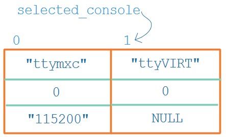

## console驱动注册过程

* 参考代码

  * Linux 4.9.88
  
    ```shell
    kernel/printk.c
    include/linux/kernel.h
    kernel/printk/internal.h
    drivers/tty/serial/imx.c
    ```
  
    
  
  * Linux 5.4
  
    ```shell
    kernel/printk.c
    include/linux/kernel.h
    kernel/printk/printk_safe.c
    drivers/tty/serial/stm32-usart.
    ```
  
  

### 1.  回顾printk的使用


### 2. console结构体分析

`include\linux\console.h`:

```c
struct console {
	char	name[16];  // name为"ttyXXX"，在cmdline中用"console=ttyXXX0"来匹配
    
    // 输出函数
	void	(*write)(struct console *, const char *, unsigned);
    
	int	    (*read)(struct console *, char *, unsigned);
    
    // APP访问/dev/console时通过这个函数来确定是哪个(index)设备
    // 举例:
    // a. cmdline中"console=ttymxc1"
    // b. 则注册对应的console驱动时：console->index = 1
    // c. APP访问/dev/console时调用"console->device"来返回这个index
	struct  tty_driver *(*device)(struct console *co, int *index);
    
	void	(*unblank)(void);
    
    // 设置函数, 可设为NULL
	int	    (*setup)(struct console *, char *);
    
    // 匹配函数, 可设为NULL
	int	    (*match)(struct console *, char *name, int idx, char *options); 
    
	short	flags;
    
    // 哪个设备用作console: 
    // a. 可以设置为-1, 表示由cmdline确定
    // b. 也可以直接指定
	short	index;
    
    // 常用: CON_PRINTBUFFER
	int	    cflag;
	void	*data;
	struct	 console *next;
};
```


### 3. console驱动注册过程

#### 3.1 处理命令行参数

在`kernel\printk\printk.c`中，可以看到如下代码：

```c
__setup("console=", console_setup);
```

这是用来处理u-boot通过设备树传给内核的cmdline参数，比如cmdline中有如下代码：

```c
console=ttymxc0,115200  console=ttyVIRT0
```

对于这两个"console=xxx"就会调用console_setup函数两次，构造得到2个数组项：

```c
struct console_cmdline
{
	char	name[16];			/* Name of the driver	    */
	int	index;				/* Minor dev. to use	    */
	char	*options;			/* Options for the driver   */
#ifdef CONFIG_A11Y_BRAILLE_CONSOLE
	char	*brl_options;			/* Options for braille driver */
#endif
};

static struct console_cmdline console_cmdline[MAX_CMDLINECONSOLES];
```

在cmdline中，最后的"console=xxx"就是"selected_console"(被选中的console，对应/dev/console)：




#### 3.2 register_console

console分为两类，它们通过console结构体的flags来分辨(flags中含有CON_BOOT)：

* bootconsoles：用来打印很早的信息
* real consoles：真正的console

可以注册很多的bootconsoles，但是一旦注册`real consoles`时，所有的bootconsoles都会被注销，并且以后再注册bootconsoles都不会成功。


被注册的console会放在console_drivers链表中，谁放在链表头部？

* 如果只有一个`real consoles`，它自然是放在链表头部
* 如果有多个`real consoles`，"selected_console"(被选中的console)被放在链表头部

放在链表头有什么好处？APP打开"/dev/console"时，就对应它。

```c
uart_add_one_port
    uart_configure_port
    	register_console(port->cons);
```


#### 3.3 /dev/console

在`drivers\tty\tty_io.c`中，代码调用过程如下：

```c
tty_open
    tty = tty_open_by_driver(device, inode, filp);
		driver = tty_lookup_driver(device, filp, &index);
			case MKDEV(TTYAUX_MAJOR, 1): {
                struct tty_driver *console_driver = console_device(index);


/* 从console_drivers链表头开始寻找
 * 如果console->device成功，就返回它对应的tty_driver
 * 这就是/dev/console对应的tty_driver
 */ 
struct tty_driver *console_device(int *index)
{
	struct console *c;
	struct tty_driver *driver = NULL;

	console_lock();
	for_each_console(c) {
		if (!c->device)
			continue;
		driver = c->device(c, index);
		if (driver)
			break;
	}
	console_unlock();
	return driver;
}
```


