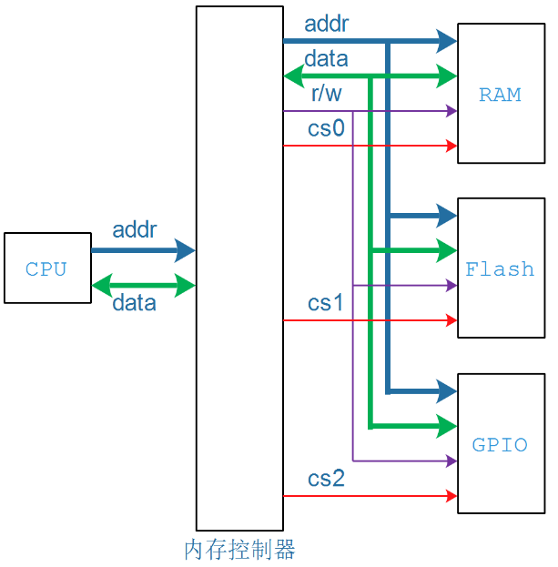
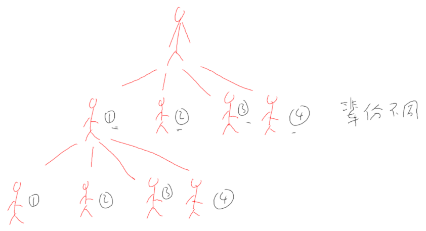
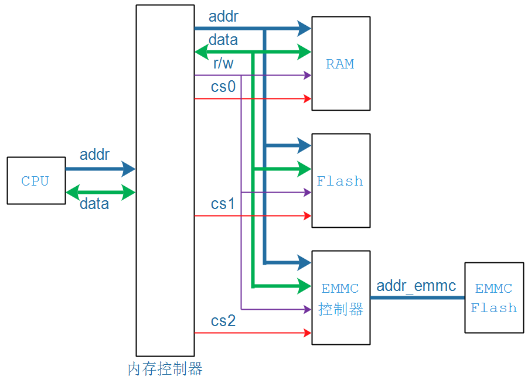
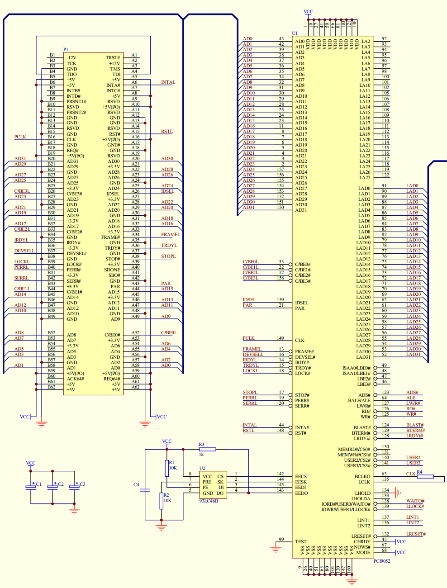
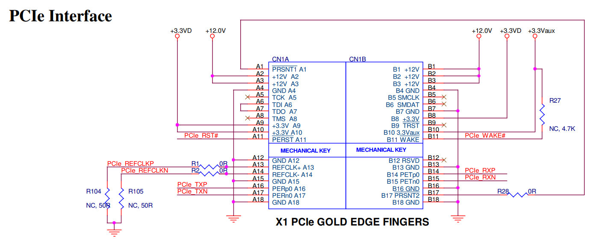

## 从软件开发角度看待PCI和PCIe

参考资料：

* 《PCI Express Technology》，Mike Jackson, Ravi Budruk; MindShare, Inc.
* [《PCIe扫盲系列博文》](http://blog.chinaaet.com/justlxy/p/5100053251)，作者Felix，这是对《PCI Express Technology》的理解与翻译
* 《PCI EXPRESS体系结构导读 (王齐)》
* 《PCI Express_ Base Specification Revision 4.0 Version 0.3 ( PDFDrive )》
* 《NCB-PCI_Express_Base_5.0r1.0-2019-05-22》

### 1. 最容易访问的设备是什么

是内存！

要读写内存，知道它的地址就可以：

```c
volatile unsigned int *p = 某个地址;
unsigned int val;
*p = val;  /* 写 */
val = *p;  /* 读 */
```


只有内存能这样简单、方便地使用吗？

不是的，所有的"ram-like"接口设备都可以这样操作。

什么叫"ram-like"接口？

* 要发出地址：有地址线
* 要读写数据：有数据线
* 怎么分辨是读还是写：有读写信号
* 众多"ram-like"设备共享上面的信号，怎么才能互不影响？每个设备都有自己的片选信号

如下图所示：



* CPU发出addr，到达内存控制器，也出现在RAM、Flash、GPIO等设备上
* 使能设备：
  * 如果addr属于RAM的地址范围，cs0就被使能
  * 如果addr属于Flash的地址范围，cs1就被使能
  * 如果addr属于GPIO的地址范围，cs2就被使能
  * 没有被使能的设备，就相当于没接上去一样，不会影响其他设备
* 读写数据


关键在于：内存控制器，它会根据地址范围发出对应的片选信号，选中对应的设备。


### 2. 地址空间的概念

以人类为例：

* 爷爷生了4个小孩，排行1234
* 老大又生了4个小孩，排行1234
* 这2个"1234"辈分不一样，空间不一样




嵌入式系统中的地址空间：

* CPU发出addr，可以用来方位EMMC控制器
* 但是CPU发出的addr，不能直接到达EMMC Flash
* 想访问EMMC Flash
  * 必须用过EMMC控制器
  * 编写EMMC控制器驱动程序
* 如果CPU发出的addr，可以直接到达EMMC Flash，那就简单了




### 3. 理解PCI和PCIE的关键

#### 3.1 地址空间转换


#### 3.2 PCI接口速览

参考文件：`01_pci接口引脚电路示例.pdf`



#### 3.3 PCIe接口速览

参考文件：`01_pcie接口引脚电路示例_AX99100.pdf`




### 4. 访问PCI/PCIe设备的流程

#### 4.1 PCI/PCIe设备的配置信息

PCI/PCIe设备上有配置空间(配置寄存器)，用来表明自己"需要多大的地址空间"。

注意，这是PCI/PCIe地址空间。


#### 4.2 主机读取设备配置信息、分配空间

主机上的程序访问PCI/PCIe设备，读出配置信息。

分配地址空间：注意，分配的是PCI/PCIe地址空间。

把地址空间首地址写入设备。


#### 4.3 CPU地址空间和PCI/PCIe地址空间怎么转换？

假设CPU发出的addr_cpu，是用来方位PCI设备的，转换关系为：

```c
addr_pci  = addr_cpu + offset
```

在PCI/PCIe控制器中，有某个寄存器，有来保存offset值。


#### 4.3 主机像读写内存一样访问设备

示例代码如下：

```c
volatile unsigned int *p = addr_cpu;
unsigned int val;
*p = val;  /* 写, 硬件会把addr_cpu转换为addr_pci去写PCI/PCIe设备 */
val = *p;  /* 读, 硬件会把addr_cpu转换为addr_pci去读PCI/PCIe设备 */
```


