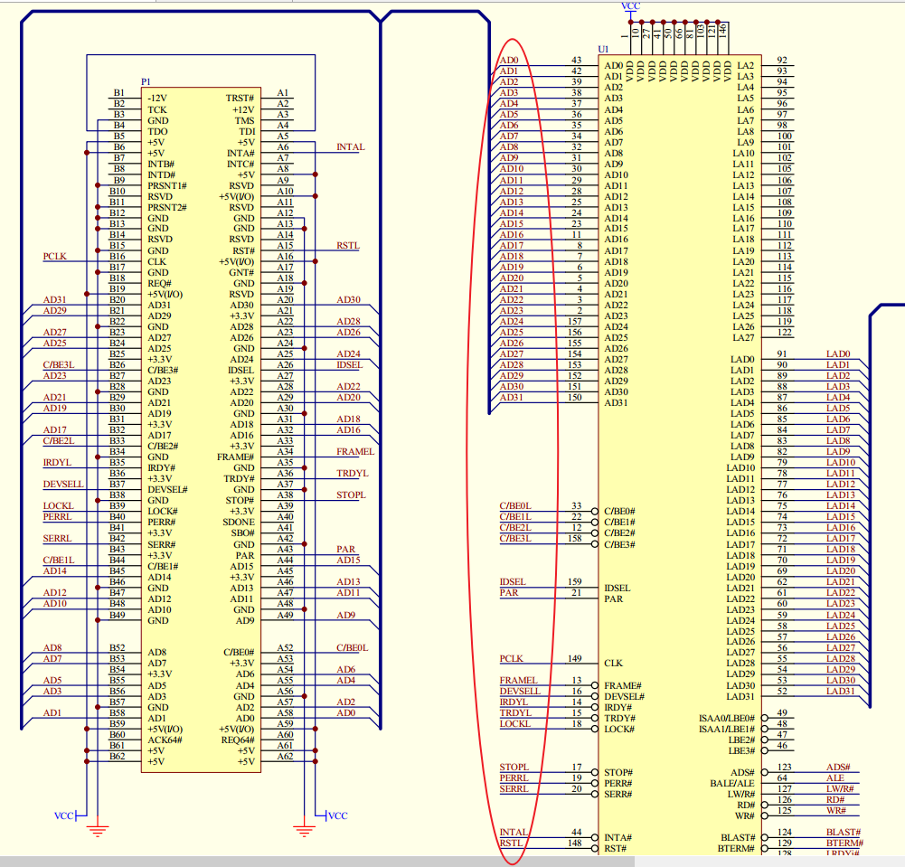
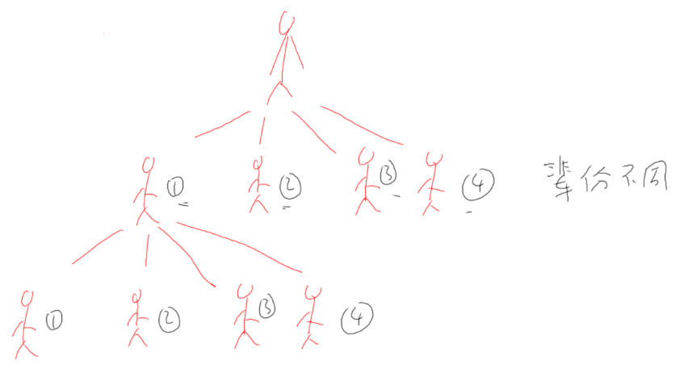

## PCI设备的访问方法_非桥设备(type0)

参考资料：GIT仓库

```shell
doc_and_source_for_drivers\IMX6ULL\doc_pic\10_PCI_PCIe\
	01_pci接口引脚电路示例.pdf
	
	协议\PCI\
		PCI_SPEV_V3_0.pdf
		pci-pci_bridge.pdf

	芯片手册\PCI-UART\MCS9865.pdf
```


### 1. 硬件结构

PCI系统框图：


怎么访问到某个PCI设备？

需要理解PCI本地总线信号。


### 2. PCI本地总线的信号

主要分为6类：

| 类别           | 信号                                                         | 描述 |
| -------------- | ------------------------------------------------------------ | ---- |
| 系统引脚       | CLK：给PCI设备提供时钟<br />RST#：用于复位PCI设备            |      |
| 地址/数据引脚  | AD[31:00]：地址、数据复用<br />C/BE[3:0]：命令或者字节使能<br />PAR：校验引脚 |      |
| 接口控制       | FRAME#：PCI主设备驱动此信号，表示一个传输开始了、进行中<br />IRDY#：Initiator ready, 传输发起者就绪，一般由PCI主设备驱动此信号<br />TRDY#：Target ready，目标设备驱动，表示它就绪了<br />STOP#：目标设备驱动，表示它想停止当前传输<br />LOCK#：锁定总线，独占总线，有PCI桥驱动此信号<br />IDSEL：Initialization Device Select，配置设备时，用来选中某个PCI设备<br />DEVSEL#：Device Select，PCI设备驱动此信号，表示说：我就是你想访问的设备 |      |
| 仲裁引脚       | REQ#：申请使用PCI总线<br />GNT#：授予，表示你申请的PCI总线成功了，给你使用 |      |
| 错误通知引脚   | PERR#：奇偶校验错误<br />SERR#：系统错误                     |      |
| 中断引脚(可选) | INTA#、INTB#、INTC#、INTD#                                   |      |


示例：




### 3. 访问PCI设备

#### 3.1 怎么访问PCI设备

以人来比喻：

* 爷爷想使唤孙子②
* 爷爷发指令给他的儿子①
* 儿子①发指令给孙子②



对于嵌入式设备，爷爷是CPU，父辈是PCI桥，孙子是PCI设备，过程如下：

* CPU发出地址addr_cpu
* PCI桥把addr_cpu转换为addr_pci
* PCI总线上所有设备都检测addr_pci地址，发现它属于某个设备的地址，该设备就负责完成此传输


问题1：PCI设备怎么确定自己的地址范围？

回答1：需要配置，软件通过PCI桥查询PCI设备的地址需求，分配一块addr_pci空间给它


问题2：PCI本地的地址空间有哪些

回答2：配置空间、内存空间、IO空间


问题3：怎么理解这些地址空间？看视频。


#### 3.1 PCI设备的地址空间

* 配置空间：PCI设备的配置寄存器

  * 我是什么设备
  * 我需要多大的内存空间
  * 我需要多大的IO空间

* 内存空间或IO空间：PCI本地总线上有AD总线，它是地址、数据复用的总线

  * 传输地址时：这些地址可以是内存地址，也可以是IO地址

  * 怎么分辨是哪类地址？通过C/BE[3:0]这4个引脚来分辨

  * 内存空间、IO空间有什么差别

    * 基本没什么差别

    * 大部分适用内存空间

    * IO空间应该是x86平台的遗留

      

#### 3.2 访问PCI设备的步骤

* 访问配置空间

* 访问内存空间/IO空间

  

#### 3.3 示例：配置PCI Agent设备

PCI设备可以简单地分为PCI Bridge和PCI Agent：

* PCI Bridge：桥，用来扩展PCI设备，必定有一个Root Bridge，下面还可以有其他Bridge。
* PCI Agent：真正的PCI设备(比如网卡)，是PCI树的最末端


怎么配置PCI Agent设备？

* 选中：通过IDSEL来选中某个设备

* 怎么访问配置空间：发起一个type 0的配置命令

  * PCI设备最多有8个功能，每个功能都有自己的配置空间(配置寄存器)
  * 你要访问哪个功能？哪个寄存器？发起
    

* CPU读取配置空间的BAR，得知：这个PCI设备想申请多大空间

* CPU分配PCI地址，写到PCI设备的BAR里

  

