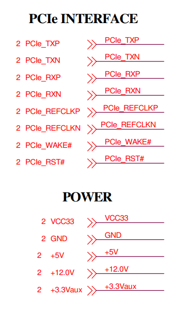
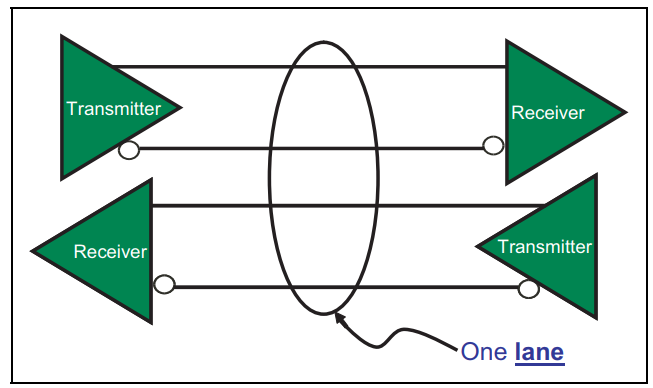
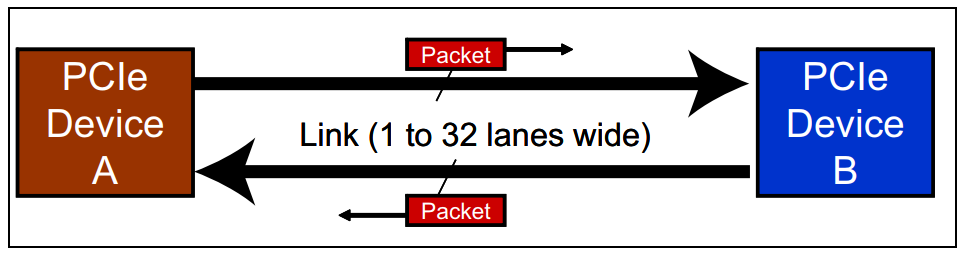
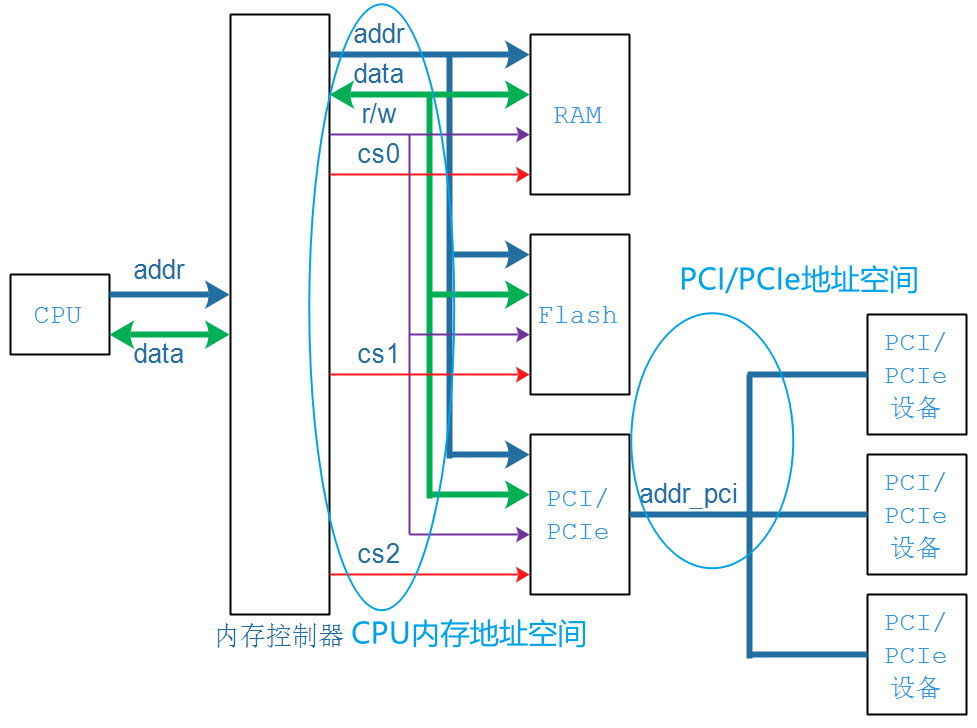
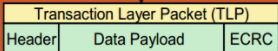
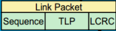
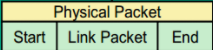
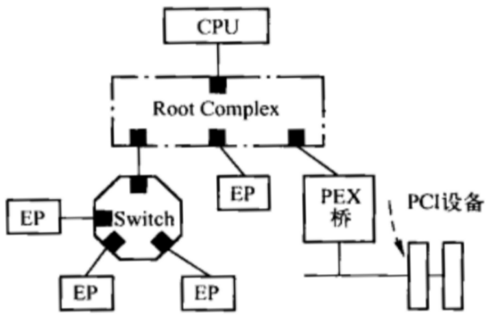

## 从软件角度看PCIe设备的硬件结构

参考资料：

* 《PCI Express Technology》，Mike Jackson, Ravi Budruk; MindShare, Inc.
* [《PCIe扫盲系列博文》](http://blog.chinaaet.com/justlxy/p/5100053251)，作者Felix，这是对《PCI Express Technology》的理解与翻译
* 《PCI EXPRESS体系结构导读 (王齐)》
* 《PCI Express_ Base Specification Revision 4.0 Version 0.3 ( PDFDrive )》
* 《NCB-PCI_Express_Base_5.0r1.0-2019-05-22》

### 1. PCIe接口引脚

参考文件：01_pcie接口引脚电路示例_AX99100.pdf

PCI接口的引脚时并行的，PCEe的是串行的，每个方向的数据使用2条差分信号线来传输，发送/接收两个方向就需要4条线，这被称为1个Lane：

PCIe设备的接口上，可以有多个Lane：

* 两个PCIe设备之间有一个Link
* 一个Link中有1对或多对"发送/接收"引脚，每对"发送/接收"引脚被称为"Lane"
* 一个Lane：有发送、接收两个方向，每个方向用2条差分信号线，所以1个Lane有4条线
* 一个Link最多可以有32 Lane

### 2. 从软件角度理解硬件接口

#### 2.1 PCI/PCIe地址空间转换

#### 2.2 PCIe上怎么传输地址、数据

既然PCIe是串行信号，那只能在"包"里传输地址、数据了。

* 需要定义包的格式：类型(Mem R/W) + 地址 + 数据
* 包怎么传递给对方、怎么确保不出错？有重传机制、有检验码
* 包怎么通过差分线传送出去？

PCIe总线的层次结构和数据包：

* 事务层(Tansaction Layer)：传输的是Transaction Layer Packet(TLP)
  
* 数据链路层(Data Link Layer)：传输的是Data Link Layer Packet(DLLP)
  * 在TLP加上前缀、后缀，得到DLLP
    
  * 当然还有数据链路层自己的数据包
  
* 物理层(Physical Layer)：传输的是Physical Packet
  * 在DLLP加上前缀、后缀，得到的是Physical Packet
    
  * 当然还有物理层自己的数据包

### 3. PCIe系统的硬件框图

在PCI系统里，多个PCI设备都链接到相同总线上。

在PCIe系统里，是点对点传输的：

* 一条PCIe总线只能接一个PCIe设备
* 要接多个PCIe设备，必须使用Switch进行扩展

