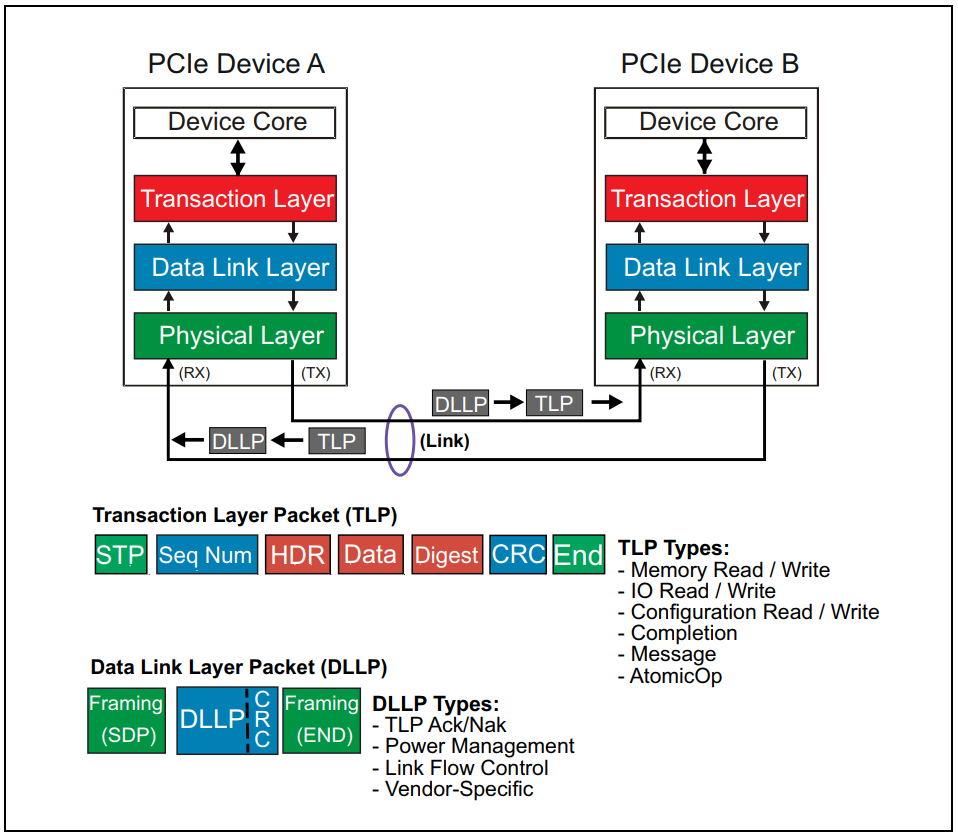
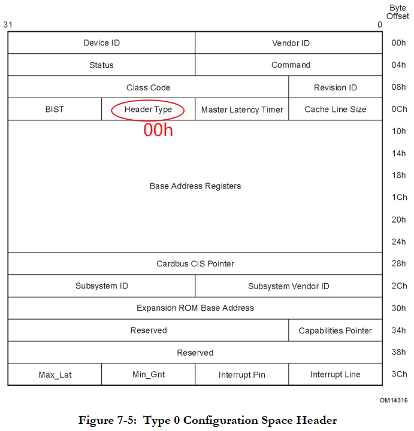

## PCIe设备的配置过程

参考资料：

* 《PCI Express Technology 3.0》，Mike Jackson, Ravi Budruk; MindShare, Inc.
* [《PCIe扫盲系列博文》](http://blog.chinaaet.com/justlxy/p/5100053251)，作者Felix，这是对《PCI Express Technology》的理解与翻译
* 《PCI EXPRESS体系结构导读 (王齐)》
* 《PCI Express_ Base Specification Revision 4.0 Version 0.3 ( PDFDrive )》
* 《NCB-PCI_Express_Base_5.0r1.0-2019-05-22》

### 1. PCIe系统硬件结构

下图来自《PCI Express_ Base Specification Revision 4.0 Version 0.3 ( PDFDrive )》，P78。

### 2. PCIe系统软件层次

下图来自《PCI Express Technology 3.0》。

在软件的角度，我们先关注事务层(Transaction Layer)，在事务层传输TLP(Transaction Layer Packet，事务层包)。

我们要关注TLP中怎么表示这些内容：

* 要做什么？内存读、内存写、IO读、IO写、配置读、配置写？
* 内存读写/IO读写：哪个地址？
* 配置读写：哪个"Bus/Device/Function/Register"？
* 数据？

### 3. 事务层TLP格式

#### 3.1 Posted和Non-Posted

Post的意思是"邮寄"、"投递"。

PCIe有两类事务：

* Posted：主设备访问目标设备时，主设备发出信号后就不再理会后续过程，也就是"发射后不管"。使用这种方式，在数据未到达目标设备前，主设备就可以结束当前操作，效率更高。适用于"内存写"等场合。
* Non-Posted：主设备访问目标设备时，主设备发出信号后必须等待后续结果。比如"内存读"，必须得到返回的数据，才能结束当前操作。

在PCIe系统中：

* Posted：内存写
* Non-Posted：内存读、IO读、IO写、配置读、配置写
* 对于Non-Posted，使用Split传送方式
  * Split含有：分离
  * 被拆分为两部分，发出请求报文、得到完成报文

#### 3.2 TLP通用格式

下图来自《PCI Express_ Base Specification Revision 4.0 Version 0.3 ( PDFDrive )》。

* 类型：你是读内存还是写内存？读IO还是写IO？读配置还是写配置？
  * 在Header里面有定义
* 地址：对于内存读写、IO读写，地址保存在Header里
* Bus/Dev/Function/Regiser：对于配置读写，这些信息保存在Header里
* 数据：对于内存读、IO读、配置读，先发出请求，再得到数据
  * 分为2个阶段：读请求报文、完成报文
  * 读请求报文：不含数据
  * 完成报文：含数据

#### 3.3 TLP头部

### 4. 配置与RC直连的设备

#### 4.1 怎么访问直连的设备

怎么访问下图红圈中的设备：

RC本身就是一个桥，要去访问跟桥直接相连的设备，用CfgRd0类型的TLP：

* Fmt和Type取值为0b00, 0b00100，表示：Configuration Read Type 0
* TLP中设置有"Bus/Device/Funciton/Register"
* 提问：上图红圈中是设备，怎么知道它自己的Bus号是0，Device分别是0、1、2？
  * 红圈中的设备都是在RC内部，它们的Device号是硬件里写死的(hard-coded)
  * 当这些设备监测到Bus0上的TLP是CfgRd0后，忽略TLP中的Bus，比对TLP中的Device
  * 如果Device吻合，就回应TLP

#### 4.2 配置EendPoint

### 5. 配置示例

本节内容参考《PCI Express Technology 3.0》。

#### 5.1 必备知识

##### 5.1.1 PCIe设备的配置寄存器

PCI/PCIe设备、桥，它们的配置寄存器前面若干字节格式是一样的，可以从里面的"Header Type"分辨：

* 它是普通设备，还是桥
* 它是单功能设备，还是多功能设备：所谓功能，就是Function，一个物理设备可以有多个功能，也就有多个逻辑设备

一般的PCI/PCIe设备，它的配置寄存器格式如上上图的"Type 0 Header"，在PCIe系统中这类设备被称为Endpoint。

PCI/PCIe桥，它的配置寄存器格式如上上图的"Type 1 Header"，

对于PCI/PCIe桥，里面的由三项重要的总线号：

* Pirmary Bus Number：上游总线号
* Secondary Bus Number：自己的总线号
* Subordinate Bus Number：下游总线号的最大数值

这些总线号示例如下：

##### 5.1.2 Type 0 Configuration Request

如果要配置的设备，就在当前总线上，即目标设备的Bus号等于当前桥的Secondary Bus Number，

那么在当前总线(即Secondary Bus Number)上传输的就是"Type 0 Configuration Request"：

* TLP格式如下图所示
* 不会穿过桥

##### 5.1.3 Type 1 Configuration Request

如果要配置的设备，不在当前总线上，但是在它下面的总线上，即：

* 目标设备的Bus号大于当前桥的Secondary Bus Number，
* 目标设备的Bus号小于或等于当前桥的Subordinate Bus Number，

那么在当前总线(即Secondary Bus Number)上传输的就是"Type 1 Configuration Request"：

* TLP格式如下图所示
* 会穿过桥
* 到达设备时，跟设备直接连接的桥会把它转换为"Type 0 Configuration Request"

#### 5.2 配置过程示例
##### 5.2.1 硬件拓扑结构

以下图中的设备的配置过程为例，给大家做示范。

##### 5.2.2 配置过程演示

下文中BDF表示Bus,Device,Function，用这三个数值来表示设备。

1. 软件设置Host/PCI Bridge的Secondary Bus Number为0，Subordinate Bus Number为255(先设置为最大，后面再改)。
2. 从Bus 0开始扫描：先尝试读到BDF(0,0,0)设备的Vendor ID，如果不成功表示没有这个设备，就尝试下一个设备BDF(0,1,0)。一个桥下最多可以直接连接32个设备，所以会尝试32次：Device号从0到31。**注意**：在Host/PCI Bridge中，这些设备的Device号是硬件写死的。
3. 步骤2读取BDF(0,0,0)设备(即使图中的A)时，发现它的Header Type是01h，表示它是一个桥、单功能设备
4. 发现了设备A是一个桥，配置它：
   * Primary Bus Number Register = 0：它的上游总线是Bus 0
   * Secondary Bus Number Register = 1：从它发出的总线是Bus 1
   * Subordinate Bus Number Register = 255：先设置为最大，后面再改
5. 因为发现了桥A，执行"深度优先"的配置过程：先去枚举A下面的设备，再回来枚举跟A同级的B
6. 软件读取BDF(1,0,0)设备(就是设备C)的Vendor ID，成功得到Vendor ID，表示这个设备存在。
7. 它的Header Type是01h，表示这是一个桥、单功能设备。
8. 配置桥C：
   * Primary Bus Number Register = 1：它的上游总线是Bus 1
   * Secondary Bus Number Register = 2：从它发出的总线是Bus 2
   * Subordinate Bus Number Register = 255：先设置为最大，后面再改
9. 继续从桥C执行"深度优先"的配置过程，枚举Bus 2下的设备，从BDF(2,0,0)开始
10. 读取BDF(2,0,0)设备(就是设备D)的Vendor ID，成功得到Vendor ID，表示这个设备存在。
11. 它的Header Type是01h，表示这是一个桥、单功能设备。
12. 配置桥D：
    * Primary Bus Number Register = 2：它的上游总线是Bus 2
    * Secondary Bus Number Register = 3：从它发出的总线是Bus 3
    * Subordinate Bus Number Register = 255：先设置为最大，后面再改
13. 继续从桥D执行"深度优先"的配置过程，枚举Bus 2下的设备，从BDF(3,0,0)开始
14. 读取BDF(3,0,0)设备的Vendor ID，成功得到Vendor ID，表示这个设备存在。
15. 它的Header Type是80h，表示这是一个Endpoing、多功能设备。
16. 软件枚举这个设备的所有8个功能，发现它有Function0、1
17. 软件继续枚举Bus 3上其他设备(Device号1~31)，没发现更多设备
18. 现在已经扫描完桥D即Bus 3下的所有设备，它下面没有桥，所以桥D的Subordinate Bus Number等于3。扫描完Bus 3后，回退到上一级Bus 2，继续扫描其他设备，从BDF(2,1,0)开始，就是开始扫描设备E。
19. 读取BDF(2,1,0)设备(就是设备E)的Vendor ID，成功得到Vendor ID，表示这个设备存在。
20. 它的Header Type是01h，表示这是一个桥、单功能设备。
21. 配置桥E：
    * Primary Bus Number Register = 2：它的上游总线是Bus 2
    * Secondary Bus Number Register = 4：从它发出的总线是Bus 4
    * Subordinate Bus Number Register = 255：先设置为最大，后面再改
22. 继续从桥D执行"深度优先"的配置过程，枚举Bus 4下的设备，从BDF(4,0,0)开始
23. 读取BDF(4,0,0)设备的Vendor ID，成功得到Vendor ID，表示这个设备存在。
24. 它的Header Type是00h，表示这是一个Endpoing、单功能设备。
25. 软件继续枚举Bus 4上其他设备(Device号1~31)，没发现更多设备
26. 已经枚举完设备E即Bus 4下的所有设备了，更新设备E的Subordinate Bus Number为4。然后继续扫描设备E的同级设备：Bus=2，Device从2到31，发现Bus 2上没有这些设备。
27. 软件更新设备C即Bus 2的桥，把它的Subordinate Bus Number设置为4。然后继续扫描设备C的同级设备：Bus=1，Device从1到31，发现Bus 1上没有这些设备。
28. 软件更新设备A即Bus 1的桥，把它的Subordinate Bus Number设置为4。然后继续扫描设备A的同级设备：Bus=0，Device从1到31，发现Bus 0上的设备B。
29. 配置桥B：
    * Primary Bus Number Register = 0：它的上游总线是Bus 0
    * Secondary Bus Number Register = 5：从它发出的总线是Bus 5
    * Subordinate Bus Number Register = 255：先设置为最大，后面再改
30. 再从桥B开始，执行"深度优先"的配置过程。

