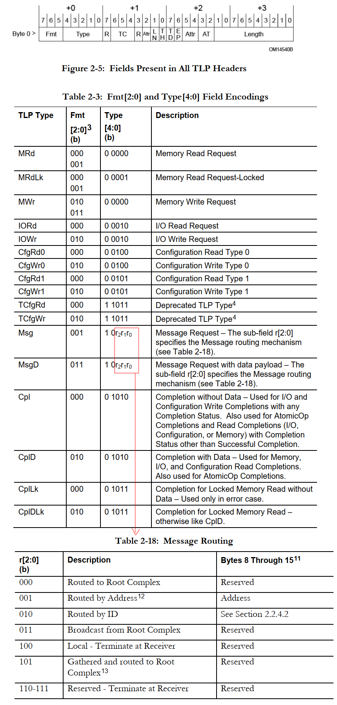
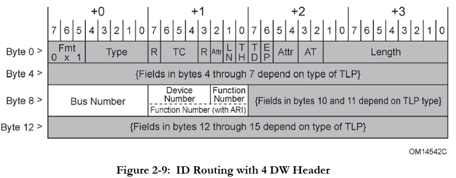
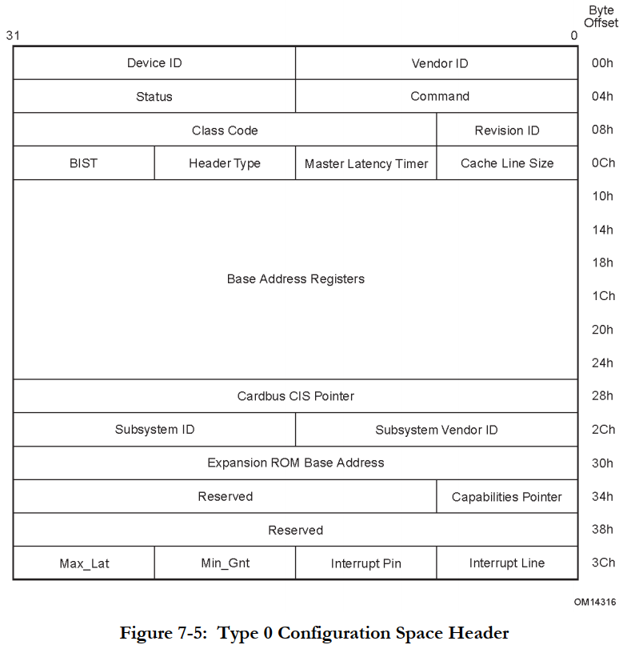
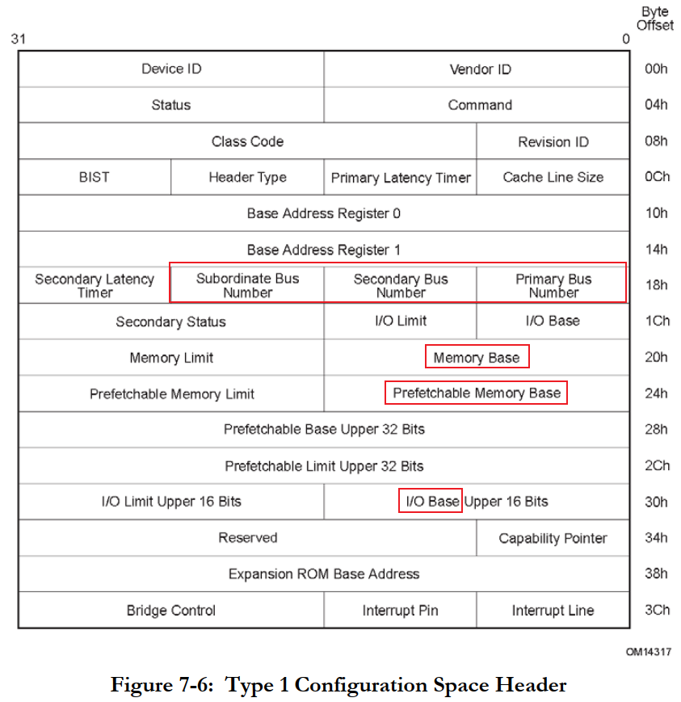
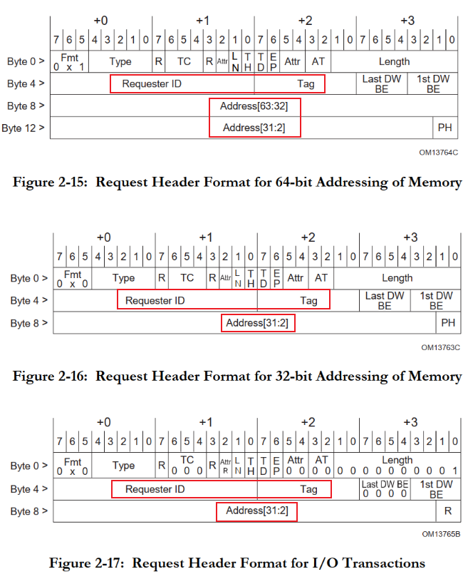
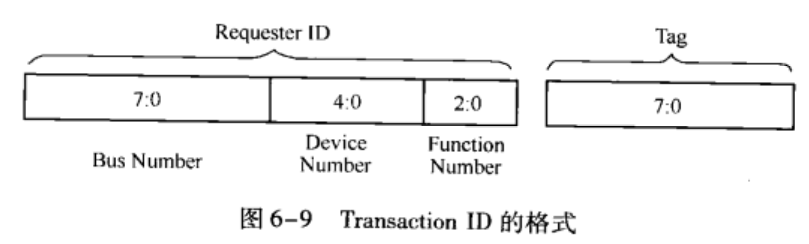
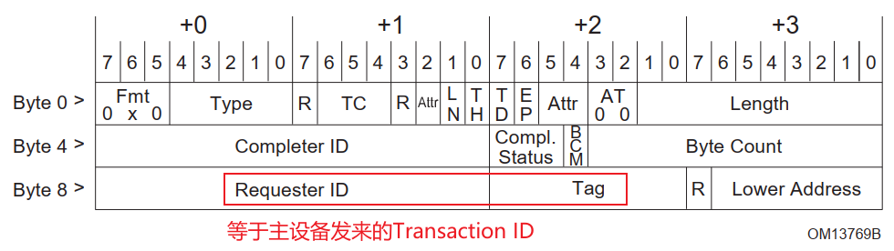
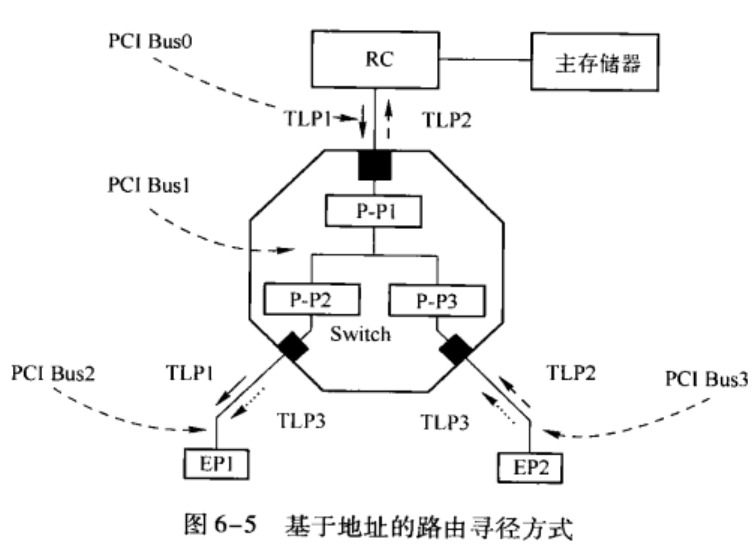
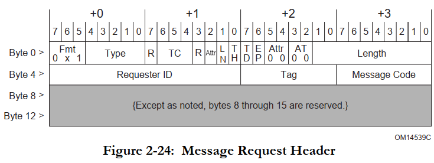
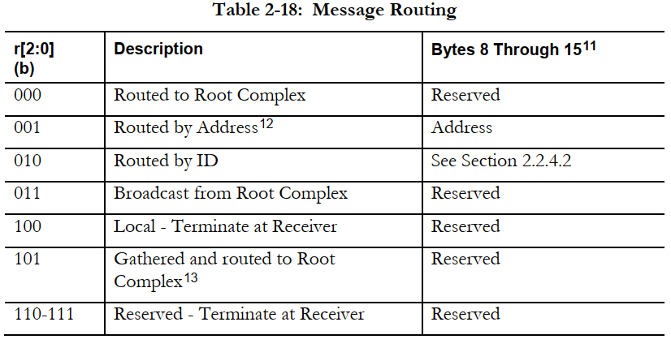

## PCIe路由方式

参考资料：

* 《PCI Express Technology 3.0》，Mike Jackson, Ravi Budruk; MindShare, Inc.
* [《PCIe扫盲系列博文》](http://blog.chinaaet.com/justlxy/p/5100053251)，作者Felix，这是对《PCI Express Technology》的理解与翻译
* 《PCI EXPRESS体系结构导读 (王齐)》
* 《PCI Express_ Base Specification Revision 4.0 Version 0.3 ( PDFDrive )》
* 《NCB-PCI_Express_Base_5.0r1.0-2019-05-22》

### 1. 三种路由方式

数据传输时，最先要确定的是：怎么找到对方？

所谓"路由"，就是怎么找到对方，PCIe协议中有三种路由方式：

* 基于ID的路由
* 基于地址的路由
* 隐式路由

TLP中怎么表示自己使用哪种路由？TLP头部就表明了：

访问PCIe设备时，要先配置，才能读写数据：

* 配置读、配置写：使用**基于ID的路由**，就是使用<Bus, Device, Function>来寻找对方。配置成功后，每个PCIe设备都有自己的PCIe地址空间了。
* 内存读、内存写或者IO读、IO写：
  * 发出报文给对方：使用**基于地址的路由**
  * 对方返回数据或者返回状态时：使用**基于ID的路由**
* 各类消息，比如中断、广播等：使用**隐式路由**

### 2. 基于ID的路由

下图来自《PCI Express_ Base Specification Revision 4.0 Version 0.3 ( PDFDrive ).pdf》：

TLP中含有<Bus number, Device number, Function number>，这就是ID。

对PCIe设备进行配置读、配置写的时候，使用的就是**基于ID的路由**，这在上节视频已经介绍了。

配置成功后，每个PCIe设备，包括虚拟的PCIe桥，都分配到了地址空间：

* PCIe设备(Endpoint)：地址空间是自己的，别的设备访问这个地址范围时，就是想访问它
* PCIe桥：地址空间是下面的PCIe设备的，别的设备访问这个地址范围时，就是想访问它下面的设备

#### 2.1 PCIe设备(Endpoint)的配置空间

Endpoint的配置空间里有"Base Address Regiseters"：

* 一开始：这些寄存器用来声明：需要多大的地址空间、是内存空间还是IO空间
* 被配置后：系统软件为它分配出地址空间，把首地址写入这些寄存器

下图来自《PCI Express_ Base Specification Revision 4.0 Version 0.3 ( PDFDrive ).pdf》：

#### 2.2 PCIe桥的配置空间

PCIe桥的配置空间里有"Primary Bus Number、Secondary Bus Number、Subordinate Bus Number"：

* 配置PCIe桥的时候，系统软件会填充这些信息
* 对于ID路由，将根据这些信息转发报文

PCIe桥的配置空间里有"Memory Base、Prefetchable Memory Base、I/O Base"：

* 表示该桥下游所有设备使用的三组空间范围
  * 存储器空间
  * 可预取的存储器空间
  * I/O空间
* 对于地址路由，将根据这些信息转发报文

下图来自《PCI Express_ Base Specification Revision 4.0 Version 0.3 ( PDFDrive ).pdf》：

#### 2.3 示例

看视频。

配置时使用ID路由；返回报文时也使用ID路由。

### 3. 基于地址的路由

PCIe设备(EndPoint)被配置后，它记录有分配给它的基地址。

PCIe桥也记录有下游PCI子树的基地址。

* PCIe桥监测总线上的信号，根据TLP里的地址决定是否转发到自己下面的总线上
* PCIe设备监测总线上的信号，根据TLP里的地址决定是否访问自己
* PCIe设备发出回应的报文时，使用**基于ID的路由**

#### 3.1 内存读写/IO读写

下图来自《PCI Express_ Base Specification Revision 4.0 Version 0.3 ( PDFDrive ).pdf》：

#### 3.2 完成报文

上图里面的Requester ID、TAG，被称为"Transaction ID"。
下图来自《PCI EXPRESS体系结构导读 (王齐)》：

主设备要给EndPoint的内存写数据，它发出"内存写报文"，不需要对方回应。

主设备要读EndPoint的内存数据，它发出"内存读报文"，需要对方回应。

主设备要给EndPoint的IO写数据，它发出"IO写报文"，需要对方回应。

主设备要读EndPoint的IO数据，它发出"IO读报文"，需要对方回应。

* PCIe设备要回应时，回应谁？给"Requester ID"，使用**基于ID的路由**
* 发起PCIe传输的设备(主设备)，对每次传输都分配一个独一的Tag，并且在硬件内部保存当前TLP
* 接收到回应报文后，才会根据Tag清除掉内存中保存数据
* 如果没接收到回应，或者失败了：会把硬件中保存的TLP重新发送出去

回应的完成报文，可以含有数据，也可以不含数据，格式如下：

#### 3.3 示例

看视频，讲解下图，来自《PCI EXPRESS体系结构导读 (王齐)》：

### 4. 隐式路由

消息报文的头部格式如下：

消息报文中头部的Type字段里低3位表示隐式路由方式：

* 000：路由到RC
* 001：使用地址路由(使用地址路由的消息不常见)
* 010：使用ID路由
* 011：来自RC的广播报文，底下的PCIe桥会向下游转发此消息
* 100：本地消息，消息到达目的设备后结束，不会再次转发
* 101：路由到RC，仅用于电源管理

