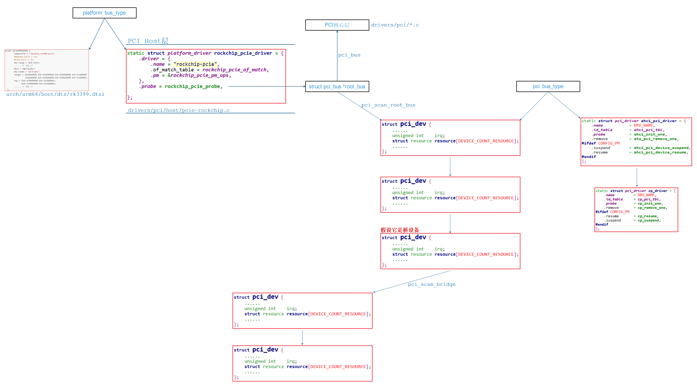
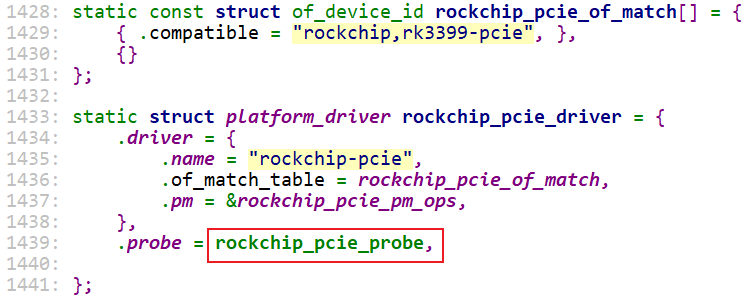
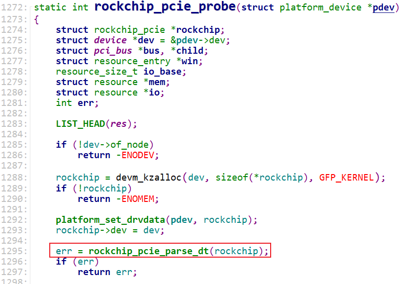
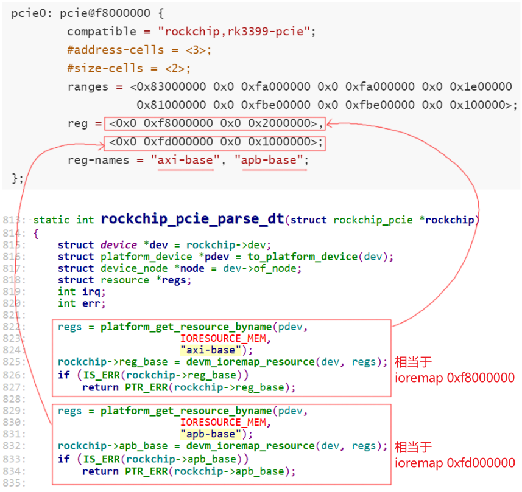
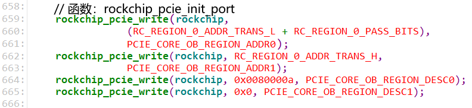
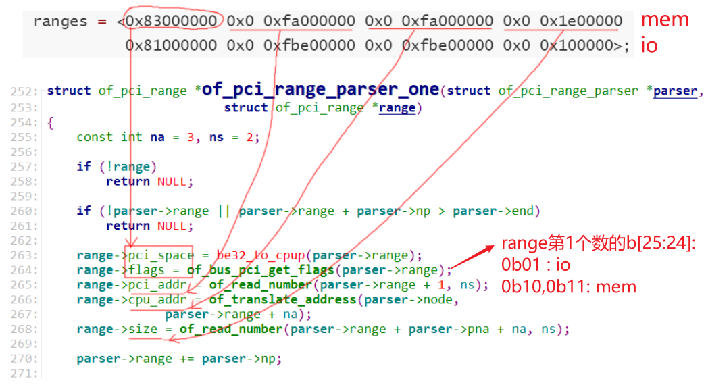
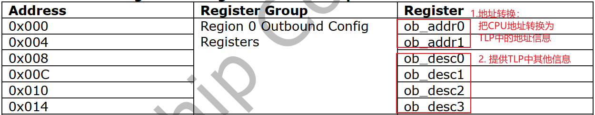
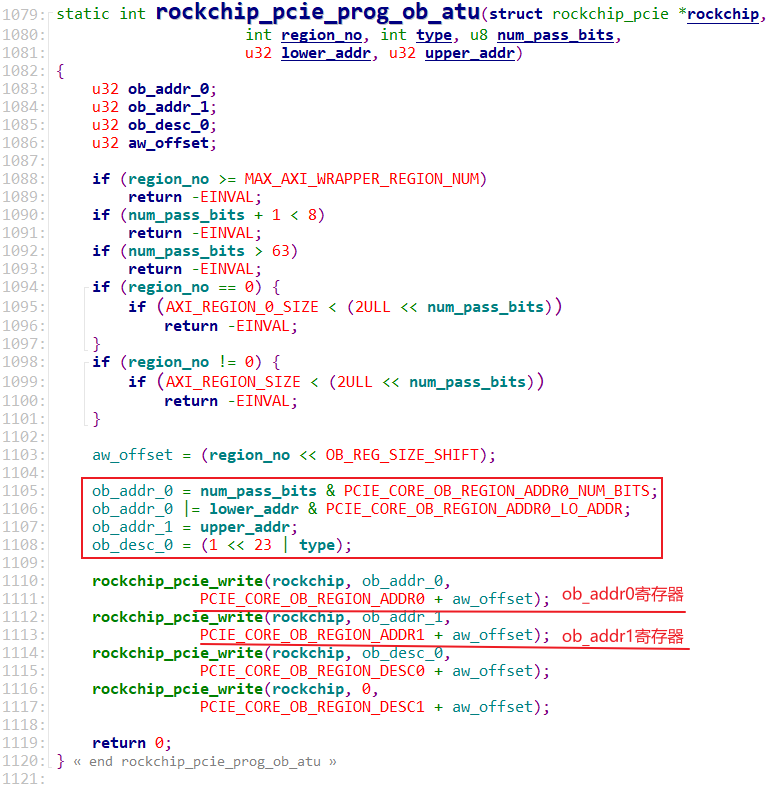

## RK3399_PCIe_Host驱动分析_地址映射

参考资料：

* 《PCI Express Technology 3.0》，Mike Jackson, Ravi Budruk; MindShare, Inc.
* [《PCIe扫盲系列博文》](http://blog.chinaaet.com/justlxy/p/5100053251)，作者Felix，这是对《PCI Express Technology》的理解与翻译
* 《PCI EXPRESS体系结构导读 (王齐)》
* 《PCI Express_ Base Specification Revision 4.0 Version 0.3 ( PDFDrive )》
* 《NCB-PCI_Express_Base_5.0r1.0-2019-05-22》
* [SOC中AXI总线是如何连接的](https://zhuanlan.zhihu.com/p/157137488)
* [AXI总线整理总结](https://blog.csdn.net/tristan_tian/article/details/89393045)
* [PCIe中MSI和MSI-X中断机制](https://blog.csdn.net/pieces_thinking/article/details/119431791)

开发板资料：

* https://wiki.t-firefly.com/zh_CN/ROC-RK3399-PC-PLUS/

本课程分析的文件：

* `linux-4.4_rk3399\drivers\pci\host\pcie-rockchip.c`


### 1. PCI驱动框架




### 2. Host驱动程序速览

怎么找到驱动？

* 在内核目录下根据芯片名字找到文件：`drivers\pci\host\pcie-rockchip.c`

  * 看到如下代码：

    ```c
    static const struct of_device_id rockchip_pcie_of_match[] = {
    	{ .compatible = "rockchip,rk3399-pcie", },
    	{}
    };
    ```

* 在内核`arch/arm64/boot/dts`下搜：`grep "rockchip,rk3399-pcie" * -nr`

  * 找到设备树文件：`arch/arm64/boot/dts/rk3399.dtsi`，代码如下：

    ```shell
            pcie0: pcie@f8000000 {
                    compatible = "rockchip,rk3399-pcie";
                    #address-cells = <3>;
                    #size-cells = <2>;
                    aspm-no-l0s;
                    clocks = <&cru ACLK_PCIE>, <&cru ACLK_PERF_PCIE>,
                             <&cru PCLK_PCIE>, <&cru SCLK_PCIE_PM>;
                    clock-names = "aclk", "aclk-perf",
                                  "hclk", "pm";
                    bus-range = <0x0 0x1f>;
                    max-link-speed = <1>;
                    linux,pci-domain = <0>;
                    msi-map = <0x0 &its 0x0 0x1000>;
                    interrupts = <GIC_SPI 49 IRQ_TYPE_LEVEL_HIGH 0>,
                                 <GIC_SPI 50 IRQ_TYPE_LEVEL_HIGH 0>,
                                 <GIC_SPI 51 IRQ_TYPE_LEVEL_HIGH 0>;
                    interrupt-names = "sys", "legacy", "client";
                    #interrupt-cells = <1>;
                    interrupt-map-mask = <0 0 0 7>;
                    interrupt-map = <0 0 0 1 &pcie0_intc 0>,
                                    <0 0 0 2 &pcie0_intc 1>,
                                    <0 0 0 3 &pcie0_intc 2>,
                                    <0 0 0 4 &pcie0_intc 3>;
                    phys = <&pcie_phy>;
                    phy-names = "pcie-phy";
                    ranges = <0x83000000 0x0 0xfa000000 0x0 0xfa000000 0x0 0x1e00000
                              0x81000000 0x0 0xfbe00000 0x0 0xfbe00000 0x0 0x100000>;
                    reg = <0x0 0xf8000000 0x0 0x2000000>,
                          <0x0 0xfd000000 0x0 0x1000000>;
                    reg-names = "axi-base", "apb-base";
                    resets = <&cru SRST_PCIE_CORE>, <&cru SRST_PCIE_MGMT>,
                             <&cru SRST_PCIE_MGMT_STICKY>, <&cru SRST_PCIE_PIPE>,
                             <&cru SRST_PCIE_PM>, <&cru SRST_P_PCIE>,
                             <&cru SRST_A_PCIE>;
                    reset-names = "core", "mgmt", "mgmt-sticky", "pipe",
                                  "pm", "pclk", "aclk";
                    status = "disabled";
                    pcie0_intc: interrupt-controller {
                            interrupt-controller;
                            #address-cells = <0>;
                            #interrupt-cells = <1>;
                    };
            };
    ```

所谓`Host`，就是PCIe控制器，它的驱动做什么？

* 解析设备树，根据设备树确定：寄存器地址、CPU空间地址、PCI空间地址、中断信息
* 记录资源：CPU空间地址、PCI空间地址
* 初始化PCIe控制器本身，建立CPU地址和PCI地址的映射
* 扫描识别当前PCIe控制器下面的PCIe设备


驱动文件`drivers\pci\host\pcie-rockchip.c`中注册了一个platform_driver，从它的probe函数开始分析：




### 3. 设备树文件解析

RK3399访问PCIe控制器时，CPU地址空间可以分为：

* Client Register Set：地址范围 0xFD000000~0xFD7FFFFF，比如选择PCIe协议的版本(Gen1/Gen2)、电源控制等
* Core Register Set  ：地址范围 0xFD800000~0xFDFFFFFF，所谓核心寄存器就是用来进行设置地址映射的寄存器等
* Region 0：0xF8000000~0xF9FFFFFF , 32MB，用于访问外接的PCIe设备的配置空间
* Region 1：0xFA000000~0xFA0FFFFF，1MB，用于地址转换
* Region 2：0xFA100000~0xFA1FFFFF，1MB，用于地址转换
* ……
* Region 32：0xFBF00000~0xFBFFFFFF，1MB，用于地址转换

其中Region 0大小为32MB，Region1~31大小分别为1MB。

在设备树里都有体现(下列代码中，其他信息省略了)：

* reg属性里的0xf8000000：Region 0的地址
* reg属性里的0xfd000000：PCIe控制器内部寄存器的地址
  * Client Register Set：地址范围 0xFD000000~0xFD7FFFFF
  * Core Register Set  ：地址范围 0xFD800000~0xFDFFFFFF
* ranges属性里
  * 第1个0xfa000000：Region1~30的CPU地址空间首地址，用于内存读写
  * 第2个0xfa000000：Region1~30的PCI地址空间首地址，用于内存读写
  * 第1个0xfbe00000：Region31的CPU地址空间首地址，用于IO读写
  * 第2个0xfbe00000：Region31的PCI地址空间首地址，用于IO读写
* Region32呢？在.c文件里用作"消息TLP"

```shell
        pcie0: pcie@f8000000 {
                compatible = "rockchip,rk3399-pcie";
                #address-cells = <3>;
                #size-cells = <2>;
                ranges = <0x83000000 0x0 0xfa000000 0x0 0xfa000000 0x0 0x1e00000
                          0x81000000 0x0 0xfbe00000 0x0 0xfbe00000 0x0 0x100000>;
                reg = <0x0 0xf8000000 0x0 0x2000000>,
                      <0x0 0xfd000000 0x0 0x1000000>;
                reg-names = "axi-base", "apb-base";
        };
```


### 4. 设备树相关驱动程序分析

代码入口如下：




#### 4.1 Region0和寄存器地址




0xF8000000就是RK3399的Region0地址，用于 ECAM：[PCIe ECAM介绍](https://zhuanlan.zhihu.com/p/176988002)。

即：只写读写0xF8000000这段空间，就可以只写读写PCIe设备的配置空间。

0xFD000000即使RK3399 PCIe控制器本身的寄存器基地址。


Region0用与读写配置空间，它对应的寄存器要设置用于产生对应的TLP，函数调用关系如下：

```c
rockchip_pcie_probe
    err = rockchip_pcie_init_port(rockchip);
```




#### 4.2 确定CPU/PCI地址空间

在PCIe设备树里有一个属性`ranges`，它里面含有多个range，每个range描述了：

* flags：是内存还是IO
* PCIe地址
* CPU地址
* 长度

先提前说一下怎么解析这些range，函数为`for_each_of_pci_range`，解析过程如下：




从probe函数开始分析，完整的代码流程如下：

```c
rockchip_pcie_probe
	resource_size_t io_base;
    LIST_HEAD(res); // 资源链表

	// 解析设备树获得PCI host bridge的资源(CPU地址空间、PCI地址空间、大小)
	err = of_pci_get_host_bridge_resources(dev->of_node, 0, 0xff, &res, &io_base);
		// 解析 bus-range
		// 设备树里:  bus-range = <0x0 0x1f>;
		// 解析得到: bus_range->start= 0 , 
		//          bus_range->end = 0x1f, 
		//          bus_range->flags = IORESOURCE_BUS;
		// 放入前面的链表"LIST_HEAD(res)"
		err = of_pci_parse_bus_range(dev, bus_range);  
			pci_add_resource(resources, bus_range);

		// 解析 ranges
		// 设备树里: 
        //        ranges = <0x83000000 0x0 0xfa000000 0x0 0xfa000000 0x0 0x1e00000
        //                  0x81000000 0x0 0xfbe00000 0x0 0xfbe00000 0x0 0x100000>;
    	of_pci_range_parser_init
    		parser->range = of_get_property(node, "ranges", &rlen);
		for_each_of_pci_range(&parser, &range) {// 解析range            
            // 把range转换为resource
            // 第0个range
            // 		range->pci_space = 0x83000000,
            //		range->flags     = IORESOURCE_MEM,
            //		range->pci_addr  = 0xfa000000,
            //		range->cpu_addr  = 0xfa000000,
            //		range->size      = 0x1e00000,
            // 转换得到第0个res：
            // 		res->flags = range->flags = IORESOURCE_MEM;
            // 		res->start = range->cpu_addr = 0xfa000000;
            // 		res->end = res->start + range->size - 1 = (0xfa000000+0x1e00000-1);
            // ---------------------------------------------------------------
            // 第1个range
            // 		range->pci_space = 0x81000000,
            //		range->flags     = IORESOURCE_IO,
            //		range->pci_addr  = 0xfbe00000,
            //		range->cpu_addr  = 0xfbe00000,
            //		range->size      = 0x100000,
            // 转换得到第1个res：
            // 		res->flags = range->flags = IORESOURCE_MEM;
            // 		res->start = range->cpu_addr = 0xfbe00000;
            // 		res->end = res->start + range->size - 1 = (0xfbe00000+0x100000-1);
            err = of_pci_range_to_resource(&range, dev, res); 

            // 在链表中增加resource
            // 第0个resource：
            //		注意第3个参数: offset = cpu_addr - pci_addr = 0xfa000000 - 0xfa000000 = 0
            // 第1个resouce
            //		注意第3个参数: offset = cpu_addr - pci_addr = 0xfbe00000 - 0xfbe00000 = 0
            pci_add_resource_offset(resources, res,	res->start - range.pci_addr);

        }

    /* Get the I/O and memory ranges from DT */
    resource_list_for_each_entry(win, &res) {
        rockchip->io_bus_addr = io->start - win->offset;   // 0xfbe00000, cpu addr
        rockchip->mem_bus_addr = mem->start - win->offset; // 0xfba00000, cpu addr
        rockchip->root_bus_nr = win->res->start; // 0
    }

	bus = pci_scan_root_bus(&pdev->dev, 0, &rockchip_pcie_ops, rockchip, &res);

	pci_bus_add_devices(bus);
```


#### 4.3 建立CPU/PCI地址空间的映射

调用关系如下：

```c
rockchip_pcie_probe
   	err = rockchip_cfg_atu(rockchip);
				/* MEM映射: Region1~30 */ 
                for (reg_no = 0; reg_no < (rockchip->mem_size >> 20); reg_no++) {
                    err = rockchip_pcie_prog_ob_atu(rockchip, reg_no + 1,
                                    AXI_WRAPPER_MEM_WRITE,
                                    20 - 1,
                                    rockchip->mem_bus_addr +
                                    (reg_no << 20),
                                    0);
                    if (err) {
                        dev_err(dev, "program RC mem outbound ATU failed\n");
                        return err;
                    }
                }
                
				/* IO映射: Region31 */
                offset = rockchip->mem_size >> 20;
                for (reg_no = 0; reg_no < (rockchip->io_size >> 20); reg_no++) {
                    err = rockchip_pcie_prog_ob_atu(rockchip,
                                    reg_no + 1 + offset,
                                    AXI_WRAPPER_IO_WRITE,
                                    20 - 1,
                                    rockchip->io_bus_addr +
                                    (reg_no << 20),
                                    0);
                    if (err) {
                        dev_err(dev, "program RC io outbound ATU failed\n");
                        return err;
                    }
                }

                /* 用于消息传输: Region32 */
                rockchip_pcie_prog_ob_atu(rockchip, reg_no + 1 + offset,
                              AXI_WRAPPER_NOR_MSG,
                              20 - 1, 0, 0);

                rockchip->msg_bus_addr = rockchip->mem_bus_addr +
                                ((reg_no + offset) << 20);

```


MEM空间映射：

```c
	// rockchip->mem_bus_addr = 0xfa000000
	// rockchip->mem_size     = 0x1e00000
	// 设置Region1、2、……30的映射关系
	for (reg_no = 0; reg_no < (rockchip->mem_size >> 20); reg_no++) {
		err = rockchip_pcie_prog_ob_atu(rockchip, reg_no + 1,
						AXI_WRAPPER_MEM_WRITE,
						20 - 1,
						rockchip->mem_bus_addr +
						(reg_no << 20),
						0);
```


IO空间映射：

```c
	// rockchip->io_bus_addr = 0xfbe00000
	// rockchip->io_size     = 0x100000
	// 设置Region31的映射关系
	offset = rockchip->mem_size >> 20;
	for (reg_no = 0; reg_no < (rockchip->io_size >> 20); reg_no++) {
		err = rockchip_pcie_prog_ob_atu(rockchip,
						reg_no + 1 + offset,
						AXI_WRAPPER_IO_WRITE,
						20 - 1,
						rockchip->io_bus_addr +
						(reg_no << 20),
						0);
		if (err) {
			dev_err(dev, "program RC io outbound ATU failed\n");
			return err;
		}
	}
```


Message空间映射：

```c
	/* Region32：assign message regions */
	rockchip_pcie_prog_ob_atu(rockchip, reg_no + 1 + offset,
				  AXI_WRAPPER_NOR_MSG,
				  20 - 1, 0, 0);

	rockchip->msg_bus_addr = rockchip->mem_bus_addr +
					((reg_no + offset) << 20);
```


任何一个Region，都有对应的寄存器：




所谓建立CPU和PCI地址空间的映射，就是设置Region对应的寄存器，都是使用函数`rockchip_pcie_prog_ob_atu`：




