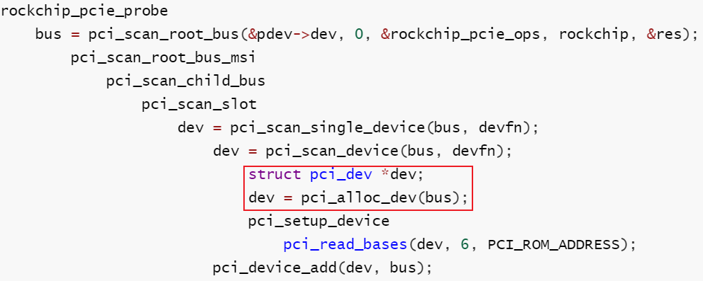
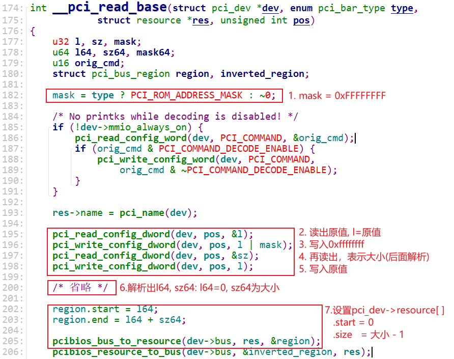

## RK3399_PCIe_Host驱动分析_设备枚举

参考资料：

* 《PCI Express Technology 3.0》，Mike Jackson, Ravi Budruk; MindShare, Inc.
* [《PCIe扫盲系列博文》](http://blog.chinaaet.com/justlxy/p/5100053251)，作者Felix，这是对《PCI Express Technology》的理解与翻译
* 《PCI EXPRESS体系结构导读 (王齐)》
* 《PCI Express_ Base Specification Revision 4.0 Version 0.3 ( PDFDrive )》
* 《NCB-PCI_Express_Base_5.0r1.0-2019-05-22》
* [SOC中AXI总线是如何连接的](https://zhuanlan.zhihu.com/p/157137488)
* [AXI总线整理总结](https://blog.csdn.net/tristan_tian/article/details/89393045)
* [PCIe中MSI和MSI-X中断机制](https://blog.csdn.net/pieces_thinking/article/details/119431791)

开发板资料：

* https://wiki.t-firefly.com/zh_CN/ROC-RK3399-PC-PLUS/

本课程分析的文件：

* `linux-4.4_rk3399\drivers\pci\host\pcie-rockchip.c`


### 1. PCIe控制器的资源

上节视频我们分析了PCIe控制器驱动程序`pcie-rockchip.c`，它解析了设备树，得到了如下资源：

* 总线资源：就是总线号，从0到0x1f
* 内存资源：CPU地址基地址为0xfa000000，PCI地址基地址为0xfa000000，大小为0x1e00000
* IO资源：CPU地址基地址为0xfbe00000，PCI地址基地址为0xfbe00000，大小为0x100000

这3类资源记录在链表中：


解析设备树时，把资源记录在这个链表里：


res链表中记录的资源最终会放到pci_bus->bridge->windows链表里，如下图记录：


### 2. 设备配置空间

本节内容参考：`PCI_SPEV_V3_0.pdf`

使用PCI/PCIe的目的，就是为了简单地访问它：像读写内存一样读写PCI/PCIe设备。

提问：

* 使用哪些地址读写设备？
* 这些地址的范围有多大？
* 是像内存一样访问它，还是像IO一样访问它？


每个PCI/PCIe设备都有配置空间，就是一系列的寄存器，对于普通的设备，它的配置空间格式如下。

里面有：

* 设备ID
* 厂家ID
* Class Code：哪类设备？存储设备？显示设备？等待
* 6个Base Address Register：


#### 2.1 设备信息

* Vendor ID：厂家ID，PCI SIG组织给每个厂家都分配了一个独一的ID
* Device ID：厂家给自己的某类产品分配一个Device ID
* Revision ID：厂家自定义的版本号，可以认为是Device ID的延伸
* Header Type：
  * b[7]: 1-它是一个多功能设备("multi-function")，0-它是单功能设备("single-function")
  * b[6:0]: 00h-普通设备, 01h-桥设备，这个取值也决定了配置空间中偏移地址10h开始处的含义
    

* Class Code：这是只读的寄存器，它含有3个字节，用来表明设备的功能，它分为3部分
  * 最高字节：表示"base class"，用来表示它属于内存卡、显卡等待
  * 中间字节：表示"sub-class"，再细分一下类别
  * 最低字节：用来表示寄存器级别的编程接口"Interface"
  * 示例如下：Base Class为01h时，表示它是一个存储设备，但是还可以继续使用sub-class、Interface细分
    


#### 2.2 基地址(Base Address)

普通的PCI/PCIe设备有6个基地址寄存器，简称为BAR：


BAR用于：

* 声明需要什么类型的空间：内存、IO、32位地址、64位地址？
* 声明需要的空间有多大
* 保存主控分配给它的PCI空间基地址


地址空间可以分为两类：内存(Memory)、IO：

* 对于内存，写入什么值读出就是什么值，可以提前读取
* 对于IO，它反应的是硬件当前的状态，每个时刻读到的值不一定相同


BAR的格式如下：

* 用于内存空间


* 用于IO空间：


BAR怎么表示它想申请多大的空间？以32位地址为例：

* 软件往BAR写入0xFFFFFFFF
* 软件读BAR
* 读出的数值假设为0xFFF0,000?，忽略最低的4位，就得到：0xFFF0,0000
  * 这表示BAR中可以写入的"Base Address"只有最高的12位
  * 也就表示了最低的20位是可以变化的范围，所以这个空间大小为2^20=1M Byte

如果BAR表示它使用32位的地址，那么BAR0~BAR5可以分别表示6个地址空间。

如果BAR表示它使用64位的地址，那么BAR0和BAR1、BAR2和BAR3、BAR4和BAR5分别表示3个地址空间：

* 低序号的BAR表示64位地址的低32位
* 高序号的地址表示64位地址的高32位。


### 3. 扫描设备的过程

#### 3.1 核心: 构造pci_dev

扫描PCIe总线，对每一个PCIe桥、PCIe设备，都构造出对应的pci_dev：

* 填充pci_dev的各项成员，比如VID、PID、Class等
* 分配地址空间、写入PCIe设备


pci_dev结构体如下：


对应pci_dev结构体里的设备信息：读取PCI设备的配置空间即可获得。

对应pci_dev结构体里的资源，本节课程先不分析irq。对于resource结构体，每个成员对应一个BAR。

resource结构体如下，要注意的是：里面记录的start、end等，是基于CPU角度看待的。也就是说，如果记录的是内存地址、IO地址，那么是CPU地址，不是PCI地址。并且这些地址是物理地址，要在软件中使用它们要先执行ioremap。


#### 3.2 代码分析

我们要找到这4个核心代码：

* 分配pci_dev
* 读取PCIe设备的配置空间，填充pci_dev中的设备信息
* 根据PCIe设备的BAR，得知它想申请什么类型的地址、多大？
* 分配地址，写入BAR


关键代码分为两部分：

* 读信息、得知PCIe设备想申请多大的空间

  ```shell
  rockchip_pcie_probe
      bus = pci_scan_root_bus(&pdev->dev, 0, &rockchip_pcie_ops, rockchip, &res);
  		pci_scan_root_bus_msi
              pci_scan_child_bus
              	pci_scan_slot
              		dev = pci_scan_single_device(bus, devfn);
  						dev = pci_scan_device(bus, devfn);
  							struct pci_dev *dev;
  							dev = pci_alloc_dev(bus);
  							pci_setup_device
                                  pci_read_bases(dev, 6, PCI_ROM_ADDRESS);	
                          pci_device_add(dev, bus);
  ```

  

* 分配空间

```c
rockchip_pcie_probe
	pci_bus_size_bridges(bus);
	pci_bus_assign_resources(bus);
		__pci_bus_assign_resources
            pbus_assign_resources_sorted
            	/* pci_dev->resource[]里记录有想申请的资源的大小, 
            	 * 把这些资源按对齐的要求排序
            	 * 比如资源A要求1K地址对齐，资源B要求32地址对齐
            	 * 那么资源A排在资源B前面, 优先分配资源A
            	 */
                list_for_each_entry(dev, &bus->devices, bus_list)
                    __dev_sort_resources(dev, &head);
				// 分配资源
				__assign_resources_sorted
                    assign_requested_resources_sorted(head, &local_fail_head);
```


##### 3.2.1 分配pci_dev结构




##### 3.2.2 读取设备信息


在`pci_scan_device`函数中，会先尝试读取VID、PID，成功的话才会继续调用`pci_setup_device`：


在`pci_setup_device`内部，会继续读取其他信息：


##### 3.2.3 读BAR


`pci_read_bases`函数代码分析：


`pci_read_bases`函数又会调用`__pci_read_base`，`__pci_read_base`只是读BAR，算出想申请的空间的大小：

* 读BAR，保留原值
* 写0xFFFFFFFF到BAR
* 在读出来，解析出所需要的地址空间大小，记录在pci_dev->resource[ ]里
  * pci_dev->resource[ ].start = 0;
  * pci_dev->resource[ ].end = size - 1;


把前面讲过的贴出来，有助于理解代码：

BAR怎么表示它想申请多大的空间？以32位地址为例：

* 软件往BAR写入0xFFFFFFFF
* 软件读BAR
* 读出的数值假设为0xFFF0,000?，忽略最低的4位，就得到：0xFFF0,0000
  * 这表示BAR中可以写入的"Base Address"只有最高的12位
  * 也就表示了最低的20位是可以变化的范围，所以这个空间大小为2^20=1M Byte


以下是`__pci_read_bases`函数的代码分析。

* 得到大小(原始数据，需要进一步解析)：比如下列代码中sz被赋值为0xFFF0,000?，需要进一步解析




##### 3.2.4 分配地址空间

这部分代码的函数调用非常深，我们抓住2个问题即可：

* 从哪里分配得到地址空间？
  * 在设备树里指明了CPU地址、PCI地址的对应关系，这些作为"资源"记录在pci_bus里
  * 读BAR时，在pci_dev->resource[]里记录了它想申请空间的大小
* 分配得到的基地址，要写入BAR


代码调用关系如下：

* 把要申请的资源, 按照对齐要求排序，然后调用assign_requested_resources_sorted，代码如下：

  ```shell
  /* 把要申请的资源, 按照对齐要求排序
   * 然后调用assign_requested_resources_sorted
   */
  
  rockchip_pcie_probe
  	pci_bus_size_bridges(bus);
  	pci_bus_assign_resources(bus);
  		__pci_bus_assign_resources
              pbus_assign_resources_sorted
              	/* pci_dev->resource[]里记录有想申请的资源的大小, 
              	 * 把这些资源按对齐的要求排序
              	 * 比如资源A要求1K地址对齐，资源B要求32地址对齐
              	 * 那么资源A排在资源B前面, 优先分配资源A
              	 */
                  list_for_each_entry(dev, &bus->devices, bus_list)
                      __dev_sort_resources(dev, &head);
  				// 分配资源
  				__assign_resources_sorted
                      assign_requested_resources_sorted(head, &local_fail_head);
  ```

* `assign_requested_resources_sorted`函数做两件事

  * 分配地址空间

  * 把这块空间对应的PCI地址写入PCIe设备的BAR

  * 代码如下：

    ```shell
    assign_requested_resources_sorted(head, &local_fail_head);
        pci_assign_resource
            ret = _pci_assign_resource(dev, resno, size, align);
            	// 分配地址空间
                __pci_assign_resource
                    pci_bus_alloc_resource
                        pci_bus_alloc_from_region
                            /* Ok, try it out.. */
                            ret = allocate_resource(r, res, size, ...);
                                err = find_resource(root, new, size,...);
                                    __find_resource
                                        
                                        // 从资源链表中分配地址空间
                                        // 设置pci_dev->resource[]
                                        new->start = alloc.start;
                                        new->end = alloc.end;
                // 把对应的PCI地址写入BAR
                pci_update_resource(dev, resno);
                    pci_std_update_resource
                        /* 把CPU地址转换为PCI地址: PCI地址 = CPU地址 - offset 
                         * 写入BAR
                         */
                        pcibios_resource_to_bus(dev->bus, &region, res);
                        new = region.start;
                        reg = PCI_BASE_ADDRESS_0 + 4 * resno;
                        pci_write_config_dword(dev, reg, new);
    ```

    


