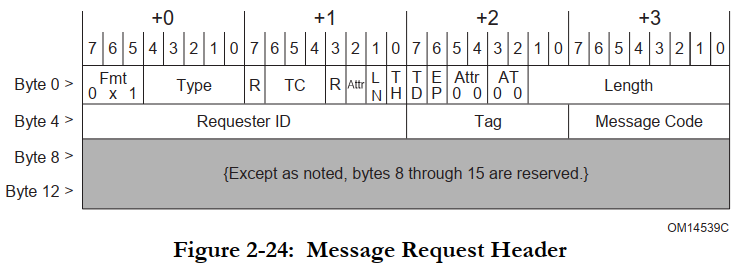
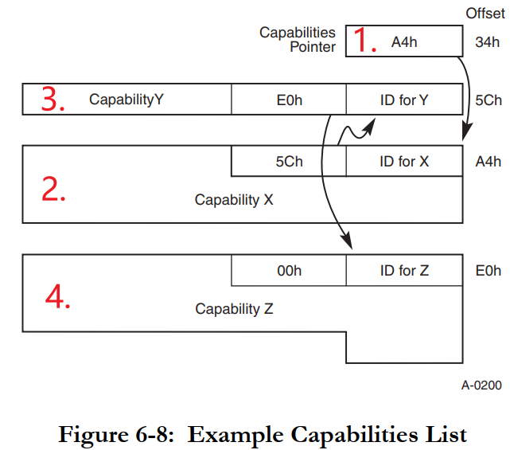

## INTx_MSI_MSIX三种中断机制分析

参考资料：

* 《PCI_SPEV_V3_0.pdf》6.8节

* [PCIe中MSI和MSI-X中断机制](https://blog.csdn.net/pieces_thinking/article/details/119431791)

* [PCIe学习笔记之MSI/MSI-x中断及代码分析](https://blog.csdn.net/yhb1047818384/article/details/106676560/)

* [msix中断分析](https://blog.csdn.net/weijitao/article/details/46566789)

* [MSI中断与Linux实现](https://www.cnblogs.com/gunl/archive/2011/06/09/2076892.html)

* [ARM GICv3中断控制器](https://blog.csdn.net/yhb1047818384/article/details/86708769)

开发板资料：

* https://wiki.t-firefly.com/zh_CN/ROC-RK3399-PC-PLUS/

本课程分析的文件：

* `linux-4.4_rk3399\drivers\pci\host\pcie-rockchip.c`

### 1. PCI设备的INTx中断机制

传统PCI设备的引脚中有4条线：INTA#、INTB#、INTC#、INTD#，"#"表示低电平有效，如下图所示：

PCI设备就像普通的设备一样，通过物理引脚发出中断信号：

在PCI设备的配置空间，它声明：通过INTA#、INTB#、INTC#还是INTD#发出中断。

配置空间有2个寄存器：Interrupt Pin、Interrupt Line，作用如下：

* Interrupt Pin：用来表示本设备通过哪条引脚发出中断信号，取值如下

  | Interrupt Pin取值 | 含义              |
  | ----------------- | ----------------- |
  | 0                 | 不需要中断引脚    |
  | 1                 | 通过INTA#发出中断 |
  | 2                 | 通过INTB#发出中断 |
  | 3                 | 通过INTC#发出中断 |
  | 4                 | 通过INTD#发出中断 |
  | 5~0xff            | 保留              |

* Interrupt Line：给软件使用的，PCI设备本身不使用该寄存器。软件可以写入中断相关的信息，比如在Linux系统中，可以把分配的virq(虚拟中断号)写入此寄存器。软件完全可以自己记录中断信息，没必要依赖这个寄存器。

INTx中断是电平触发，处理过程如下：

* PCI设备发出中断：让INTx引脚变低
* 软件处理中断，清除中断：写PCI设备的某个寄存器，导致PCI设备取消中断
* PCI设备取消中断：让INTx引脚变高

### 2. PCIe设备的INTx中断机制

PCIe设备的配置空间也同样有这2个寄存器：Interrupt Pin、Interrupt Line，它们的作用跟PCI设备完全一样。

PCI总线上有INTA#~INTD#这些真实存在的引脚，但是PCIE总线上并没有这些引脚，PCIe设备怎么兼容INTx中断机制？

PCIe设备通过"INTx模拟"(PCI Compatible INTx Emulation)来实现传统的INTx中断，当设备需要发出中断时，它会发出特殊的TLP包：

TLP头部中，Message Code被用来区分发出的是哪类TLP包，为例"INTx模拟"，有两类TLP包：

* Assert_INTx
  
* Deassert_INTx
  

跟传统PCI设备类似，这个"INTx模拟"的处理过程也是一样的：

* PCIe设备发出中断：发出Assert_INTx的TLP包
* 软件处理中断，清除中断：写PCIe设备的某个寄存器，导致PCIe设备取消中断
* PCIe设备取消中断：发出Deassert_INTx的TLP包

硬件框图如下：

对于软件开发人员来说，他感觉不到变化：

* PCI设备通过真实的引脚传输中断
* PCIe设备通过TLP实现虚拟的引脚传输中断

PCIe控制器内部接收到INTx的TLP包后，就会向GIC发出中断，最终导致CPU接收到中断信号。

对应的中断程序执行时，会读取PCIe控制器的寄存器，分辨发生的是INTA#~INTD#这4个中断的哪一个。

### 3. MSI中断机制

在PCI系统中，使用真实的引脚发出中断已经带来了不方便：

* 电路板上需要布线
* 只有4条引脚，多个PCI设备共享这些引脚，中断处理效率低。

在PCI系统中，就已经引入了新的中断机制：MSI，Message Signaled Interrupts。

在初始PCI设备时，可以告诉它一个地址(主控芯片的地址)、一个数据：

* PCI设备想发出中断时，往这个地址写入这个数据就可以触发中断
* 软件读到这个数据，就知道是哪个设备发出中断了

流程及硬件框图如下：

* 写哪个地址可以触发中断？可能是PCI/PCIe控制器里面的某个地址，也可能是GIC的某个地址
* 初始化PCI/PCIe设备时，把该地址(cpu_addr)转换为pci_addr，告知PCI/PCIe设备(写入它的配置空间)
* PCI/PCIe设备要发出中断时，会发起一个"写内存传输"：往pci_addr写入数据value
* 这导致cpu_addr被写入数据value，触发中断

上图中的"pci_addr/value"保存在哪里？保存在设备的配置空间的capability里。

#### 3.1 capability  

capability的意思是"能力"，PCI/PCIe设备可以提供各种能力，所以在配置空间里有寄存器来描述这些capability：

* 配置空间里有第1个capability的位置：Capabilities Pointer
* 它指向第1个capability的多个寄存器，这些寄存器也是在配置空间里
* 第1个capability的寄存器里，也会指示第2个capability在哪里

Capability示例图如下：

* 配置空间0x34位置，存放的是第1个capability的位置：假设是 A4H
* 在配置空间0xA4位置，找到第1个capability，capability的寄存器有如下约定
  * 第1个字节表示ID，每类capability都有自己的ID
  * 第2个字节表示下一个capability的位置，如果等于0表示这是最后一个capability
  * 其他寄存器由capability决定，所占据的寄存器数量由capability决定
* 第1个capability里面，它表示下一个capability在5CH
* 在配置空间0x5C位置，找到第2个capability
  * 第1个字节表示ID，第2个字节表示下一个capability的位置(图里是E0H)
  * 其他字节由capability本身决定
* 在配置空间0xE0位置，找到第3个capability
  * 第1个字节表示ID
  * 第2个字节表示下一个capability的位置，这里是00H表示没有更多的capability了
  * 其他字节由capability本身决定

#### 3.2 MSI capability

一个PCI设备是否支持MSI，需要读取配置空间的capability来判断: 有MSI capability的话就支持MSI机制。

在配置空间中，MSI capability用来保存：pci_addr、data。表示：PCI设备往这个pci_addr写入data，就可以触发中断。

有如下问题要确认：

* pci_addr是32位、还是64位？
* 能触发几个中断？通过地址来分辨，还是通过数据来分辨？
* 这些中断能否屏蔽？
* 能否读出中断状态？
* 这个些问题，都由capability里面的"Message Control"决定。

MSI capability格式如下：

#### 3.3 格式解析

MSI Capability格式的含义如下：

* Capability ID：对于MSI capability，它的ID为05H

* Next Pointer：下一个capability的位置，00H表示这是最后一个capability

* Message Control

  | 位   | 域                         | 描述                                                         |
  | ---- | -------------------------- | ------------------------------------------------------------ |
  | 8    | Per-vector masking capable | 是否支持屏蔽单个中断(vector)： 1: 支持 0: 不支持 这是只读位。 |
  | 7    | 64 bit address capable     | 是否支持64位地址： 1: 支持 0: 不支持 这是只读位。 |
  | 6:4  | Multiple Message Enable    | 系统软件可以支持多少个MSI中断？ PCI设备可以表明自己想发出多少个中断， 但是到底能发出几个中断？ 由系统软件决定，它会写这些位，表示能支持多少个中断： 000: 系统分配了1个中断 001: 系统分配了2个中断 010: 系统分配了4个中断 011: 系统分配了8个中断 100: 系统分配了16个中断 101: 系统分配了32个中断 110: 保留值 111: 保留值 这些位是可读可写的。 |
  | 3:1  | Multiple Message Capable   | PCI设备可以表明自己想发出多少个中断： 000: 设备申请1个中断 001: 设备申请2个中断 010: 设备申请4个中断 011: 设备申请8个中断 100: 设备申请16个中断 101: 设备申请32个中断 110: 保留值 111: 保留值 这些位是只读的。 |
  | 0    | MSI Enable                 | 使能MSI： 1: 使能 0: 禁止                          |

* Message Address/Message Uper Address：地址

  * 32位地址保存在Message Address中
  * 64位地址：低32位地址保存在Message Address中，高32位地址保存在Message Uper Address中
  * 这些地址是系统软件初始化PCI设备时分配的，系统软件把分配的地址写入这些寄存器
  * 这些地址属于PCI地址空间

* Message Data：数据

  * 这个寄存器只有15位，PCI设备发出中断时数据是32位的，其中高16位数据为0
  * 这个寄存器的数值是系统软件初始化设备时写入的
  * 当PCI设备想发出中断是会发起一次写传输：
    * 往Message Address寄存器表示的地址，写入Message Data寄存器的数据
    * 如果可以发出多个中断的话，发出的数据中低位可以改变
    * 比如"Multiple Message Enable"被设置为"010"表示可以发出4个中断
    * 那么PCI设备发出的数据中bit1,0可以修改

* Mask Bits/Pending Bits: 屏蔽位/挂起位，这是可选的功能，PCI设备不一定实现它
  * Mask Bits：每一位用来屏蔽一个中断，被系统软件设置为1表示禁止对应的中断
  * Pending Bits：每一位用来表示一个中断的状态，这是软件只读位，它的值为1表示对应中断发生了，待处理

### 4. MSI-X中断机制

MSI机制有几个缺点：

* 每个设备的中断数最大是32，太少了
* 需要系统软件分配连续的中断号，很可能失败，也就是说设备想发出N个中断，但是系统软件分配给它的中断少于N个
* 通过MSI发出中断时，地址是固定的

于是引入了MSI-X机制：Enhanced MSI interrupt support，它解决了MSI的缺点：

* 可以支持多大2048个中断
* 系统软件可以单独设置每个中断，不需要分配连续的中断号
* 每个中断可以单独设置：PCI设备使用的"地址/数据"可以单独设置

假设MSI-X可以支持很多中断，每个中断的"地址/数据"都不一样。提问：在哪里描述这些信息？

* "地址/数据"：
  * 不放在配置空间，空间不够
  * 放在PCI设备的内存空间：哪个内存空间？哪个BAR？内存空间哪个位置(偏移地址)？
  * 系统软件可以读写这些内存空间
* 中断的控制信息
  * 使能/禁止？
  * 地址是32位还是64位？
  * 这些控制信息也是保存在PCI设备的内存空间
* 中断的状态信息(挂起？)
  * 这些信息也是保存在PCI设备的内存空间

#### 4.1 MSI-X capability

一个PCI设备是否支持MSI-X，需要读取配置空间的capability来判断: 有MSI-X capability的话就支持MSI-X机制。

MSI-X capability格式如下：

#### 4.2 MSI-X capability格式解析

格式解析如下：

* Capability ID：对于MSI-X capability，它的ID为11H

* Next Pointer：下一个capability的位置，00H表示这是最后一个capability

* Message Control

  | 位   | 名            | 描述                                                         |
  | ---- | ------------- | ------------------------------------------------------------ |
  | 15   | MSI-X Enable  | 是否使能MSI-X： 1: 使能 0: 禁止 注意: MSI-X和MSI不能同时使能。 |
  | 14   | Function Mask | 相当于MSI-X中断总开关： 1: 所有中断禁止 0: 有各个中断的Mask位决定是否使能对应中断 |
  | 13   | 保留          |                                                              |
  | 10:0 | Table Size    | 系统软件读取这些位，算出MSI-X Table的大小，也就是支持多少个中断 读出值为"N-1"，表示支持N个中断 |

* Table Offset/Table BIR ：BIR意思为"BAR Indicator register"，表示使用哪个BAR。

  | 位   | 域           | 描述                                                         |
  | ---- | ------------ | ------------------------------------------------------------ |
  | 31:3 | Table Offset | MSI-X Table保存在PCI设备的内存空间里， 在哪个内存空间？有下面的"Table BIR"表示。 在这个内存空间的哪个位置？由当前这几位表示。 |
  | 2:0  | Table BIR    | 使用哪个内存空间来保存MSI-X Table？ 也就是系统软件使用哪个BAR来访问MSI-X Table？ 取值为0~5，表示BAR0~BAR5 |

* PBA Offset/PBA BIR：PBA意思为"Pending Bit Array"，用来表示MSI-X中断的挂起状态。
  | 位   | 域         | 描述                                                         |
  | ---- | ---------- | ------------------------------------------------------------ |
  | 31:3 | PBA Offset | PBA保存在PCI设备的内存空间里， 在哪个内存空间？有下面的"PBA BIR"表示。 在这个内存空间的哪个位置？由当前这几位表示。 |
  | 2:0  | PBA BIR    | 使用哪个内存空间来保存PBA？ 也就是系统软件使用哪个BAR来访问PBA？ 取值为0~5，表示BAR0~BAR5 |

#### 4.3 MSI-X Table

PCI设备可以往某个地址写入某个数据，从而触发MSI-X中断。

这些"地址/数据"信息，是由系统软件分配的，系统软件要把"地址/数据"发给PCI设备。

PCI设备在哪里保存这些信息？

* 在PCI设备的内存空间
* 在哪个内存空间？由MSI-X capability的"Table BIR"决定
* 在这个内存空间的哪个位置？由MSI-X capability的"Table Offset"决定

MSI-X Table格式如何？如下图所示：

上图中，Msg Data、Msg Addr Msg Upper Addr含义与MSI机制相同：PCI设备要发出MSI-X中断时，往这个地址写入这个数据。如果使用32位地址的话，写哪个地址由Msg Addr寄存器决定；如果使用64位地址的话，写哪个地址由Msg Addr和Msg Upper Addr这两个寄存器决定。

Vector Control寄存器中，只有Bit0有作用，表示"Mask Bit"。系统软件写入1表示禁止对应中断，写入0表示使能对应中断。

#### 4.4 PBA

PBA意思为"Pending Bit Array"，用来表示MSI-X中断的挂起状态。它的格式如下：

这些"挂起"信息，是由PCI设备设置，系统软件只能读取这些信息。

PCI设备在哪里保存这些信息？

* 在PCI设备的内存空间
* 在哪个内存空间？由MSI-X capability的"PBA BIR"决定
* 在这个内存空间的哪个位置？由MSI-X capability的"PBA Offset"决定

PBA格式如下：每一位对应一个中断，值为1表示中断发生了、等待处理。

### 5. MSI/MSI-X操作流程

#### 5.1 扫描设备

扫描设备，读取capability，确定是否含有MSI capability、是否含有MSI-X capability。

#### 5.2 配置设备

一个设备，可能都支持INTx、MSI、MSI-X，这3中方式只能选择一种。

##### 5.2.1 MSI配置

系统软件读取MSI capability，确定设备想申请多少个中断。

系统软件确定能分配多少个中断给这个设备，并把"地址/数据"写入MSI capability。

如果MSI capability支持中断使能的话，还需要系统软件设置MSI capability来使能中断。

注意：如果支持多个MSI中断，PCI设备发出中断时，写的是同一个地址，但是数据的低位可以发生变化。

比如支持4个MSI中断时，通过数据的bit1、bit0来表示是哪个中断。

##### 5.2.2 MSI-X配置

MSI-X机制中，中断相关的更多信息保存在设备的内存空间。所以要使用MSI-X中断，要先配置设备、分配内存空间。

然后，系统软件读取MSI-X capability，确定设备需要多少个中断。

系统软件确定能分配多少个中断给这个设备，并把多个"地址/数据"写入MSI-X Table。

注意：PCI设备要发出MSI-X中断时，它会往"地址"写入"数据"，这些"地址/数据"一旦配置后是不会变化的。MSI机制中，数据可以变化，MSI-X机制中数据不可以变化。

使能中断：设置总开关、MSI-X Table中某个中断的开关。

注意：MSI-X Table中，每一项都可以保存一个"地址/数据"，Table中"地址/数据"可以相同，也就是说：PCI设备发出的中断可以是同一个。

#### 5.3 设备发出中断

PCI设备发出MSI中断、MSI-X中断时，都是发起"数据写"传输，就是往指定地址写入指定数据。

PCI控制器接收到数据后，就会触发CPU中断。

#### 5.4 中断函数

系统软件执行中断处理函数。

