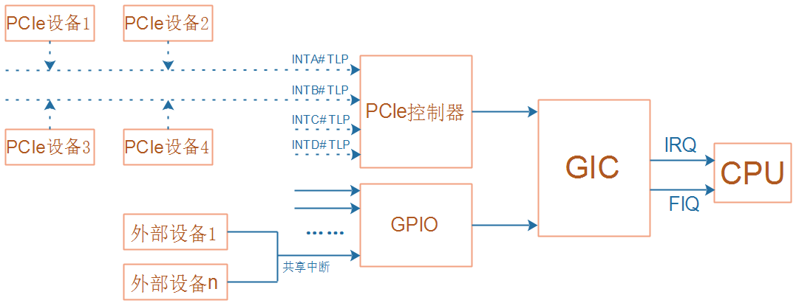
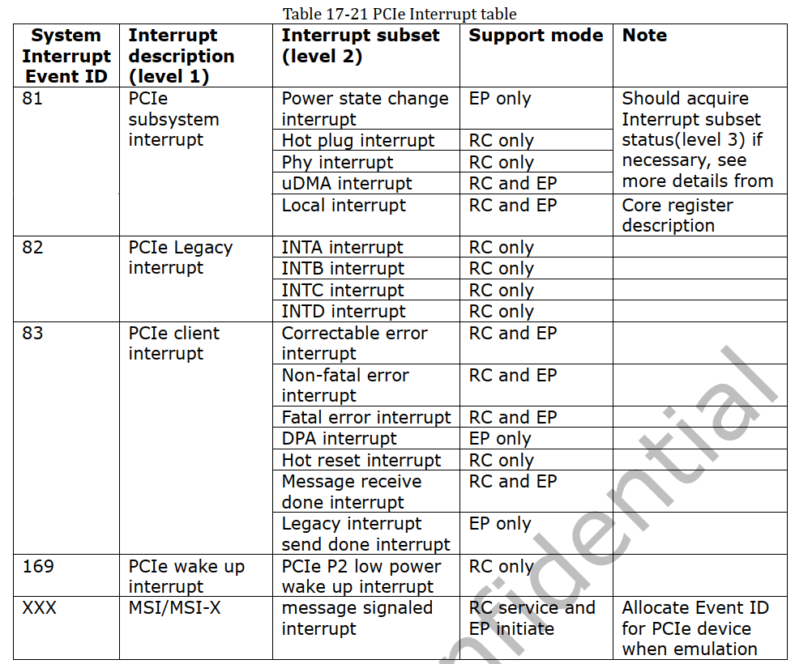

## INTx中断机制源码分析

参考资料：

* 《PCI_SPEV_V3_0.pdf》6.8节
* 《devicetree-specification-v0.2.pdf》

开发板资料：

* https://wiki.t-firefly.com/zh_CN/ROC-RK3399-PC-PLUS/

本课程分析的文件：

* `linux-4.4_rk3399\drivers\pci\host\pcie-rockchip.c`


### 1. 配置空间

无论是PCI设备还是PCIe设备，它们都可以在配置空间里声明：通过INTA#、INTB#、INTC#还是INTD#发出中断。


配置空间有2个寄存器：Interrupt Pin、Interrupt Line，作用如下：

* Interrupt Pin：用来表示本设备通过哪条引脚发出中断信号，取值如下

  | Interrupt Pin取值 | 含义              |
  | ----------------- | ----------------- |
  | 0                 | 不需要中断引脚    |
  | 1                 | 通过INTA#发出中断 |
  | 2                 | 通过INTB#发出中断 |
  | 3                 | 通过INTC#发出中断 |
  | 4                 | 通过INTD#发出中断 |
  | 5~0xff            | 保留              |

* Interrupt Line：给软件使用的，PCI设备本身不使用该寄存器。软件可以写入中断相关的信息，比如在Linux系统中，可以把分配的virq(虚拟中断号)写入此寄存器。软件完全可以自己记录中断信息，没必要依赖这个寄存器。


### 2. 扫描设备时分配中断号

PCIe设备在硬件信息里表明自己可以发出哪个中断，比如INTA、INTB、INTC或INTD，这个中断要转换为中断号，我们编写的软件才可以为它注册中断处理函数。

怎么得到中断号？下面只列出调用过程，后面再分析：

```shell
rockchip_pcie_probe
    bus = pci_scan_root_bus(&pdev->dev, 0, &rockchip_pcie_ops, rockchip, &res);
		pci_scan_root_bus_msi
            pci_scan_child_bus
            	pci_scan_slot
            		dev = pci_scan_single_device(bus, devfn);
						dev = pci_scan_device(bus, devfn);
							struct pci_dev *dev;
							dev = pci_alloc_dev(bus);
							pci_setup_device
                                pci_read_bases(dev, 6, PCI_ROM_ADDRESS);	
                        pci_device_add(dev, bus);
                        	pcibios_add_device(struct pci_dev *dev)
                        		dev->irq = of_irq_parse_and_map_pci(dev, 0, 0);
```


解析出中断信息后，分配的中断号放在pci_dev的irq里面：

```c
pci_scan_single_device
    pci_device_add
    	pcibios_add_device(struct pci_dev *dev)
    		dev->irq = of_irq_parse_and_map_pci(dev, 0, 0);
```


### 3. 使用INTx中断

每个PCIe设备，在Linux内核里都对应一个pci_dev结构体：


可以为这个设备注册中断：

```c
request_irq(pci_dev->irq, ....);
```


### 4. PCIe中断树

要分析PCIe设备中断号的分配过程，需要从RK3399的芯片资料开始学习。

层级结构为：PCIe设备 => PCIe控制器 => GIC =>CPU



在设备树中：

```shell
       gic: interrupt-controller@fee00000 {
                compatible = "arm,gic-v3";
                #interrupt-cells = <4>;
                #address-cells = <2>;
                #size-cells = <2>;
                ranges;
                interrupt-controller;
                /* 省略 */
		};

       pcie0: pcie@f8000000 {
                compatible = "rockchip,rk3399-pcie";
                #address-cells = <3>;
                #size-cells = <2>;
                aspm-no-l0s;
                clocks = <&cru ACLK_PCIE>, <&cru ACLK_PERF_PCIE>,
                         <&cru PCLK_PCIE>, <&cru SCLK_PCIE_PM>;
                clock-names = "aclk", "aclk-perf",
                              "hclk", "pm";
                bus-range = <0x0 0x1f>;
                max-link-speed = <1>;
                linux,pci-domain = <0>;
                msi-map = <0x0 &its 0x0 0x1000>;
                interrupts = <GIC_SPI 49 IRQ_TYPE_LEVEL_HIGH 0>,
                             <GIC_SPI 50 IRQ_TYPE_LEVEL_HIGH 0>,
                             <GIC_SPI 51 IRQ_TYPE_LEVEL_HIGH 0>;
                interrupt-names = "sys", "legacy", "client";
                #interrupt-cells = <1>;
                interrupt-map-mask = <0 0 0 7>;
                interrupt-map = <0 0 0 1 &pcie0_intc 0>,
                                <0 0 0 2 &pcie0_intc 1>,
                                <0 0 0 3 &pcie0_intc 2>,
                                <0 0 0 4 &pcie0_intc 3>;
	};
```


发出中断的过程：

* 任何一个PCIe设备向PCIe控制器发出"Assert INTx"(x=A/B/C/D)这类TLP包
* PCIe控制器就会向GIC发出第50号SPI中断
* GIC再给CPU发出中断。

中断的处理过程是反过来的：

* CPU接收到中断，跳转到异常向量表处理代码，会调用GIC驱动
* GIC：读取寄存器，得知发生的是SPI 50号中断，这个中断函数由PCIe控制器驱动提供
* PCIe控制器：读取PCIe控制器的寄存器，分辨是INTA还是INTB、INTC、INTD，调用对应函数，这个函数由PCIe设备驱动程序提供
* PCI设备：提供设备相关的驱动程序


### 5. PCIe INTx中断映射过程

文件：`drivers\pci\host\pcie-rockchip.c`

#### 5.1 PCIe控制器支持的中断

对于RK3399，PCIe控制器可以向GIC发出3个中断：sys、legacy、client：

* sys：下图中Event ID为81，就是SPI 49号中断(81=32+49)，用来处理一些系统性的中断，比如电源状态、热拔插
* legacy：用来处理PCIe设备发来的INTA/INTB/INTC/INTD中断
* client：跟外接的PCIe设备通信时，可能会发送传输错误，用这个中断来处理




在设备树中，这3类中断如下定义：

```shell
       pcie0: pcie@f8000000 {
       			/* 省略 */
                interrupts = <GIC_SPI 49 IRQ_TYPE_LEVEL_HIGH 0>,
                             <GIC_SPI 50 IRQ_TYPE_LEVEL_HIGH 0>,
                             <GIC_SPI 51 IRQ_TYPE_LEVEL_HIGH 0>;
                interrupt-names = "sys", "legacy", "client";
```


#### 5.2 PCIe控制器注册中断


为什么legacy中断的函数，不是使用`devm_request_irq`而是使用`irq_set_chained_handler_and_data`?

因为发生legacy中断时，rockchip_pcie_legacy_int_handler函数要进一步分辨发生的是INTA还是INTB、INTC、INTD中断，然后处理。


#### 5.3 PCIe设备中断号的分配

##### 5.3.1 IRQ domain

在设备树里，PCIe控制器的节点里有一个更下一级的中断控制器，这是一个虚拟的中断控制器：

```shell
          pcie0: pcie@f8000000 {
          		#address-cells = <3>;
          		#interrupt-cells = <1>;
          		
               	interrupt-map-mask = <0 0 0 7>;
                interrupt-map = <0 0 0 1 &pcie0_intc 0>,
                                <0 0 0 2 &pcie0_intc 1>,
                                <0 0 0 3 &pcie0_intc 2>,
                                <0 0 0 4 &pcie0_intc 3>;
          
                pcie0_intc: interrupt-controller {
                        interrupt-controller;
                        #address-cells = <0>;
                        #interrupt-cells = <1>;
                };                    
          };
```


在代码里，对于`pcie0_intc`会创建出一个IRQ domain：


在设备树的`interrupt-map`里面就用到了这个子节点，也就是用到了对应的IRQ domain：

```shell
               	interrupt-map-mask = <0 0 0 7>;
                interrupt-map = <0 0 0 1 &pcie0_intc 0>,
                                <0 0 0 2 &pcie0_intc 1>,
                                <0 0 0 3 &pcie0_intc 2>,
                                <0 0 0 4 &pcie0_intc 3>;
```


##### 5.3.2 得到PCIe设备的中断号

从PCIe设备得到的硬件中断信息，将会映射得到pcie0_intc，从它里面得到中断号。

这会涉及`interrupt-map-mask`、`interrupt-map`，比较复杂，在视频里讲解。

```shell
pci_scan_single_device
    pci_device_add
    	pcibios_add_device(struct pci_dev *dev)
    		dev->irq = of_irq_parse_and_map_pci(dev, 0, 0);

of_irq_parse_and_map_pci
	ret = of_irq_parse_pci(dev, &oirq);
				rc = pci_read_config_byte(pdev, PCI_INTERRUPT_PIN, &pin);

                out_irq->np = ppnode;
                out_irq->args_count = 1;
                out_irq->args[0] = pin;
                laddr[0] = cpu_to_be32((pdev->bus->number << 16) | (pdev->devfn << 8));
                laddr[1] = laddr[2] = cpu_to_be32(0);
                rc = of_irq_parse_raw(laddr, out_irq);				
	
	return irq_create_of_mapping(&oirq);
```


