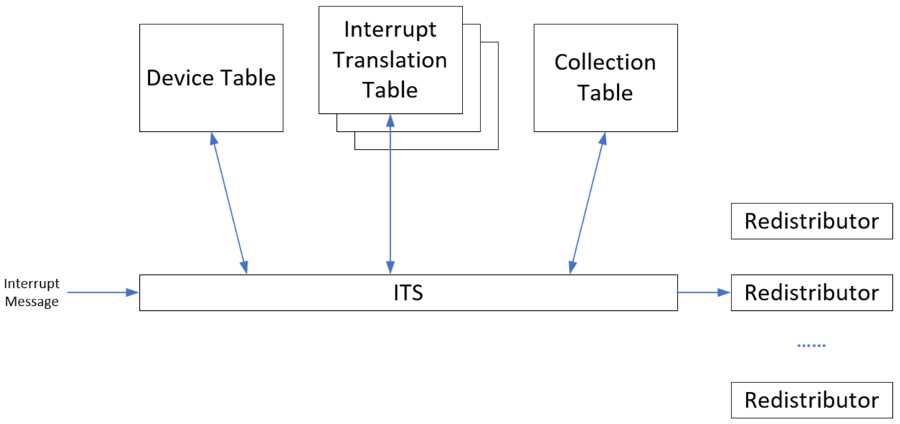

## GICv3_LPI机制

参考资料：这几个PDF文档在GIT仓库的`IMX6ULL\doc_pic\08_Interrupt`里

* 《ARM® Generic Interrupt Controller Architecture Specification Architecture version 2.0(IHI0048B_b_gic_architecture_specification_v2).pdf》
* 《IHI0069G_gic_architecture_specification.pdf》第5章
* 《GICv3_Software_Overview_Official_Release_B.pdf》
* [ARM GIC（六）gicv3架构-LPI](http://www.lujun.org.cn/?p=3921)

### 1. GICv2

框图如下：

GIC V2有3种中断：

① 软件触发中断（SGI，Software Generated Interrupt）
  	这是由软件通过写入专用仲裁单元的寄存器即软件触发中断寄存器（ICDSGIR）显式生成的。它最常用于CPU核间通信。SGI既可以发给所有的核，也可以发送给系统中选定的一组核心。中断号0-15保留用于SGI的中断号。用于通信的确切中断号由软件决定。 

② 私有外设中断（PPI，Private Peripheral Interrupt）
	这是由单个CPU核私有的外设生成的。PPI的中断号为16-31。它们标识CPU核私有的中断源，并且独立于另一个内核上的相同中断源，比如，每个核的计时器。

③ 共享外设中断（SPI，Shared Peripheral Interrupt）
	这是由外设生成的，中断控制器可以将其路由到多个核。中断号为32-1020。SPI用于从整个系统可访问的各种外围设备发出中断信号。

在GICv2里，设备向中断控制器发出中断，必须使用物理上的线路：

在复杂系统中有成本上千的中断时，就需要成本上千的中断信号线，这太复杂了。

于是在GICv3中引入MSI("message-based interrupts")，设备往某个地址写入数值，即可触发中断。

### 2. GICv3

#### 2.1 MSI

在GICv3里，添加了MSI("message-based interrupts")，设备往某个地址写入数值，即可触发中断：

使用消息来发送中断，好处是可以省略硬件线路。在大型系统中有成百上千个中断，使用MSI可以省下很多线路。

#### 2.2 GICv3内部结构

GIC V3里新增加了一类中断：LPI(Locality-specific Peripheral Interrupts)

框图如下：

对于原来的SPI，它也是可以使用MSI的方式传递的，这个功能是可选的。如果GICv3支持MSI方式的SPI，要产生/清除中断时，操作如下GIC寄存器：

* 产生中断：写寄存器GICD_SETSPI_NSR 或 GICD_SETSPI_SR  
* 清除中断：写寄存器GICD_CLRSPI_NSR 或 GICD_CLRSPI_SR  

对于LPI中断，有两种触发方式：

* 写寄存器GITS_TRANSLATER
  * 设备把数据写入GITS_TRANSLATER寄存器，写入的值被称为EventID
* 写寄存器GICR_SETLPIR

#### 2.3 中断号

0~1023跟GICv2保存一致。

| INTID         | 中断类型 | 描述                     |
| ------------- | -------- | ------------------------ |
| 0~15          | SGI      |                          |
| 16~31         | PPI      |                          |
| 32~1019       | SPI      | 设备发出的中断           |
| 1020~1023     | SPI      | 用于特殊目的             |
| 1024~1055     | -        | 保留                     |
| 1056~1119     | PPI      | 扩展的PPI，GICv3.1才支持 |
| 1120~4095     | -        | 保留                     |
| 4096~5119     | SPI      | 扩展的SPI，GICv3.1才支持 |
| 5120~8191     | -        | 保留                     |
| 8192~芯片实现 | LPI      |                          |

### 3. LPI的触发方式

LPI有两种触发中断的方式：

* 把INTID直接写入GICR_SETLPIR寄存器
* 使用ITS把EventID 转换为LPI INTID，会用到"GITS_TRANSLATER"寄存器

这两种方法只能支持一种。

#### 3.1 使用GICR_SETLPIR

这个寄存器格式如下：

把LPI的中断号写入这个寄存器即可触发中断。

#### 3.2 使用ITS

ITS的意思是：Interrupt Translation Service，中断转换服务。

能产生MSI中断的设备，都有一个DeviceDI(设备ID)，它产生的每一个MSI中断都有一个EventID(事件ID)。"DeviceID+EventID"组合被传入ITS，IDS会把它们转换为INTID。

过程如下：

* 外设发生中断消息(Interrupt Message)到ITS
  * 外设只要写GITS_TRANSLATER就可以发送消息，这个寄存器格式如下：
    
  * 消息里包含有：DeviceID(哪一个设备)、EventID(这个设备的哪一个中断)
* ITS使用DeviceID在Device Table中找到一项
  * 只有一个Device Table
  * 每一个能发生MSI中断的设备在里面都有一项，它指向这个设备的Interrupt Translation Table(中断转换表，简称ITT)
  * 每一个能发生MSI中断的设备，都有一个ITT
* ITS使用EventID在ITT中找到一项，从中返回INTID和Collection ID
* ITS使用Collection ID在Collection Table中找到一项，从中返回"Target Redistributor"，即：中断发给哪个CPU
* ITS把INTID发给Redistributor

上图中Device Table、Interrupt Translation Table、Collection Table都是在内存里，但是我们不能直接去设置内存。而是通过发送ITS命令来设置这些表格。

我们不研究ITS的内部细节，暂且了解这些内容即可。

