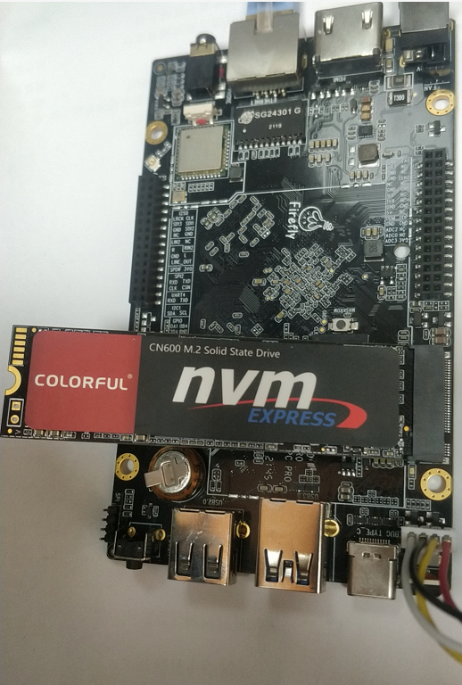
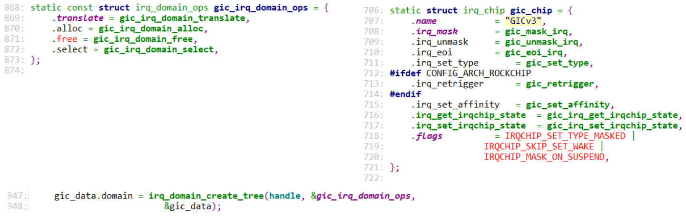

## MSI_MSI-X中断之源码分析

开发板资料：

* https://wiki.t-firefly.com/zh_CN/ROC-RK3399-PC-PLUS/

参考内核文件：

* `Documentation\PCI\MSI-HOWTO.txt`
* `drivers\pci\host\pcie-rockchip.c`
* `drivers\nvme\host\pci.c`
* `drivers\irqchip\irq-gic-v3.c`
* `drivers\irqchip\irq-gic-v3-its.c`
* `drivers\irqchip\irq-gic-v3-its-pci-msi.c`


### 1. 怎么发出MSI/MSI-X中断

PCIe设备向发出中断，它发出TLP包，往某个地址写入某个数据即可：

* 往哪个地址？GICv3 ITS的GITS_TRANSLATER寄存器，TLP包里使用的是PCI地址
* 写什么数据？0、1、2、……，要发出第1个中断时写0，要发出第2个中断时写1，……


在设备树文件rk3399.dtsi中，可以看到ITS的基地址是0xfee20000：

```shell
its: interrupt-controller@fee20000 {
                        compatible = "arm,gic-v3-its";
                        msi-controller;
                        reg = <0x0 0xfee20000 0x0 0x20000>;
                };
```

在`IHI0069G_gic_architecture_specification.pdf`中有ITS寄存器的偏移地址：


GITS_TRANSLATER寄存器的CPU地址是：0xfee20000 + 0x010000 + 0x0040 = 0xfee30040。

对应的PCI地址也是0xfee30040(驱动程序里为例方便，故意使得CPU地址跟PCI地址相同，这2个地址属于不同地址空间)，

所以下图中PCI地址都是0xfee30040。


#### 1.1 在RK3399上体验

我们使用RK3399开发板，插上了**NVMe** SSD固态硬盘。



##### 1.1.1 安装工具

请给RK3399刷入Ubuntu映像文件，然后在开发板上执行：

```c
udhcpc  # 获取IP
apt update  # 更新源
apt install pciutils  # 安装lspci工具
apt install devmem2   # 安装devmem2工具
```


##### 1.1.2 查看设备MSI-X信息

执行`lspci -vvv`，得到如下信息：

```shell
01:00.0 Non-Volatile memory controller: Silicon Motion, Inc. Device 2263 (rev 03) (prog-if 02 [NVM Express])
        Subsystem: Silicon Motion, Inc. Device 2263
        Control: I/O- Mem+ BusMaster+ SpecCycle- MemWINV- VGASnoop- ParErr- Stepping- SERR- FastB2B- DisINTx+
        Status: Cap+ 66MHz- UDF- FastB2B- ParErr- DEVSEL=fast >TAbort- <TAbort- <MAbort- >SERR- <PERR- INTx-
        Latency: 0
        Interrupt: pin A routed to IRQ 231
        Region 0: Memory at fa000000 (64-bit, non-prefetchable) [size=16K]
        Capabilities: [40] Power Management version 3
                Flags: PMEClk- DSI- D1- D2- AuxCurrent=0mA PME(D0-,D1-,D2-,D3hot-,D3cold-)
                Status: D0 NoSoftRst+ PME-Enable- DSel=0 DScale=0 PME-
        Capabilities: [50] MSI: Enable- Count=1/8 Maskable+ 64bit+
                Address: 0000000000000000  Data: 0000
                Masking: 00000000  Pending: 00000000
        Capabilities: [70] Express (v2) Endpoint, MSI 00
                DevCap: MaxPayload 128 bytes, PhantFunc 0, Latency L0s unlimited, L1 unlimited
                        ExtTag- AttnBtn- AttnInd- PwrInd- RBE+ FLReset+ SlotPowerLimit 0.000W
                DevCtl: Report errors: Correctable- Non-Fatal- Fatal- Unsupported-
                        RlxdOrd+ ExtTag- PhantFunc- AuxPwr- NoSnoop- FLReset-
                        MaxPayload 128 bytes, MaxReadReq 512 bytes
                DevSta: CorrErr- UncorrErr- FatalErr- UnsuppReq- AuxPwr+ TransPend-
                LnkCap: Port #0, Speed 8GT/s, Width x4, ASPM L1, Exit Latency L0s <1us, L1 <8us
                        ClockPM+ Surprise- LLActRep- BwNot- ASPMOptComp+
                LnkCtl: ASPM Disabled; RCB 64 bytes Disabled- CommClk-
                        ExtSynch- ClockPM- AutWidDis- BWInt- AutBWInt-
                LnkSta: Speed 2.5GT/s, Width x4, TrErr- Train- SlotClk+ DLActive- BWMgmt- ABWMgmt-
                DevCap2: Completion Timeout: Range ABCD, TimeoutDis+, LTR+, OBFF Not Supported
                DevCtl2: Completion Timeout: 50us to 50ms, TimeoutDis-, LTR-, OBFF Disabled
                LnkCtl2: Target Link Speed: 8GT/s, EnterCompliance- SpeedDis-
                         Transmit Margin: Normal Operating Range, EnterModifiedCompliance- ComplianceSOS-
                         Compliance De-emphasis: -6dB
                LnkSta2: Current De-emphasis Level: -3.5dB, EqualizationComplete-, EqualizationPhase1-
                         EqualizationPhase2-, EqualizationPhase3-, LinkEqualizationRequest-
        Capabilities: [b0] MSI-X: Enable+ Count=16 Masked-
                Vector table: BAR=0 offset=00002000
                PBA: BAR=0 offset=00002100
        Capabilities: [100 v2] Advanced Error Reporting
                UESta:  DLP- SDES- TLP- FCP- CmpltTO- CmpltAbrt- UnxCmplt- RxOF- MalfTLP- ECRC- UnsupReq- ACSViol-
                UEMsk:  DLP- SDES- TLP- FCP- CmpltTO- CmpltAbrt- UnxCmplt- RxOF- MalfTLP- ECRC- UnsupReq- ACSViol-
                UESvrt: DLP+ SDES+ TLP- FCP+ CmpltTO- CmpltAbrt- UnxCmplt- RxOF+ MalfTLP+ ECRC- UnsupReq- ACSViol-
                CESta:  RxErr- BadTLP- BadDLLP- Rollover- Timeout- NonFatalErr-
                CEMsk:  RxErr- BadTLP- BadDLLP- Rollover- Timeout- NonFatalErr+
                AERCap: First Error Pointer: 00, GenCap+ CGenEn- ChkCap+ ChkEn-
        Capabilities: [158 v1] #19
        Capabilities: [178 v1] Latency Tolerance Reporting
                Max snoop latency: 0ns
                Max no snoop latency: 0ns
        Capabilities: [180 v1] L1 PM Substates
                L1SubCap: PCI-PM_L1.2+ PCI-PM_L1.1+ ASPM_L1.2+ ASPM_L1.1+ L1_PM_Substates+
                          PortCommonModeRestoreTime=10us PortTPowerOnTime=10us
                L1SubCtl1: PCI-PM_L1.2- PCI-PM_L1.1- ASPM_L1.2- ASPM_L1.1-
                           T_CommonMode=0us LTR1.2_Threshold=0ns
                L1SubCtl2: T_PwrOn=10us
        Kernel driver in use: nvme
```


从上述信息可以看到：

```shell
        Region 0: Memory at fa000000 (64-bit, non-prefetchable) [size=16K]
        Capabilities: [b0] MSI-X: Enable+ Count=16 Masked-
                Vector table: BAR=0 offset=00002000
                PBA: BAR=0 offset=00002100
```

这表示：

* MSI-X: Enable+：使用MSI-X功能
* Vector table: BAR=0 offset=00002000：MSI的向量在BAR 0偏移地址0x00002000处
* Region 0: Memory at fa000000：
  * BAR 0的PCI地址是0xfa000000，
  * 驱动程序里为了方便令CPU地址等于PCI地址，所以BAR的CPU地址也是0xfa000000。

我们可以去读取 `0xfa000000 + 0x00002000`开始的向量表，验证里：

* msg addr为0xfee30040
* msg data为0、1、……


##### 1.1.3 验证MSI-X信息


### 2. 怎么使用MSI/MSI-X

参考内核文档：`Documentation\PCI\MSI-HOWTO.txt`、`drivers\nvme\host\pci.c`

主要函数是这2个:

```c
int pci_enable_msix_range(struct pci_dev *dev, struct msix_entry *entries,
			  int minvec, int maxvec);
int pci_enable_msi_range(struct pci_dev *dev, int minvec, int maxvec);
```


示例代码如下：

```c
	// 分配 msix_entry 数组，每一数组项用来保存一个中断的信息
	dev->entry = kzalloc_node(num_possible_cpus() * sizeof(*dev->entry),
							GFP_KERNEL, node);

	// 先尝试使用MSI-X
	vecs = pci_enable_msix_range(pdev, dev->entry, 1, nr_io_queues);
	if (vecs < 0) {
        // 再尝试使用MSI
		vecs = pci_enable_msi_range(pdev, 1, min(nr_io_queues, 32));
		if (vecs < 0) {
			vecs = 1;
		} else {
			for (i = 0; i < vecs; i++)
				dev->entry[i].vector = i + pdev->irq;
		}
	}

	// request_irq: 中断号都保存在dev->entry[i].vector里
	for (i = 0; i < vecs; i++)
		request_irq(dev->entry[i].vector, ...);
```

**注意**，在`pci_enable_msix_range`或者`pci_enable_msi_range`函数中：

* minvec从1开始
* 对于pci_enable_msix_range，中断号保存在entries[i].vector里
* 对于pci_enable_msi_range，第1个中断号保存在pdev->irq里


### 3. MSI/MSI-X中断源码分析

#### 3.1 IRQ Domain创建流程

从PCI设备触发，涉及三个IRQ Domain：

* `drivers\irqchip\irq-gic-v3-its-pci-msi.c`
* `drivers\irqchip\irq-gic-v3-its.c`
* `drivers\irqchip\irq-gic-v3.c`


##### 3.1.1 GIC

设备树：

```shell
        gic: interrupt-controller@fee00000 {
                compatible = "arm,gic-v3";
                #interrupt-cells = <4>;
                #address-cells = <2>;
                #size-cells = <2>;
                ranges;
                interrupt-controller;

                reg = <0x0 0xfee00000 0 0x10000>, /* GICD */
                      <0x0 0xfef00000 0 0xc0000>, /* GICR */
                      <0x0 0xfff00000 0 0x10000>, /* GICC */
                      <0x0 0xfff10000 0 0x10000>, /* GICH */
                      <0x0 0xfff20000 0 0x10000>; /* GICV */
                interrupts = <GIC_PPI 9 IRQ_TYPE_LEVEL_HIGH 0>;
                its: interrupt-controller@fee20000 {
                        compatible = "arm,gic-v3-its";
                        msi-controller;
                        reg = <0x0 0xfee20000 0x0 0x20000>;
                };
```


驱动代码：`drivers\irqchip\irq-gic-v3.c`




##### 3.1.2 ITS

设备树：

```shell
its: interrupt-controller@fee20000 {
                        compatible = "arm,gic-v3-its";
                        msi-controller;
                        reg = <0x0 0xfee20000 0x0 0x20000>;
                };
```


驱动代码：`drivers\irqchip\irq-gic-v3-its.c`


##### 3.1.3 PCI MSI

对应的设备节点跟ITS驱动使用的一样的：

```shell
its: interrupt-controller@fee20000 {
                        compatible = "arm,gic-v3-its";
                        msi-controller;
                        reg = <0x0 0xfee20000 0x0 0x20000>;
                };
```


驱动代码：`drivers\irqchip\irq-gic-v3-its-pci-msi.c`，它只是在ITS下面再增加了一个处理层：


##### 3.1.4 PCIe控制器

设备树：

```shell
        pcie0: pcie@f8000000 {
                compatible = "rockchip,rk3399-pcie";
                #address-cells = <3>;
                #size-cells = <2>;
                aspm-no-l0s;
                clocks = <&cru ACLK_PCIE>, <&cru ACLK_PERF_PCIE>,
                         <&cru PCLK_PCIE>, <&cru SCLK_PCIE_PM>;
                clock-names = "aclk", "aclk-perf",
                              "hclk", "pm";
                bus-range = <0x0 0x1f>;
                max-link-speed = <1>;
                linux,pci-domain = <0>;
                msi-map = <0x0 &its 0x0 0x1000>;
```

里面的`msi-map = <0x0 &its 0x0 0x1000>;`是用来把PCIe设备映射到MSI控制器，它的格式为：

```shell
msi-map = <rid-base &msi-controller msi-base length>;
```

* rid-base：第1个Request ID，就是使用<bus, dev, function>组成的一个数字
* msi-controller：这个PCIe设备映射到哪个MSI控制器？
* msi-base：第1个PCIe设备映射到MSI控制器哪个中断？
* length：能映射多少个设备


#### 3.2 分配中断

代码：`drivers\nvme\host\pci.c`

```c
nvme_probe > nvme_probe_work > nvme_setup_io_queues 
    	pci_enable_msix_range
    		pci_enable_msix(dev, entries, nvec);
				msix_capability_init(dev, entries, nvec);
    	
    	pci_enable_msi_range
            	msi_capability_init(dev, nvec);
    
msix_capability_init/msi_capability_init
    pci_msi_setup_msi_irqs
        pci_msi_domain_alloc_irqs
            msi_domain_alloc_irqs
    			ret = ops->msi_prepare(domain, dev, nvec, &arg); // its_pci_msi_prepare
					its_pci_msi_prepare // irq-gic-v3-its-pci-msi.c
                        // rid = (bus << 8) | (dev << 4) | function
                        info->scratchpad[0].ul = pci_msi_domain_get_msi_rid(domain, pdev);	
						return msi_info->ops->msi_prepare(...) // 上一层irq-gic-v3-its.c
                            	its_msi_prepare
                            		dev_id = info->scratchpad[0].ul;  // rid
									its_dev = its_create_device(its, dev_id, nvec);
												// 从ITS全局的位图里找到空闲位 chunk
												// 一个chunk表示32个中断
												// its的hwirq = (chunk << 5) + 8192
												// 这也是GIC的hwirq
												lpi_map = its_lpi_alloc_chunks(nvecs, &lpi_base, &nr_lpis);
														// 等于(chunk << 5) + 8192 
														dev->event_map.lpi_base = lpi_base;
                            		
    			__irq_domain_alloc_irqs
    				irq_domain_alloc_irqs_recursive
    					ret = domain->ops->alloc(domain, irq_base, nr_irqs, arg);
								its_irq_domain_alloc
                                    err = its_alloc_device_irq(its_dev, &hwirq);
												*hwirq = dev->event_map.lpi_base + idx;
									irq_domain_set_hwirq_and_chip
                                        irq_data->hwirq = hwirq;
										irq_data->chip = chip ? chip : &no_irq_chip;
    			irq_domain_activate_irq(irq_data);
					domain->ops->activate(domain, irq_data);
						msi_domain_activate
                            irq_chip_compose_msi_msg(irq_data, &msg)	
                            	   // 构造msg，里面含有MSI或msi-x的addr/val
                                   its_irq_compose_msi_msg
                            			addr = its->phys_base + GITS_TRANSLATER;
                                        msg->address_lo		= addr & ((1UL << 32) - 1);
                                        msg->address_hi		= addr >> 32;
										// its_get_event_id:
										// d->hwirq - its_dev->event_map.lpi_base;
                                        msg->data		= its_get_event_id(d);                   
                            // 设置msi-x的entry地址	
                            irq_chip_write_msi_msg(irq_data, &msg);
                            data->chip->irq_write_msi_msg(data, msg);
                            pci_msi_domain_write_msg
                                __pci_write_msi_msg(desc, msg);

__pci_write_msi_msg(desc, msg);
    // 对于MSI-X
    writel(msg->address_lo, base + PCI_MSIX_ENTRY_LOWER_ADDR);
    writel(msg->address_hi, base + PCI_MSIX_ENTRY_UPPER_ADDR);
    writel(msg->data, base + PCI_MSIX_ENTRY_DATA);

	// 对于MSI
	pci_write_config_word(dev, pos + PCI_MSI_FLAGS, msgctl);
	pci_write_config_dword(dev, pos + PCI_MSI_ADDRESS_LO,
				       msg->address_lo);


// 为PCI设备确定hwirq
its_domain_ops.alloc
its_irq_domain_alloc
    its_alloc_device_irq
        *hwirq = dev->event_map.lpi_base + idx;


```


