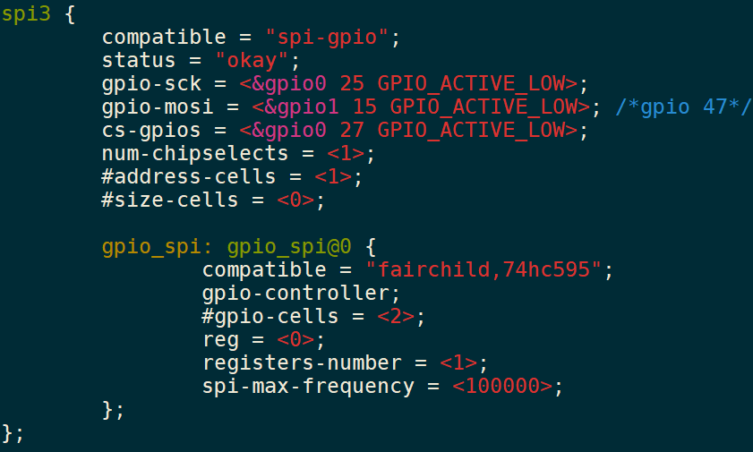
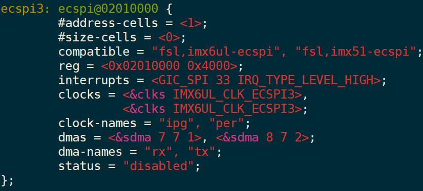
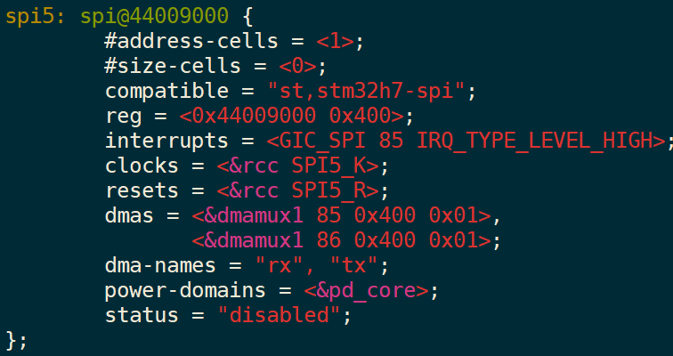
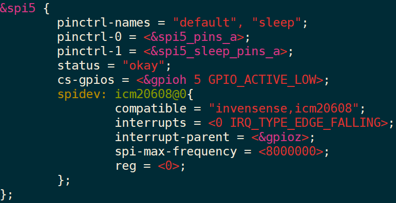
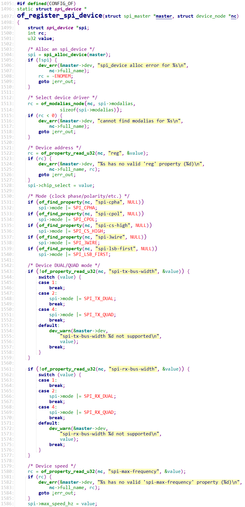

# SPI设备树处理过程 #

参考资料：

* 内核头文件：`include\linux\spi\spi.h`
* 内核文档：`Documentation\devicetree\bindings\spi\spi-bus.txt`	
* 内核源码：`drivers\spi\spi.c`


## 1. spi_device结构体

```c
/**
 * struct spi_device - Master side proxy for an SPI slave device
 * @dev: Driver model representation of the device.
 * @master: SPI controller used with the device.
 * @max_speed_hz: Maximum clock rate to be used with this chip
 *	(on this board); may be changed by the device's driver.
 *	The spi_transfer.speed_hz can override this for each transfer.
 * @chip_select: Chipselect, distinguishing chips handled by @master.
 * @mode: The spi mode defines how data is clocked out and in.
 *	This may be changed by the device's driver.
 *	The "active low" default for chipselect mode can be overridden
 *	(by specifying SPI_CS_HIGH) as can the "MSB first" default for
 *	each word in a transfer (by specifying SPI_LSB_FIRST).
 * @bits_per_word: Data transfers involve one or more words; word sizes
 *	like eight or 12 bits are common.  In-memory wordsizes are
 *	powers of two bytes (e.g. 20 bit samples use 32 bits).
 *	This may be changed by the device's driver, or left at the
 *	default (0) indicating protocol words are eight bit bytes.
 *	The spi_transfer.bits_per_word can override this for each transfer.
 * @irq: Negative, or the number passed to request_irq() to receive
 *	interrupts from this device.
 * @controller_state: Controller's runtime state
 * @controller_data: Board-specific definitions for controller, such as
 *	FIFO initialization parameters; from board_info.controller_data
 * @modalias: Name of the driver to use with this device, or an alias
 *	for that name.  This appears in the sysfs "modalias" attribute
 *	for driver coldplugging, and in uevents used for hotplugging
 * @cs_gpio: gpio number of the chipselect line (optional, -ENOENT when
 *	when not using a GPIO line)
 *
 * @statistics: statistics for the spi_device
 *
 * A @spi_device is used to interchange data between an SPI slave
 * (usually a discrete chip) and CPU memory.
 *
 * In @dev, the platform_data is used to hold information about this
 * device that's meaningful to the device's protocol driver, but not
 * to its controller.  One example might be an identifier for a chip
 * variant with slightly different functionality; another might be
 * information about how this particular board wires the chip's pins.
 */
struct spi_device {
	struct device		dev;
	struct spi_master	*master;
	u32			max_speed_hz;
	u8			chip_select;
	u8			bits_per_word;
	u16			mode;
#define	SPI_CPHA	0x01			/* clock phase */
#define	SPI_CPOL	0x02			/* clock polarity */
#define	SPI_MODE_0	(0|0)			/* (original MicroWire) */
#define	SPI_MODE_1	(0|SPI_CPHA)
#define	SPI_MODE_2	(SPI_CPOL|0)
#define	SPI_MODE_3	(SPI_CPOL|SPI_CPHA)
#define	SPI_CS_HIGH	0x04			/* chipselect active high? */
#define	SPI_LSB_FIRST	0x08			/* per-word bits-on-wire */
#define	SPI_3WIRE	0x10			/* SI/SO signals shared */
#define	SPI_LOOP	0x20			/* loopback mode */
#define	SPI_NO_CS	0x40			/* 1 dev/bus, no chipselect */
#define	SPI_READY	0x80			/* slave pulls low to pause */
#define	SPI_TX_DUAL	0x100			/* transmit with 2 wires */
#define	SPI_TX_QUAD	0x200			/* transmit with 4 wires */
#define	SPI_RX_DUAL	0x400			/* receive with 2 wires */
#define	SPI_RX_QUAD	0x800			/* receive with 4 wires */
	int			irq;
	void			*controller_state;
	void			*controller_data;
	char			modalias[SPI_NAME_SIZE];
	int			cs_gpio;	/* chip select gpio */

	/* the statistics */
	struct spi_statistics	statistics;

	/*
	 * likely need more hooks for more protocol options affecting how
	 * the controller talks to each chip, like:
	 *  - memory packing (12 bit samples into low bits, others zeroed)
	 *  - priority
	 *  - drop chipselect after each word
	 *  - chipselect delays
	 *  - ...
	 */
};
```


各个成员含义如下：

* max_speed_hz：该设备能支持的SPI时钟最大值
* chip_select：是这个spi_master下的第几个设备
  * 在spi_master中有一个cs_gpios数组，里面存放有下面各个spi设备的片选引脚
  * spi_device的片选引脚就是：cs_gpios[spi_device.chip_select]
* cs_gpio：这是可选项，也可以把spi_device的片选引脚记录在这里
* bits_per_word：每个基本的SPI传输涉及多少位
  * word：我们使用SPI控制器时，一般是往某个寄存器里写入数据，SPI控制器就会把这些数据一位一位地发送出去
  * 一个寄存器是32位的，被称为一个word(有时候也称为double word)
  * 这个寄存器里多少位会被发送出去？使用bits_per_word来表示
  * 扩展：bits_per_word是可以大于32的，也就是每次SPI传输可能会发送多于32位的数据，这适用于DMA突发传输
* mode：含义广泛，看看结构体里那些宏
  * SPI_CPHA：在第1个周期采样，在第2个周期采样？
  * SPI_CPOL：平时时钟极性
    * SPI_CPHA和SPI_CPOL组合起来就可以得到4种模式
    * SPI_MODE_0：平时SCK为低(SPI_CPOL为0)，在第1个周期采样(SPI_CPHA为0)
    * SPI_MODE_1：平时SCK为低(SPI_CPOL为0)，在第2个周期采样(SPI_CPHA为1)
    * SPI_MODE_2：平时SCK为高(SPI_CPOL为1)，在第1个周期采样(SPI_CPHA为0)
    * SPI_MODE_3：平时SCK为高(SPI_CPOL为1)，在第2个周期采样(SPI_CPHA为1)
  * SPI_CS_HIGH：一般来说片选引脚时低电平有效，SPI_CS_HIGH表示高电平有效
  * SPI_LSB_FIRST：
    * 一般来说先传输MSB(最高位)，SPI_LSB_FIRST表示先传LSB(最低位)；
    * 很多SPI控制器并不支持SPI_LSB_FIRST
  * SPI_3WIRE：SO、SI共用一条线
  * SPI_LOOP：回环模式，就是SO、SI连接在一起
  * SPI_NO_CS：只有一个SPI设备，没有片选信号，也不需要片选信号
  * SPI_READY：SPI从设备可以拉低信号，表示暂停、表示未就绪
  * SPI_TX_DUAL：发送数据时有2条信号线
  * SPI_TX_QUAD：发送数据时有4条信号线
  * SPI_RX_DUAL：接收数据时有2条信号线
  * SPI_RX_QUAD：接收数据时有4条信号线


## 2. SPI设备树格式


对于SPI Master，就是SPI控制器，它下面可以连接多个SPI设备。

在设备树里，使用一个节点来表示SPI Master，使用子节点来表示挂在下面的SPI设备。

### 2.1 SPI Master

在设备树中，对于SPI Master，必须的属性如下：

* #address-cells：这个SPI Master下的SPI设备，需要多少个cell来表述它的片选引脚
* #size-cells：必须设置为0
* compatible：根据它找到SPI Master驱动

可选的属性如下：

* cs-gpios：SPI Master可以使用多个GPIO当做片选，可以在这个属性列出那些GPIO
* num-cs：片选引脚总数

其他属性都是驱动程序相关的，不同的SPI Master驱动程序要求的属性可能不一样。


### 2.2 SPI Device

在SPI Master对应的设备树节点下，每一个子节点都对应一个SPI设备，这个SPI设备连接在该SPI Master下面。

这些子节点中，必选的属性如下：

* compatible：根据它找到SPI Device驱动
* reg：用来表示它使用哪个片选引脚
* spi-max-frequency：必选，该SPI设备支持的最大SPI时钟

可选的属性如下：

* spi-cpol：这是一个空属性(没有值)，表示CPOL为1，即平时SPI时钟为低电平
* spi-cpha：这是一个空属性(没有值)，表示CPHA为1)，即在时钟的第2个边沿采样数据
* spi-cs-high：这是一个空属性(没有值)，表示片选引脚高电平有效
* spi-3wire：这是一个空属性(没有值)，表示使用SPI 三线模式
* spi-lsb-first：这是一个空属性(没有值)，表示使用SPI传输数据时先传输最低位(LSB)
* spi-tx-bus-width：表示有几条MOSI引脚；没有这个属性时默认只有1条MOSI引脚
* spi-rx-bus-width：表示有几条MISO引脚；没有这个属性时默认只有1条MISO引脚
* spi-rx-delay-us：单位是毫秒，表示每次读传输后要延时多久
* spi-tx-delay-us：单位是毫秒，表示每次写传输后要延时多久


### 2.3 设备树示例

```shell
	spi@f00 {
		#address-cells = <1>;
		#size-cells = <0>;
		compatible = "fsl,mpc5200b-spi","fsl,mpc5200-spi";
		reg = <0xf00 0x20>;
		interrupts = <2 13 0 2 14 0>;
		interrupt-parent = <&mpc5200_pic>;

		ethernet-switch@0 {
			compatible = "micrel,ks8995m";
			spi-max-frequency = <1000000>;
			reg = <0>;
		};

		codec@1 {
			compatible = "ti,tlv320aic26";
			spi-max-frequency = <100000>;
			reg = <1>;
		};
	};
```


## 3. 设备树实例

在设备树里，会有一个节点用来表示SPI控制器。

在这个SPI控制器下面，连接有哪些SPI设备？会在设备树里使用子节点来描述SPI设备。

### 3.1 使用GPIO模拟的SPI控制器




### 3.2 IMX6ULL SPI控制器

内核文件：arch/arm/boot/dts/imx6ull.dtsi



内核文件：arch/arm/boot/dts/100ask_imx6ull-14x14.dts


### 3.3 STM32MP157 SPI控制器

内核文件：arch/arm/boot/dts/stm32mp151.dtsi



内核文件：arch/arm/boot/dts/stm32mp157c-100ask-512d-lcd-v1.dts




## 4. 设备树处理过程

内核源码：`drivers\spi\spi.c`




