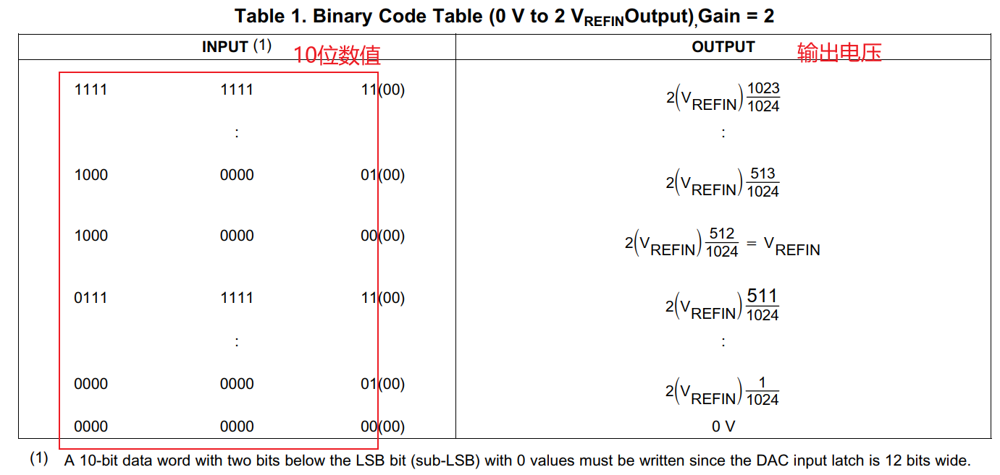

# 使用spidev操作SPI_DAC模块 #

参考资料：

* 内核驱动：`drivers\spi\spidev.c`

* 内核提供的测试程序：`tools\spi\spidev_fdx.c`

* 内核文档：`Documentation\spi\spidev`	

* DAC芯片手册：`TLC5615.pdf`

  

## 1. 硬件

### 1.1 原理图

IMX6ULL:


STM32MP157:


原理图：


### 1.2 连接

#### 1.2.1 IMX6ULL

DAC模块接到IMX6ULL扩展板的SPI_A插座上：


#### 1.2.2 STM32MP157


## 2. DAC操作原理

### 2.1 内部框图


操作过程为：

* CS为低
* 在SCLK的上升沿，从DIN采集16位数据，存入上图中的`16-Bit Shift Register`
* 在CS的上升沿，把`16-Bit Shift Register`中的10位数据传入`10-Bit DAC Register`，作为模拟量在OUT引脚输出

**注意**：

* 传输的16位数据中，高4位是无意义的
* 中间10位才被转换为模拟量
* 最低2位必须是0


### 2.2 时序图


使用SPI传输的细节：

* SCLK初始电平为低
* 使用16个SCLK周期来传输16位数据
* 在SCLK上升沿读取DIN电平
* 在SCLK上升沿发出DOUT信号
* DOUT数据来自`16-Bit Shift Register`
  * 第1个数据是上次数据遗留下的LSB位
  * 其余15个数据来自`16-Bit Shift Register`的高15位
  * `16-Bit Shift Register`的LSB在下一个周期的第1个时钟传输
  * LSB必定是0，所以当前的周期里读出`16-Bit Shift Register`的15位数据也足够了

### 2.3 DAC公式




```shell
输出电压 = 2 * VREFIN * n / 1024 = 2 * 2.048 * n / 1024
其中: n为10位数值
```


## 3. 编写APP

源码在GIT仓库里，这2个位置里的源码是一样的：


