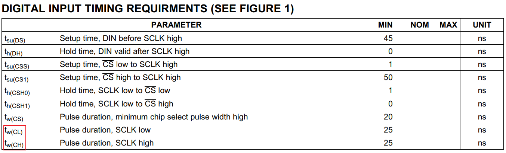
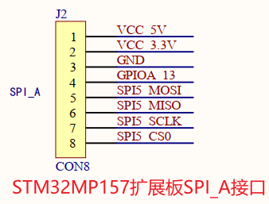

# SPI_DAC模块上机实验 #

参考资料：

* 内核驱动：`drivers\spi\spidev.c`

* 内核提供的测试程序：`tools\spi\spidev_fdx.c`

* 内核文档：`Documentation\spi\spidev`	

* DAC芯片手册：`TLC5615.pdf`

  

## 1. 硬件

### 1.1 原理图

IMX6ULL:


STM32MP157:


原理图：


### 1.2 连接

#### 1.2.1 IMX6ULL

DAC模块接到IMX6ULL扩展板的SPI_A插座上：


#### 1.2.2 STM32MP157

DAC模块接到STM32MP157扩展板的SPI_A插座上：


## 2. 编写设备树

确认SPI时钟最大频率：



```shell
T = 25 + 25 = 50ns
F = 20000000 = 20MHz
```


设备树如下：

```shell
    dac: dac {
        compatible = "spidev";
        reg = <0>;
        spi-max-frequency = <20000000>;
    };
```


### 2.1 IMX6ULL


DAC模块接在这个插座上，那么要在设备树里spi1的节点下创建子节点。

代码在`arch/arm/boot/dts/100ask_imx6ull-14x14.dtb`中，如下：

```shell
&ecspi1 {
    pinctrl-names = "default";
    pinctrl-0 = <&pinctrl_ecspi1>;

    fsl,spi-num-chipselects = <2>;
    cs-gpios = <&gpio4 26 GPIO_ACTIVE_LOW>, <&gpio4 24 GPIO_ACTIVE_LOW>;
    status = "okay";

    dac: dac {
        compatible = "spidev";
        reg = <0>;
        spi-max-frequency = <20000000>;
    };
};
```


### 2.2 STM32MP157



DAC模块接在这个插座上，那么要在设备树里spi5的节点下创建子节点。

代码在`arch/arm/boot/dts/stm32mp157c-100ask-512d-lcd-v1.dts`中，如下：

```shell
&spi5 {
        pinctrl-names = "default", "sleep";
        pinctrl-0 = <&spi5_pins_a>;
        pinctrl-1 = <&spi5_sleep_pins_a>;
        status = "okay";
        cs-gpios = <&gpioh 5 GPIO_ACTIVE_LOW>, <&gpioz 4 GPIO_ACTIVE_LOW>;
        spidev: icm20608@0{
                compatible = "invensense,icm20608";
                interrupts = <0 IRQ_TYPE_EDGE_FALLING>;
                interrupt-parent = <&gpioz>;
                spi-max-frequency = <8000000>;
                reg = <0>;
        };
        dac_test: dac_test@1{
                compatible = "spidev";
                spi-max-frequency = <20000000>;
                reg = <1>;
        };
};
```


## 3. 编译替换设备树

### 3.1 IMX6ULL

#### 3.1.1 设置工具链

```shell
export ARCH=arm
export CROSS_COMPILE=arm-buildroot-linux-gnueabihf-
 export PATH=$PATH:/home/book/100ask_imx6ull-sdk/ToolChain/arm-buildroot-linux-gnueabihf_sdk-buildroot/bin
```


#### 3.1.2 编译、替换设备树

  * 编译设备树：
    在Ubuntu的IMX6ULL内核目录下执行如下命令,
    得到设备树文件：`arch/arm/boot/dts/100ask_imx6ull-14x14.dtb`

    ```shell
    make dtbs
    ```

  * 复制到NFS目录：

    ```shell
    $ cp arch/arm/boot/dts/100ask_imx6ull-14x14.dtb ~/nfs_rootfs/
    ```

  * 开发板上挂载NFS文件系统

    ```shell
    [root@100ask:~]#  mount -t nfs -o nolock,vers=3 192.168.1.137:/home/book/nfs_rootfs /mnt
    ```

* 更新设备树

    ```shell
    [root@100ask:~]# cp /mnt/100ask_imx6ull-14x14.dtb /boot
    [root@100ask:~]# sync
    ```

* 重启开发板


### 3.2 STM32MP157

#### 3.2.1 设置工具链

```shell
export ARCH=arm
export CROSS_COMPILE=arm-buildroot-linux-gnueabihf-
export PATH=$PATH:/home/book/100ask_stm32mp157_pro-sdk/ToolChain/arm-buildroot-linux-gnueabihf_sdk-buildroot/bin
```


#### 3.2.2 编译、替换设备树

  * 编译设备树：
    在Ubuntu的STM32MP157内核目录下执行如下命令,
    得到设备树文件：`arch/arm/boot/dts/stm32mp157c-100ask-512d-lcd-v1.dtb`

    ```shell
    make dtbs
    ```

  * 复制到NFS目录：

    ```shell
    $ cp arch/arm/boot/dts/stm32mp157c-100ask-512d-lcd-v1.dtb ~/nfs_rootfs/
    ```

  * 开发板上挂载NFS文件系统

    ```shell
    [root@100ask:~]#  mount -t nfs -o nolock,vers=3 192.168.1.137:/home/book/nfs_rootfs /mnt
    ```

* 确定设备树分区挂载在哪里

  由于版本变化，STM32MP157单板上烧录的系统可能有细微差别。
  在开发板上执行`cat /proc/mounts`后，可以得到两种结果(见下图)：

  * mmcblk2p2分区挂载在/boot目录下(下图左边)：无需特殊操作，下面把文件复制到/boot目录即可

  * mmcblk2p2挂载在/mnt目录下(下图右边)

    * 在视频里、后面文档里，都是更新/boot目录下的文件，所以要先执行以下命令重新挂载：
      * `mount  /dev/mmcblk2p2  /boot`

    

* 更新设备树

  ```shell
  [root@100ask:~]# cp /mnt/stm32mp157c-100ask-512d-lcd-v1.dtb /boot/
  [root@100ask:~]# sync
  ```

* 重启开发板


## 4. 编译spidev驱动

首先要确定内核中已经含有spidev。在内核目录下执行make menuconfig，查看是否有改驱动，如下图：

```shell
-> Device Drivers
  -> SPI support (SPI [=y]) 
    < >   User mode SPI device driver support  
```

如果`User mode SPI device driver support`前面不是`<Y>`或`<M>`，可以输入`M`表示把它编译为模块。

* 如果已经是`<Y>`，则不用再做其他事情。
* 如果你设置为`<M>`，在内核目录下执行`make modules`，把生成的`drivers/spi/spidev.ko`复制到NFS目录备用


## 5. 编译APP

```shell
arm-buildroot-linux-gnueabihf-gcc  -o  dac_test  dac_test.c
```


## 6. 上机实验

如果spidev没有被编译进内核，那么先执行：

```shell
insmod spidev.ko
```


确定设备节点：

```shell
ls /dev/spidev*
```


假设设备节点为`/dev/spidev0.0`，执行测试程序：

```shell
./dac_test  /dev/spidev0.0  500
./dac_test  /dev/spidev0.0  600
./dac_test  /dev/spidev0.0  1000
```


